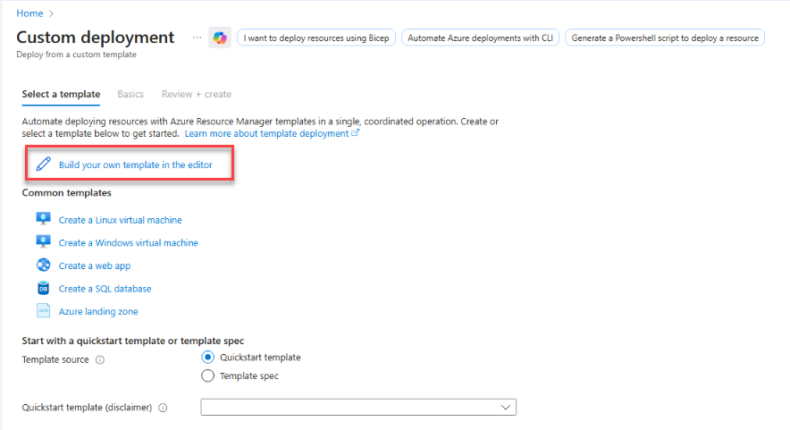
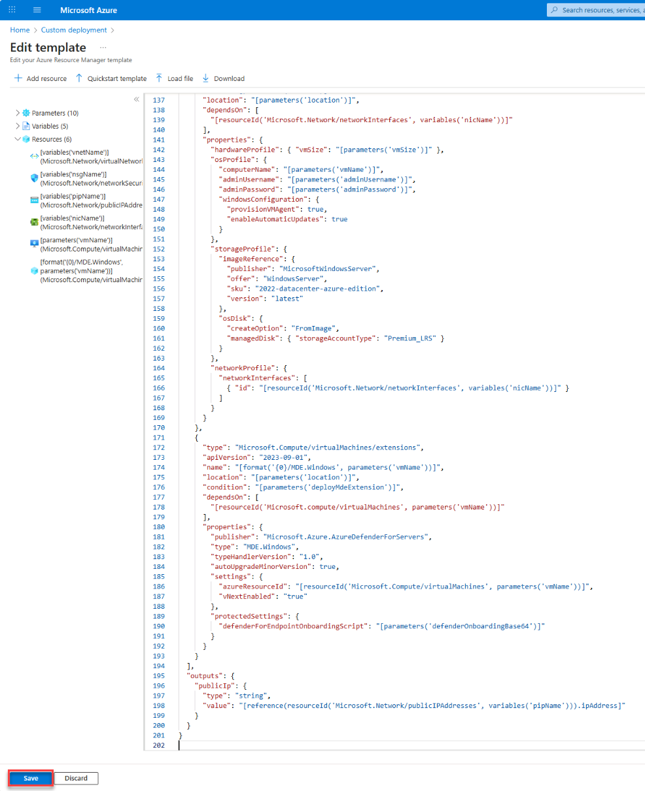
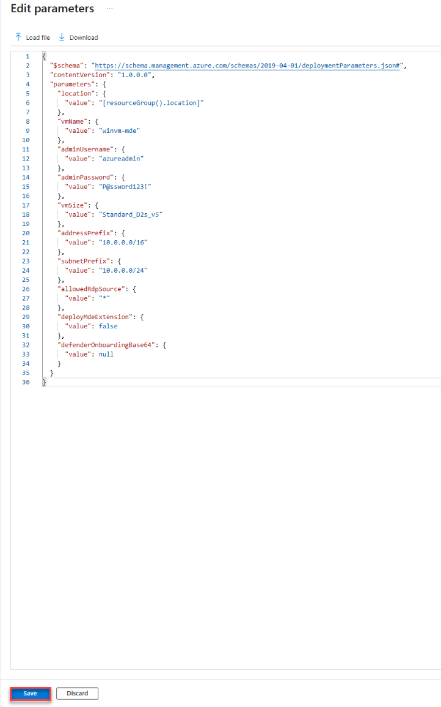
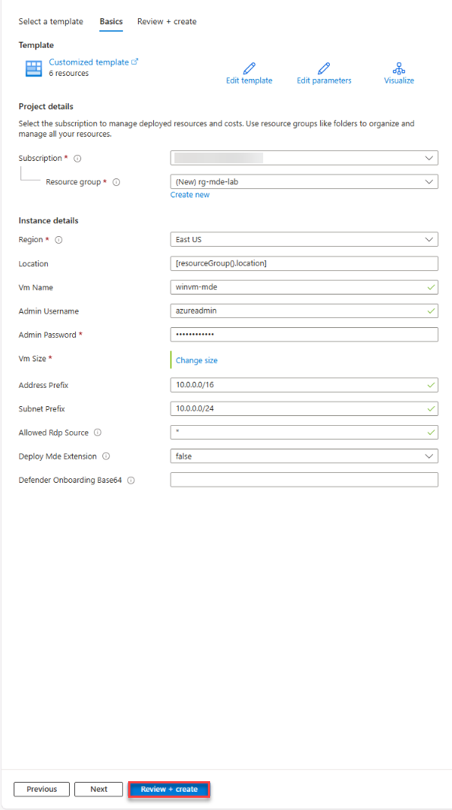
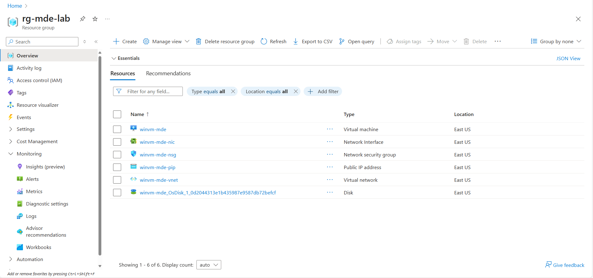

## Task 01: Provision a Windows VM on Azure

1. Sign into **@lab.VirtualMachine(Workstation1).SelectLink** using +++@lab.VirtualMachine(Workstation1).Password+++ for the password.

1. Open a browser, go to **portal.azure.com** and sign in with your credentials.

1. Create a new resource group named **rg-mde-lab** and go to the new resource group. 

1. In the search box, enter and select **Deploy a custom template**. 

1. Select **Build your own template in the editor**.

        

1. Delete the existing JSON text and replace it with the **azuredeploy.json** by entering the following:

    <details markdown='block'>
    <summary>
    Expand here to copy **azuredeploy.json**
    </summary>
    ```azuredeploy.json-wrap
    {
      "$schema": "https://schema.management.azure.com/schemas/2019-04-01/deploymentTemplate.json#",
      "contentVersion": "1.0.0.0",
      "parameters": {
        "location": {
          "type": "string",
          "defaultValue": "[resourceGroup().location]"
        },
        "vmName": {
          "type": "string",
          "defaultValue": "winvm-mde"
        },
        "adminUsername": {
          "type": "string",
          "defaultValue": "azureadmin"
        },
        "adminPassword": {
          "type": "secureString"
        },
        "vmSize": {
          "type": "string",
          "defaultValue": "Standard_D2s_v6"
        },
        "addressPrefix": {
          "type": "string",
          "defaultValue": "10.0.0.0/16"
        },
        "subnetPrefix": {
          "type": "string",
          "defaultValue": "10.0.0.0/24"
        },
        "allowedRdpSource": {
          "type": "string",
          "defaultValue": "*",
          "metadata": { "description": "CIDR or single IP for RDP (e.g., 203.0.113.10/32). Use * only for labs." }
        },

        /* --- MDE extension controls --- */
        "deployMdeExtension": {
          "type": "bool",
          "defaultValue": false,
          "metadata": { "description": "Set true to deploy MDE.Windows extension during VM provisioning." }
        },
        "defenderOnboardingBase64": {
          "type": "secureString",
          "defaultValue": "",
          "metadata": { "description": "Base64-encoded MDE onboarding package (protected settings). Leave empty if using Defender for Cloud auto-provisioning." }
        }
      },
      "variables": {
        "vnetName": "[format('{0}-vnet', parameters('vmName'))]",
        "subnetName": "default",
        "nsgName": "[format('{0}-nsg', parameters('vmName'))]",
        "pipName": "[format('{0}-pip', parameters('vmName'))]",
        "nicName": "[format('{0}-nic', parameters('vmName'))]"
      },
      "resources": [
        {
          "type": "Microsoft.Network/virtualNetworks",
          "apiVersion": "2023-09-01",
          "name": "[variables('vnetName')]",
          "location": "[parameters('location')]",
          "properties": {
            "addressSpace": { "addressPrefixes": [ "[parameters('addressPrefix')]" ] },
            "subnets": [
              {
                "name": "[variables('subnetName')]",
                "properties": { "addressPrefix": "[parameters('subnetPrefix')]" }
              }
            ]
          }
        },
        {
          "type": "Microsoft.Network/networkSecurityGroups",
          "apiVersion": "2023-09-01",
          "name": "[variables('nsgName')]",
          "location": "[parameters('location')]",
          "properties": {
            "securityRules": [
              {
                "name": "RDP-3389",
                "properties": {
                  "priority": 1000,
                  "access": "Allow",
                  "direction": "Inbound",
                  "protocol": "Tcp",
                  "sourcePortRange": "*",
                  "destinationPortRange": "3389",
                  "sourceAddressPrefix": "[parameters('allowedRdpSource')]",
                  "destinationAddressPrefix": "*"
                }
              }
            ]
          }
        },
        {
          "type": "Microsoft.Network/publicIPAddresses",
          "apiVersion": "2023-09-01",
          "name": "[variables('pipName')]",
          "location": "[parameters('location')]",
          "sku": { "name": "Standard" },
          "properties": { "publicIPAllocationMethod": "Static" }
        },
        {
          "type": "Microsoft.Network/networkInterfaces",
          "apiVersion": "2023-09-01",
          "name": "[variables('nicName')]",
          "location": "[parameters('location')]",
          "dependsOn": [
            "[resourceId('Microsoft.Network/virtualNetworks', variables('vnetName'))]",
            "[resourceId('Microsoft.Network/publicIPAddresses', variables('pipName'))]",
            "[resourceId('Microsoft.Network/networkSecurityGroups', variables('nsgName'))]"
          ],
          "properties": {
            "ipConfigurations": [
              {
                "name": "ipconfig1",
                "properties": {
                  "subnet": {
                    "id": "[resourceId('Microsoft.Network/virtualNetworks/subnets', variables('vnetName'), variables('subnetName'))]"
                  },
                  "publicIPAddress": {
                    "id": "[resourceId('Microsoft.Network/publicIPAddresses', variables('pipName'))]"
                  }
                }
              }
            ],
            "networkSecurityGroup": {
              "id": "[resourceId('Microsoft.Network/networkSecurityGroups', variables('nsgName'))]"
            }
          }
        },
        {
          "type": "Microsoft.Compute/virtualMachines",
          "apiVersion": "2023-09-01",
          "name": "[parameters('vmName')]",
          "location": "[parameters('location')]",
          "dependsOn": [
            "[resourceId('Microsoft.Network/networkInterfaces', variables('nicName'))]"
          ],
          "properties": {
            "hardwareProfile": { "vmSize": "[parameters('vmSize')]" },
            "osProfile": {
              "computerName": "[parameters('vmName')]",
              "adminUsername": "[parameters('adminUsername')]",
              "adminPassword": "[parameters('adminPassword')]",
              "windowsConfiguration": {
                "provisionVMAgent": true,
                "enableAutomaticUpdates": true
              }
            },
            "storageProfile": {
              "imageReference": {
                "publisher": "MicrosoftWindowsServer",
                "offer": "WindowsServer",
                "sku": "2022-datacenter-azure-edition",
                "version": "latest"
              },
              "osDisk": {
                "createOption": "FromImage",
                "managedDisk": { "storageAccountType": "Premium_LRS" }
              }
            },
            "networkProfile": {
              "networkInterfaces": [
                { "id": "[resourceId('Microsoft.Network/networkInterfaces', variables('nicName'))]" }
              ]
            }
          }
        },
        {
          "type": "Microsoft.Compute/virtualMachines/extensions",
          "apiVersion": "2023-09-01",
          "name": "[format('{0}/MDE.Windows', parameters('vmName'))]",
          "location": "[parameters('location')]",
          "condition": "[parameters('deployMdeExtension')]",
          "dependsOn": [
            "[resourceId('Microsoft.compute/virtualMachines', parameters('vmName'))]"
          ],
          "properties": {
            "publisher": "Microsoft.Azure.AzureDefenderForServers",
            "type": "MDE.Windows",
            "typeHandlerVersion": "1.0",
            "autoUpgradeMinorVersion": true,
            "settings": {
              "azureResourceId": "[resourceId('Microsoft.Compute/virtualMachines', parameters('vmName'))]",
              "vNextEnabled": "true"
            },
            "protectedSettings": {
              "defenderForEndpointOnboardingScript": "[parameters('defenderOnboardingBase64')]"
            }
          }
        }
      ],
      "outputs": {
        "publicIp": {
          "type": "string",
          "value": "[reference(resourceId('Microsoft.Network/publicIPAddresses', variables('pipName'))).ipAddress]"
        }
      }
    }
    ```
    </details>

1. Select **Save**. 

     

1. Select **Edit Parameters** and replace the contents with the following **azuredeploy.parameters.json**:

    <details markdown='block'>
    <summary>
    Expand here to copy **azuredeploy.parameters.json**
    </summary>
    
    ```json
    {
      "$schema": "https://schema.management.azure.com/schemas/2019-04-01/deploymentParameters.json#",
      "contentVersion": "1.0.0.0",
      "parameters": {
        "location": {
          "value": "[resourceGroup().location]"
        },
        "vmName": {
          "value": "winvm-mde"
        },
        "adminUsername": {
          "value": "azureadmin"
        },
        "adminPassword": {
          "value": "P@ssword123!"
        },
        "vmSize": {
          "value": "Standard_D2s_v6"
        },
        "addressPrefix": {
          "value": "10.0.0.0/16"
        },
        "subnetPrefix": {
          "value": "10.0.0.0/24"
        },
        "allowedRdpSource": {
          "value": "*"
        },
        "deployMdeExtension": {
          "value": false
        },
        "defenderOnboardingBase64": {
          "value": null
        }
      }
    }
    ```
    </details>

1. Select **Save**. 

      

1. Complete the custom deployment by selecting **Review and Create**.

    

1. Select **Create**. 

    {: .note }
    > Wait until the deployment is succeeded and VM is created. 

1. Go to the resource group **rg-mde-lab** to confirm the VM **winvm-mde** is created. 

     
