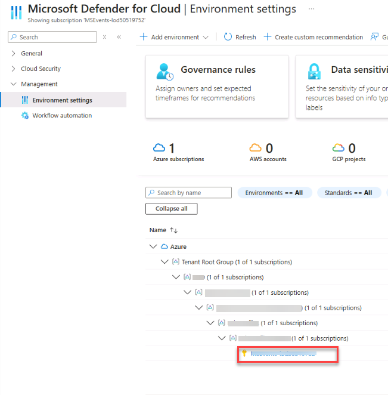
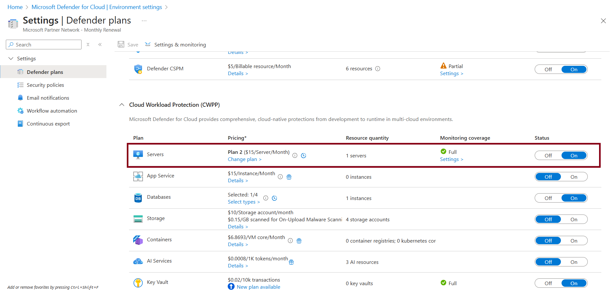
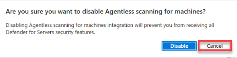
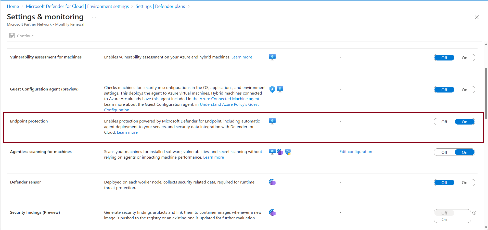

## Task 02: Onboard the VM to MDE

1. In the Azure Portal search box, search for and select **Microsoft Defender for Cloud**. 

1. On the leftmost pane, select **Management** > **Environment settings**.

1. Expand the Environment until your subscription is visible and then select it. 

    

1. Under **Cloud Workload Protection (CWPP)**, ensure Defender for **Servers** is **On**.

    {: .note }
    > If not already, set to **On**. 

    

1. On the **Servers** plan, under **Monitoring coverage**, select **Settings >**.

    {: .warning }
    > If necessary, select **Cancel** if prompted to disable Agentless scanning for machines. 
    >
    > 

1. On the Settings & monitoring page, verify that **Endpoint protection** is set to **On**.  
        
    

1. Near the top of the page, select **Continue**.

1. Near the top of the Defender plans page, select **Save**.

    {: .note }
    > The above step will automatically deploy the MDE sensor/extension to supported Windows machines in the subscription.

    {: .warning }
    > Wait up to 1 hour for the VM to appear in MDE/XDR by navigating to security.microsoft.com

<!-- {: .warning } Look into this!
>
1. Select the **Microsoft Defender for Cloud | Environment settings** breadcrumb to return to the previous page and then on the leftmost pane select Click Assets > Devices and you should be able to see the winvm-mde device been on boarded. 
>
    
> -->
