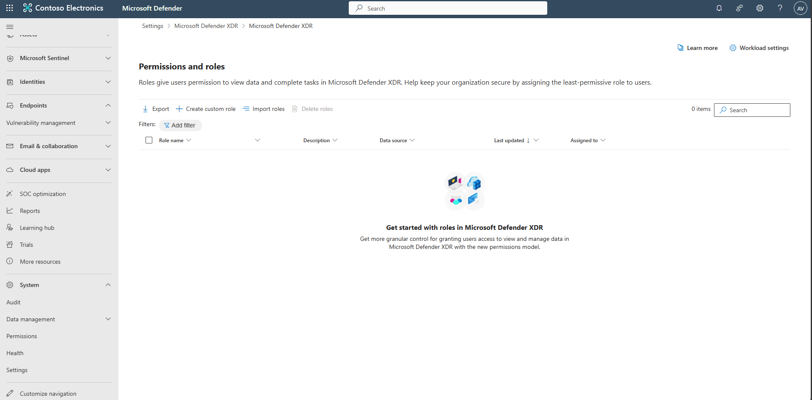
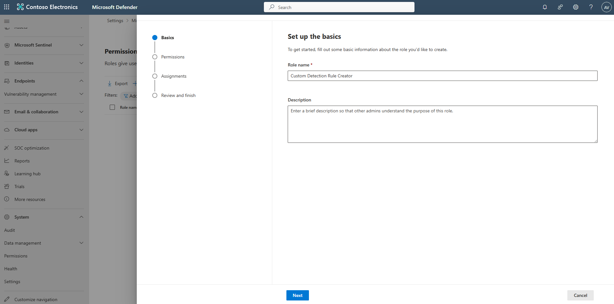
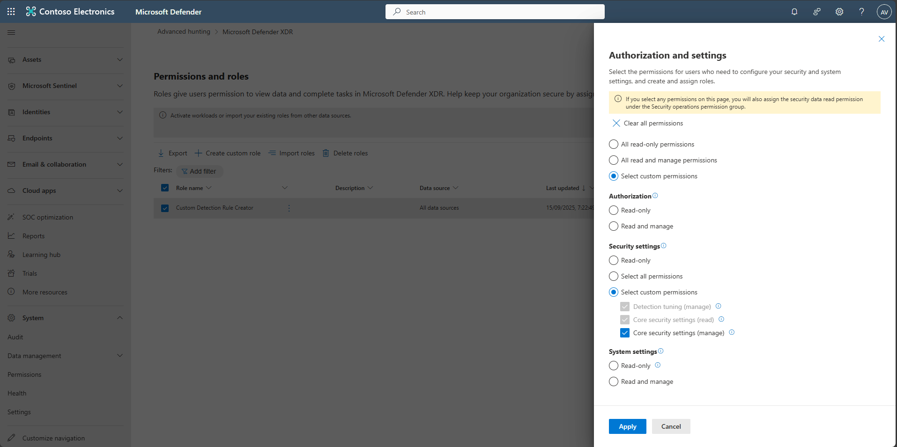
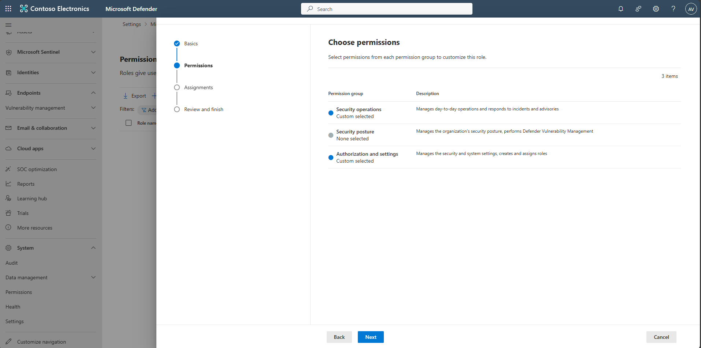
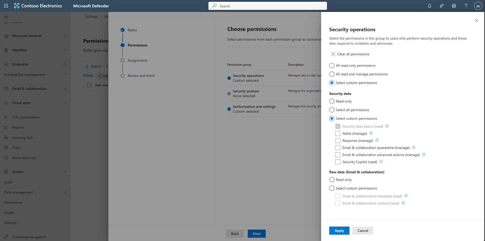
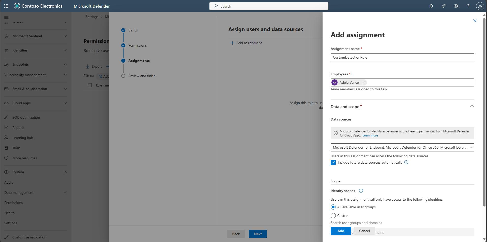
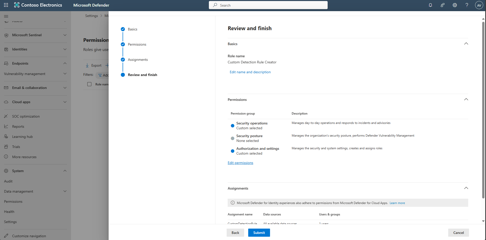
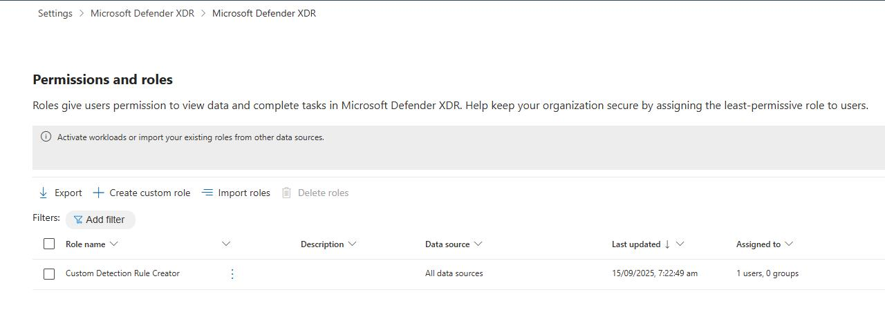

## Task 03: Assign permissions for custom detection rules

{: .note }
> This task is a prerequisite for creating custom detection rules. 

1. Open a new browser tab, go to [MS Defender](https://sip.security.microsoft.com/), and sign in.

1. In the Defender portal's leftmost pane, go to **System** > **Permissions**.

1. Select **Microsoft Defender XDR** > **Roles**.

1. Select **Create custom role**.

      

1. Name the role +++**Custom Detection Rule Creator**+++, then select **Next**. 

      

1. Under **Choose permissions**, select **Authorization and settings**.

1. In the flyout, select **Select custom permissions**.
     
1. Under **Security settings**, select **Select custom permissions** > **Core security settings (manage)** > **Apply**.
    
      

     

1. Under **Choose permissions**, select **Security operations**.

    {: .note }
    > Notice this automatically added **Security data basics (Read)**.  

      

1. Close the flyout.

1. Select **Next** to move to the **Assignments** step.  

1. Select **Create assignment**.

1. In the flyout pane, under **Assignment name**, enter +++**CustomDetectionRule**+++.
 
1. Under Employees, select any other username in your tenant other than your username. If you don’t have any other users, enter your Azure username. 

1. Leave the defaults for **Data and scope**, then select **Add** at the bottom of the pane.

     

1. Back on the **Assignments** step, select **Next**, then select **Submit**.  

    

1. Select **Done** once the role's been created.

1. Confirm the new role appears in the table.  

    

{: .warning }
> Permissions may take 10-15 minutes to take effect.