## Task 01: Review Microsoft Defender solutions

Gain visibility and strengthen your organization's security posture from a single, unified portal. Use Microsoft Defender to safeguard assets, prioritize risks, track exposure, and explore attack paths with actionable insights.

1. Review **Exposure management** to learn about reducing threat exposure and improving posture.

    {: .note }
    > Use Exposure management to centrally assess exposure risk, discover and monitor assets, investigate risk areas with initiatives, and track posture metrics.

    

    
Expand here to review Exposure management

    - In the leftmost pane, select **Exposure management** > **Secure score**.  

    - Review your organizations Secure Score and high-risk exposures.

        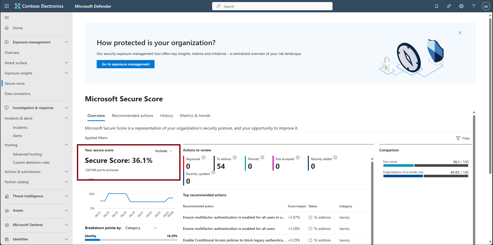 

    - Observe recommendations and asset classes driving the exposure.

        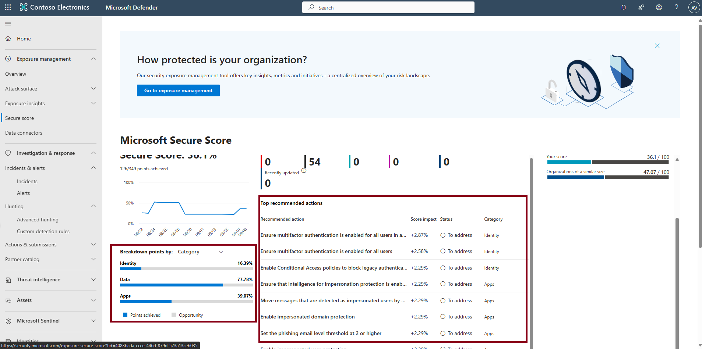   

    

1. Review Investigation & response to check incidents and alerts. 

    {: .note }
    > There are no incidents or alerts currently showing as it is a clean XDR environment and this is normal. 

    

    
Expand here to review Incidents & alerts

    
    - In the leftmost pane, select **Investigation & response** > **Incidents & alerts** > **Incidents**.

    - Set the time filter to **1 Day**; review incidents.  
      
      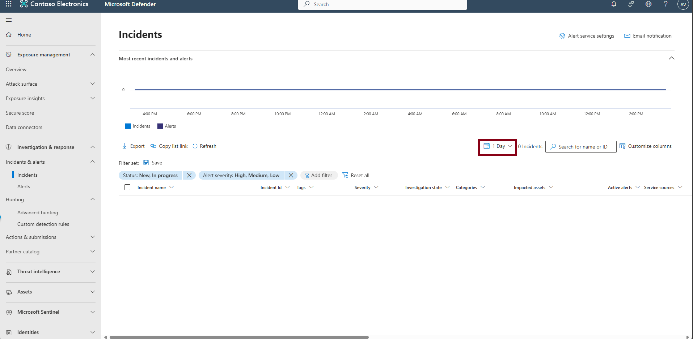

    - In the leftmost pane, under the same subcategory, select **Alerts**, then review alerts for **1 Day**.  
      
      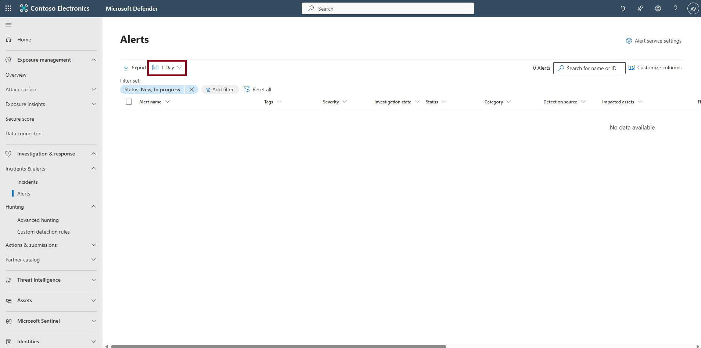

    

1. Review **Threat intelligence** for recent intel and artifacts.

    

    
Expand here to review Threat intelligence

    - In the leftmost pane, select **Threat intelligence**, then **Intel explorer**.

    - Skim recent articles relevant to your environment.  
      
      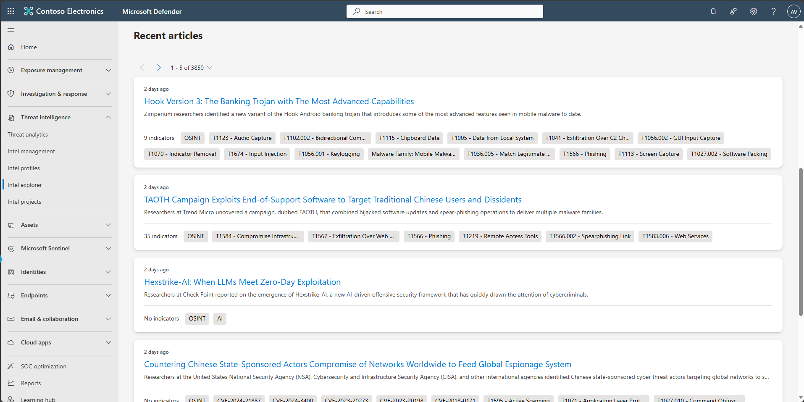

    

1. In the leftmost pane, select **Assets** > **Devices** to spot-check unhealthy devices. 

    {: .note }
    > Once the Windows VM is on boarded successfully, it will be displayed here.

    

    
Expand here to review Assets

    - In the leftmost pane, select **Assets** > **Devices** to spot-check unhealthy devices.  
      
      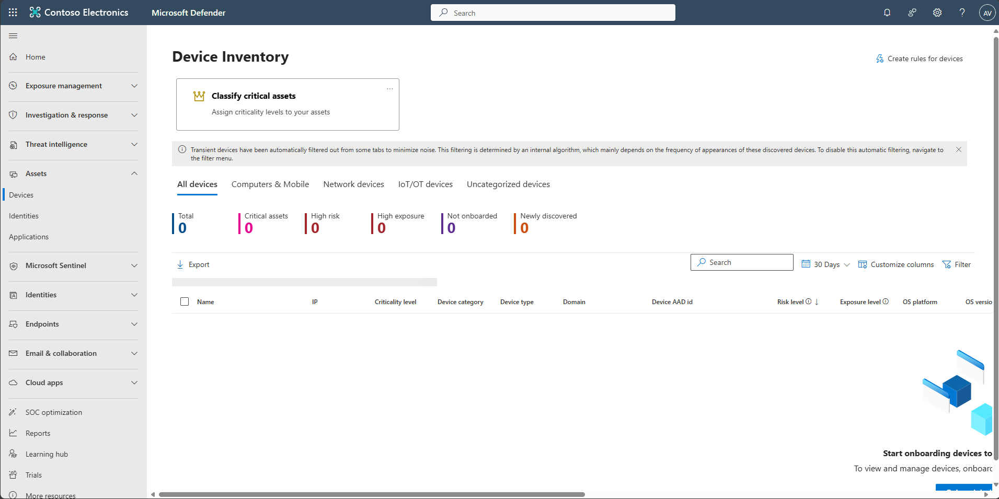 

    - In the leftmost pane, select **Assets** > **Identities** to review highly privileged identities.  
      
      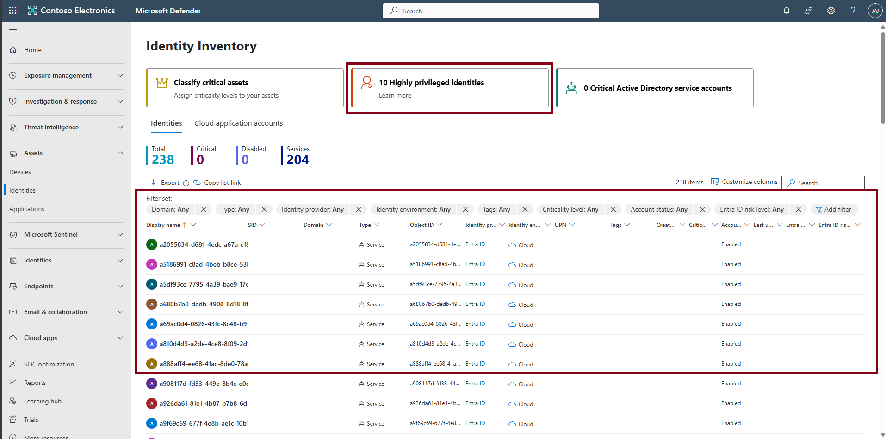 

    - In the leftmost pane, select **Assets** > **Applications** to review newly discovered and untagged high-risk, high-traffic, and GenAI apps.  
      
      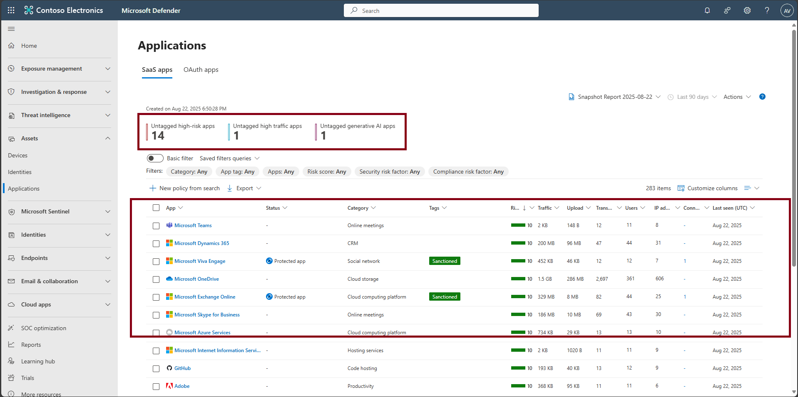

    

1. Review **Identities** posture and privileged accounts.

    

    
Expand here to review Identity posture

    - In the leftmost pane, select **Identities** > **Dashboard**.  
      
      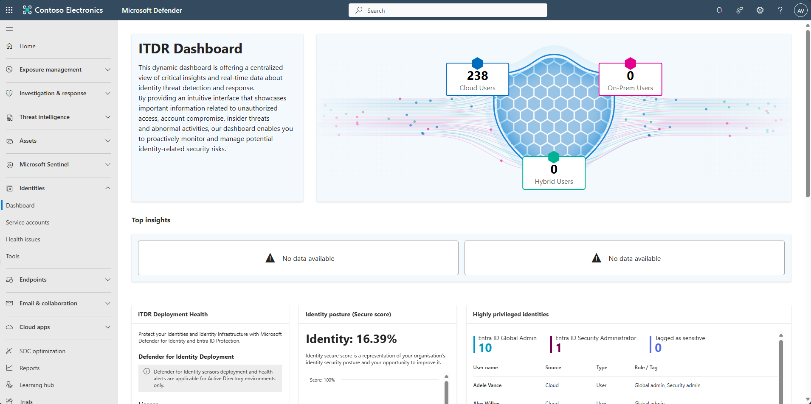  

    - Review **Identity posture** and highly privileged identities.  
      
      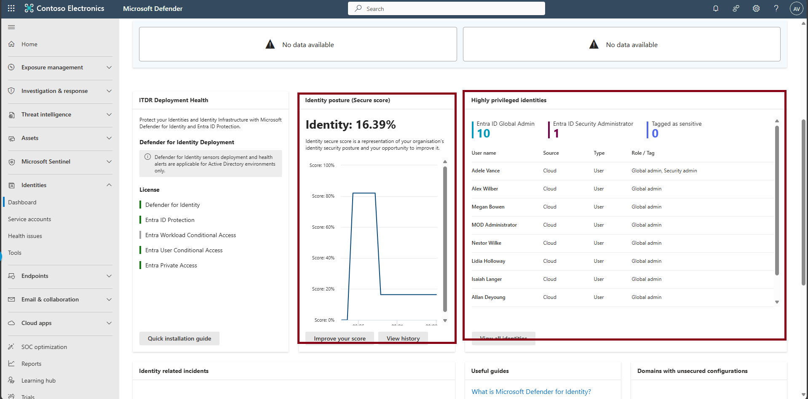

    

1. Review **Endpoints** exposure and recommendations.

    

    
Expand here to review Endpoints

    - In the leftmost pane, select **Endpoints**, then **Vulnerability management** and then **Dashboard**.  
      
      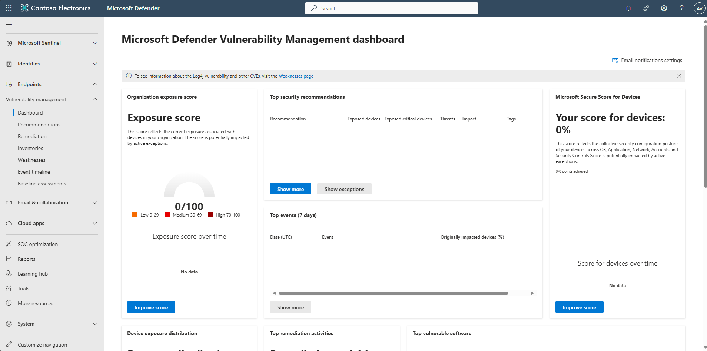  

    - Review exposure score and top recommendations.

    - View your exposure score, which is associated with devices in your company.

    - View your top security recommendations, such as addressing impaired communications with devices, turning on firewall protection, or updating Microsoft Defender Antivirus definitions.

    - View remediation activities, such as any files that were sent to quarantine, or vulnerabilities found on devices.

    - Turn On: **Live Response**, **Live response for servers**, and **Live response unsigned script execution**, then select **Save preferences**.

       

    

1. Review **Email & collaboration** threat activity.

    

    
Expand here to review Email & collaboration

    - In the leftmost pane, select **Email & collaboration**, then **Explorer**.

    - Review recent threats.

        {: .note }
        > Provides information around recent email threats (Phish, malware, spam, URLs, attachments and campaigns), pivot into message details and take response actions.  
      
      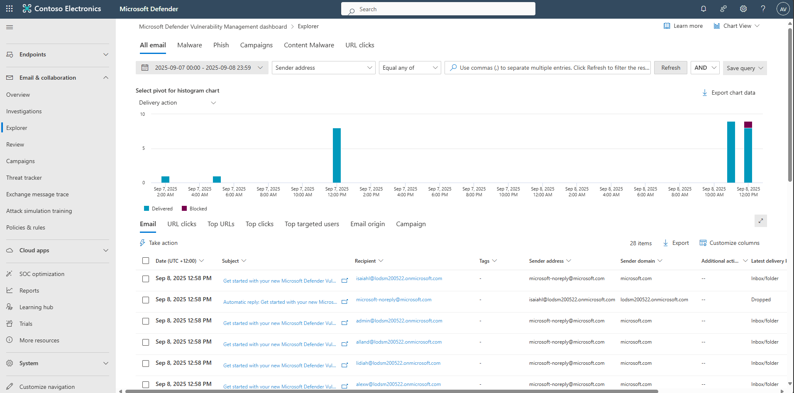
    

1. Review **Cloud apps** discovery and governance.

    

    
Expand here to review Cloud apps

    - In the leftmost pane, select **Cloud apps**, then **Cloud discovery**.

    - Review discovered applications and governance alerts.  
      
      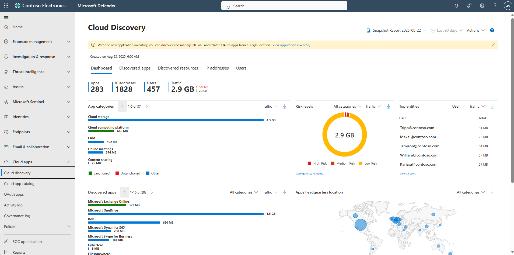

    

1. On the leftmost pane, select **Microsoft Sentinel**.

    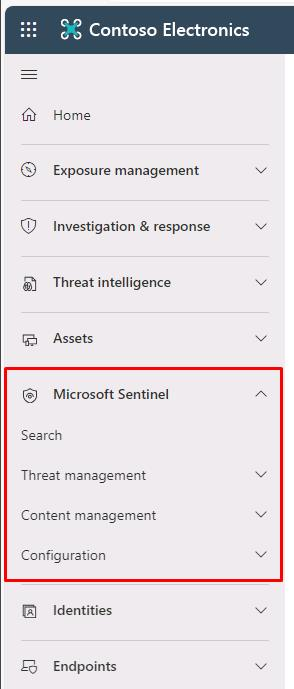

    {: .note }
    > Sentinel now appears inside Defender. For this session, focus on XDR, but confirm Sentinel health here and you can also review the connected data sources (Data Connectors) under **Microsoft Sentinel** > **Configuration** >** Data Connectors** for any logs being collected. 