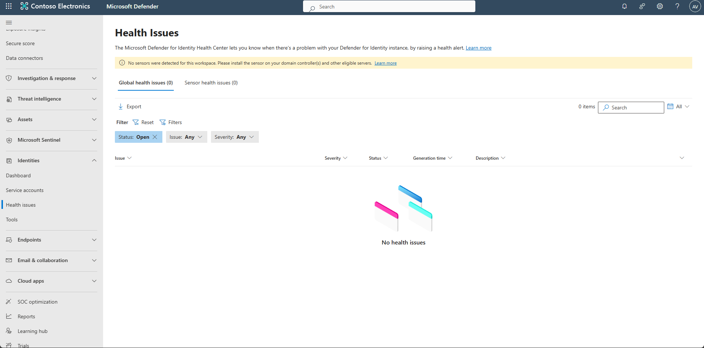
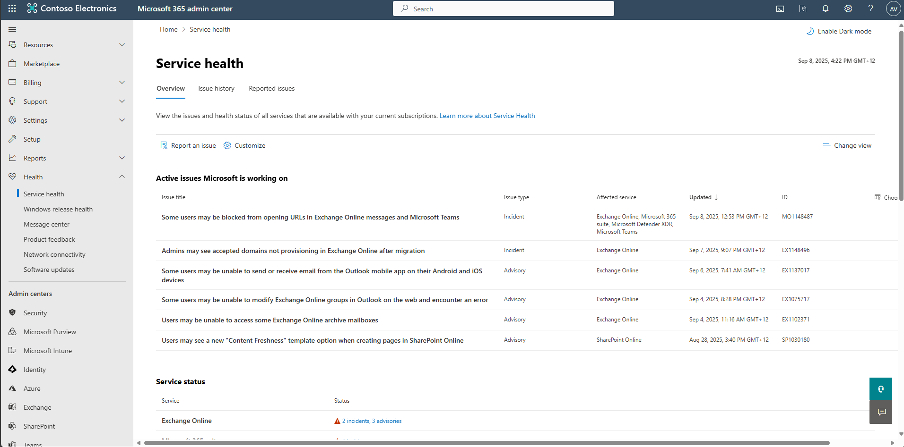
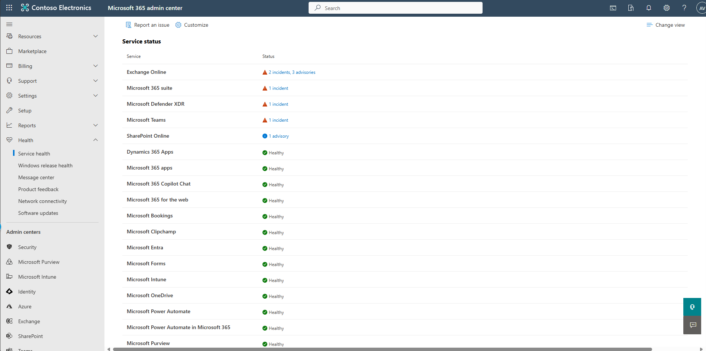
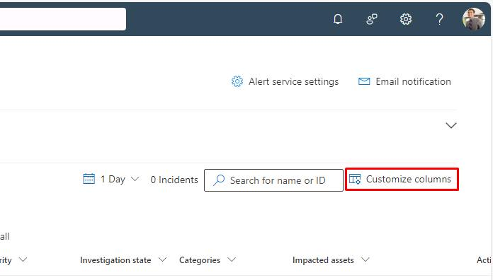
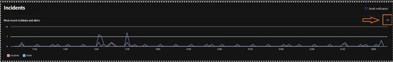

## Task 02: Check for degraded services and incidents from the last 24 hours

Check service health, warnings, and incidents across your environment.

1. Look for in-product warnings in the portal.  

   

   
Expand here to confirm degraded services and warnings

   
   - On the leftmost pane, select **Identities** > **Health issues**.   
   - Review the top banner and left navigation for component-specific warnings (for example, Endpoint sensors or Email protection). These link to related health views.
    
   

1. Confirm Microsoft 365 service health.  

   

   
Expand here to check Microsoft 365 service health

   
   - Open a new tab and go to [M365 Admin Center](https://admin.microsoft.com).

     

   - In the leftmost pane, select **Health** > **Service Health**.

    {: .warning }
    > If needed, select **Show all** to display the **Health** category.
 
 
   - Review any tenant-wide outages or advisories (Exchange, SharePoint, Teams, Entra ID).
    
      
   
   

1. Return to the browser tab that is signed into Microsoft Defender.

1. Select **Investigation & response** > **Incidents & alerts** > **Incidents**.

1. Set the time filter to **1 Day**.  

1. Near the upper-corner of the table, select **Customize columns**.

    

1. Select the following, if not already selected:

    - Severity
    - Categories
    - Detection sources
    - Last update time
    - Status
    - Assigned to

1. Sort by **Last update time** (descending) by selecting the column header, then by **Severity**.  

    {: .note }
    > Sorting this way surfaces the most critical issues first.

1. Access the alert timeline within the Incident queue by clicking on the ‘Most recent incidents and alerts arrow’ in the top right corner. 

    