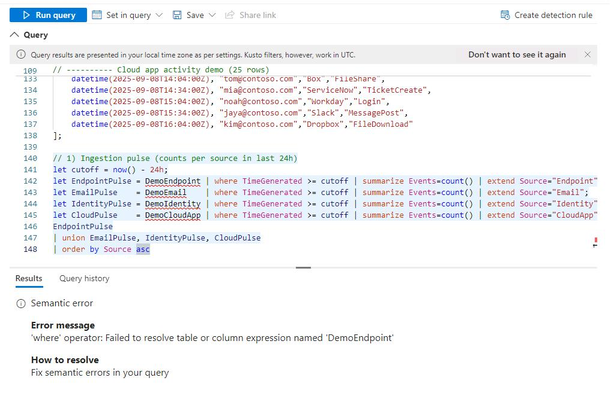

## Task 04: Verify data ingestion from XDR sources using KQL queries

1. In the leftmost pane, select **Investigation & response** > **Hunting** > **Advanced hunting**.  

    {: .note }
    > In the following steps, copy/paste the provided query file contents from the code blocks into the query editor. After pasting, **highlight the entire query by selecting Ctrl+A**, then select **Run query** to review the results.  

    {: .warning }
    > You'll run into an error if you don't highlight the entire query, as it will try to run just one block of the query by default.
    >
    > 

1. Copy and paste the **01-IngestionPulse.txt** content below in the Query Window, highlight the entire query by selecting **Ctrl+A**, then select **Run Query** to view the result.

    {: .note }
    > Ingestion pulse (counts per source in last 24h): Tallies event volumes from the demo Endpoint, Email, Identity, and CloudApp datasets in the last 24 hours to confirm data is flowing.

    {: .note }
    > This data does not actually come from any existing assets (emails, endpoints, cloud apps, identities) within the Microsoft Defender portal.  It is artificially generated to give us data to work with in the lab.  

    <details markdown='block'>
    <summary>Expand here to copy **01-IngestionPulse.txt** content --></summary>

    {: .warning }
    > Selecting the **Copy** option in the upper-right corner of the code block and pasting with **Ctrl+V** will be significantly faster than selecting **Type**!

    ```
    // Always-fresh demo data (all rows fall within last 24h)
    let T0 = now() - 18h;  // earliest row ~18h ago

    // ---------- Endpoint demo (30 rows)
    let DemoEndpointRaw =
    datatable(Offset:timespan, DeviceName:string, ActionType:string, ReportId:long)
    [
       time(00:00:00), "PC-001","AntivirusDetection",       1001,
       time(00:30:00), "PC-002","AntivirusDetection",       1002,
       time(01:00:00), "PC-003","ProcessCreated",           1003,
       time(01:30:00), "PC-004","NetworkConnectionAllowed", 1004,
       time(02:00:00), "PC-005","SensorHeartbeat",          1005,
       time(02:30:00), "PC-006","AntivirusDetection",       1006,
       time(03:00:00), "PC-007","ProcessCreated",           1007,
       time(03:30:00), "PC-008","NetworkConnectionBlocked", 1008,
       time(04:00:00), "PC-009","AntivirusDetection",       1009,
       time(04:30:00), "PC-010","SensorHeartbeat",          1010,
       time(05:00:00), "PC-011","AntivirusDetection",       1011,
       time(05:30:00), "PC-012","ProcessCreated",           1012,
       time(06:00:00), "PC-013","ProcessCreated",           1013,
       time(06:30:00), "PC-014","NetworkConnectionAllowed", 1014,
       time(07:00:00), "PC-015","SensorHeartbeat",          1015,
       time(07:30:00), "PC-016","AntivirusDetection",       1016,
       time(08:00:00), "PC-017","NetworkConnectionBlocked", 1017,
       time(08:30:00), "PC-018","ProcessCreated",           1018,
       time(09:00:00), "PC-019","SensorHeartbeat",          1019,
       time(09:30:00), "PC-020","AntivirusDetection",       1020,
       time(10:00:00), "PC-021","AntivirusDetection",       1021,
       time(10:30:00), "PC-022","NetworkConnectionAllowed", 1022,
       time(11:00:00), "PC-023","ProcessCreated",           1023,
       time(11:30:00), "PC-024","SensorHeartbeat",          1024,
       time(12:00:00), "PC-025","AntivirusDetection",       1025,
       time(12:30:00), "PC-026","ProcessCreated",           1026,
       time(13:00:00), "PC-027","NetworkConnectionBlocked", 1027,
       time(13:30:00), "PC-028","SensorHeartbeat",          1028,
       time(14:00:00), "PC-029","ProcessCreated",           1029,
       time(14:30:00), "PC-030","AntivirusDetection",       1030
    ];
    let DemoEndpoint =
        DemoEndpointRaw
        | extend TimeGenerated = T0 + Offset
        | project TimeGenerated, DeviceName, ActionType, ReportId;

    // ---------- Email demo (30 rows)
    let DemoEmailRaw =
    datatable(Offset:timespan, Recipient:string, SenderFromDomain:string, ThreatType:string,    DeliveryAction:string)
    [
       time(00:05:00), "user1@contoso.com","fabrikam.com","Phish","Blocked",
       time(00:10:00), "user2@contoso.com","news.example","Spam","Delivered",
       time(00:15:00), "user3@contoso.com","fabrikam.com","Malware","Blocked",
       time(00:20:00), "user4@contoso.com","updates.example","Clean","Delivered",
       time(00:25:00), "user5@contoso.com","promo.example","Spam","Junked",
       time(00:30:00), "user6@contoso.com","fabrikam.com","Phish","Blocked",
       time(00:35:00), "user7@contoso.com","alerts.example","Clean","Delivered",
       time(00:40:00), "user8@contoso.com","fabrikam.com","Phish","Blocked",
       time(00:45:00), "user9@contoso.com","promo.example","Spam","Junked",
       time(00:50:00), "user10@contoso.com","fabrikam.com","Phish","Blocked",
       time(00:55:00), "user11@contoso.com","fabrikam.com","Malware","Blocked",
       time(01:00:00), "user12@contoso.com","updates.example","Clean","Delivered",
       time(01:10:00), "user13@contoso.com","fabrikam.com","Phish","Blocked",
       time(01:20:00), "user14@contoso.com","promo.example","Spam","Junked",
       time(01:30:00), "user15@contoso.com","fabrikam.com","Phish","Blocked",
       time(01:40:00), "user16@contoso.com","news.example","Spam","Delivered",
       time(01:50:00), "user17@contoso.com","fabrikam.com","Malware","Blocked",
       time(02:00:00), "user18@contoso.com","alerts.example","Clean","Delivered",
       time(02:10:00), "user19@contoso.com","fabrikam.com","Phish","Blocked",
       time(02:20:00), "user20@contoso.com","promo.example","Spam","Junked",
       time(02:30:00), "user21@contoso.com","fabrikam.com","Phish","Blocked",
       time(02:40:00), "user22@contoso.com","fabrikam.com","Phish","Blocked",
       time(02:50:00), "user23@contoso.com","fabrikam.com","Malware","Blocked",
       time(03:00:00), "user24@contoso.com","updates.example","Clean","Delivered",
       time(03:10:00), "user25@contoso.com","fabrikam.com","Phish","Blocked",
       time(03:20:00), "user26@contoso.com","promo.example","Spam","Junked",
       time(03:30:00), "user27@contoso.com","fabrikam.com","Phish","Blocked",
       time(03:40:00), "user28@contoso.com","news.example","Spam","Delivered",
       time(03:50:00), "user29@contoso.com","fabrikam.com","Phish","Blocked",
       time(03:55:00), "user30@contoso.com","fabrikam.com","Malware","Blocked"
    ];
    let DemoEmail =
        DemoEmailRaw
        | extend TimeGenerated = T0 + Offset
        | project TimeGenerated, Recipient, SenderFromDomain, ThreatType, DeliveryAction;

    // ---------- Identity sign-in demo (30 rows)
    let DemoIdentityRaw =
    datatable(Offset:timespan, AccountUpn:string, AppDisplayName:string, AuthenticationRequirement:string,  Result:string)
    [
       time(00:02:00), "alex@contoso.com","SharePoint","MFA","Success",
       time(00:07:00), "alex@contoso.com","Exchange Online","MFA","Success",
       time(00:12:00), "lee@contoso.com","Teams","SingleFactor","Failure",
       time(00:17:00), "sam@contoso.com","Exchange Online","MFA","Success",
       time(00:22:00), "sam@contoso.com","Teams","MFA","Success",
       time(00:27:00), "rani@contoso.com","Entra ID","MFA","Failure",
       time(00:32:00), "rani@contoso.com","SharePoint","MFA","Success",
       time(00:37:00), "tom@contoso.com","Teams","SingleFactor","Failure",
       time(00:42:00), "mia@contoso.com","Exchange Online","MFA","Success",
       time(00:47:00), "mia@contoso.com","SharePoint","MFA","Success",
       time(00:52:00), "noah@contoso.com","Entra ID","MFA","Success",
       time(00:57:00), "noah@contoso.com","Teams","MFA","Success",
       time(01:02:00), "jaya@contoso.com","Exchange Online","MFA","Failure",
       time(01:12:00), "jaya@contoso.com","Exchange Online","MFA","Success",
       time(01:22:00), "kim@contoso.com","SharePoint","SingleFactor","Failure",
       time(01:32:00), "kim@contoso.com","SharePoint","MFA","Success",
       time(01:42:00), "raj@contoso.com","Entra ID","MFA","Success",
       time(01:52:00), "raj@contoso.com","Teams","MFA","Success",
       time(02:02:00), "nina@contoso.com","Exchange Online","MFA","Success",
       time(02:12:00), "nina@contoso.com","SharePoint","MFA","Success",
       time(02:22:00), "omar@contoso.com","Entra ID","SingleFactor","Failure",
       time(02:32:00), "omar@contoso.com","SharePoint","MFA","Success",
       time(02:42:00), "li@contoso.com","Teams","MFA","Success",
       time(02:52:00), "li@contoso.com","Exchange Online","MFA","Success",
       time(03:02:00), "zoe@contoso.com","SharePoint","MFA","Success",
       time(03:12:00), "zoe@contoso.com","Teams","MFA","Success",
       time(03:22:00), "yan@contoso.com","Entra ID","SingleFactor","Failure",
       time(03:32:00), "yan@contoso.com","Entra ID","MFA","Success",
       time(03:42:00), "ari@contoso.com","Teams","MFA","Success",
       time(03:52:00), "ari@contoso.com","Exchange Online","MFA","Success"
    ];
    let DemoIdentity =
        DemoIdentityRaw
        | extend TimeGenerated = T0 + Offset
        | project TimeGenerated, AccountUpn, AppDisplayName, AuthenticationRequirement, Result;

    // ---------- Cloud app activity demo (25 rows)
    let DemoCloudAppRaw =
    datatable(Offset:timespan, User:string, AppName:string, ActivityType:string)
    [
       time(00:04:00), "alex@contoso.com","Dropbox","FileDownload",
       time(00:34:00), "lee@contoso.com","Salesforce","Login",
       time(01:04:00), "sam@contoso.com","Box","FileUpload",
       time(01:34:00), "rani@contoso.com","ServiceNow","Login",
       time(02:04:00), "tom@contoso.com","Workday","Login",
       time(02:34:00), "mia@contoso.com","Slack","MessagePost",
       time(03:04:00), "noah@contoso.com","Dropbox","FileDownload",
       time(03:34:00), "jaya@contoso.com","Salesforce","ReportExport",
       time(04:04:00), "kim@contoso.com","Box","FileShare",
       time(04:34:00), "raj@contoso.com","ServiceNow","TicketCreate",
       time(05:04:00), "nina@contoso.com","Workday","PayrollView",
       time(05:34:00), "omar@contoso.com","Slack","MessagePost",
       time(06:04:00), "li@contoso.com","Dropbox","FileDownload",
       time(06:34:00), "zoe@contoso.com","Salesforce","Login",
       time(07:04:00), "yan@contoso.com","Box","FileUpload",
       time(07:34:00), "ari@contoso.com","ServiceNow","Login",
       time(08:04:00), "alex@contoso.com","Workday","Login",
       time(08:34:00), "lee@contoso.com","Slack","MessagePost",
       time(09:04:00), "sam@contoso.com","Dropbox","FileDownload",
       time(09:34:00), "rani@contoso.com","Salesforce","ReportExport",
       time(10:04:00), "tom@contoso.com","Box","FileShare",
       time(10:34:00), "mia@contoso.com","ServiceNow","TicketCreate",
       time(11:04:00), "noah@contoso.com","Workday","Login",
       time(11:34:00), "jaya@contoso.com","Slack","MessagePost",
       time(12:04:00), "kim@contoso.com","Dropbox","FileDownload"
    ];
    let DemoCloudApp =
        DemoCloudAppRaw
        | extend TimeGenerated = T0 + Offset
        | project TimeGenerated, User, AppName, ActivityType;

    // 1) Ingestion pulse (counts per source in last 24h)
    let cutoff = now() - 24h;
    let EndpointPulse = DemoEndpoint | where TimeGenerated >= cutoff | summarize Events=count() | extend    Source="Endpoint";
    let EmailPulse    = DemoEmail    | where TimeGenerated >= cutoff | summarize Events=count() | extend    Source="Email";
    let IdentityPulse = DemoIdentity | where TimeGenerated >= cutoff | summarize Events=count() | extend    Source="Identity";
    let CloudPulse    = DemoCloudApp | where TimeGenerated >= cutoff | summarize Events=count() | extend    Source="CloudApp";
    EndpointPulse
    | union EmailPulse, IdentityPulse, CloudPulse
    | order by Source asc
    ```

    </details>

1. Copy and paste **02-EndpointSanity.txt** content in the Query Window and select **Run Query** to view the result.  

    {: .note }
    > Endpoint sensor & AV detection sanity: Summarizes per-device antivirus detections and sensor heartbeats to spot coverage gaps or dead sensors.
    
    <details markdown='block'>
    <summary>Expand here to copy **02-EndpointSanity.txt** content --></summary>

    ```
    // --- Moving anchor so rows are always within last 24h (no startofhour needed)
    let T0 = now() - 18h;

    // ---------- Endpoint demo (30 rows) -> build from offsets
    let DemoEndpointOffsets =
    datatable(Offset:timespan, DeviceName:string, ActionType:string, ReportId:long)
    [
        time(00:00:00), "PC-001","AntivirusDetection",       1001,
        time(00:30:00), "PC-002","AntivirusDetection",       1002,
        time(01:00:00), "PC-003","ProcessCreated",           1003,
        time(01:30:00), "PC-004","NetworkConnectionAllowed", 1004,
        time(02:00:00), "PC-005","SensorHeartbeat",          1005,
        time(02:30:00), "PC-006","AntivirusDetection",       1006,
        time(03:00:00), "PC-007","ProcessCreated",           1007,
        time(03:30:00), "PC-008","NetworkConnectionBlocked", 1008,
        time(04:00:00), "PC-009","AntivirusDetection",       1009,
        time(04:30:00), "PC-010","SensorHeartbeat",          1010,
        time(05:00:00), "PC-011","AntivirusDetection",       1011,
        time(05:30:00), "PC-012","ProcessCreated",           1012,
        time(06:00:00), "PC-013","ProcessCreated",           1013,
        time(06:30:00), "PC-014","NetworkConnectionAllowed", 1014,
        time(07:00:00), "PC-015","SensorHeartbeat",          1015,
        time(07:30:00), "PC-016","AntivirusDetection",       1016,
        time(08:00:00), "PC-017","NetworkConnectionBlocked", 1017,
        time(08:30:00), "PC-018","ProcessCreated",           1018,
        time(09:00:00), "PC-019","SensorHeartbeat",          1019,
        time(09:30:00), "PC-020","AntivirusDetection",       1020,
        time(10:00:00), "PC-021","AntivirusDetection",       1021,
        time(10:30:00), "PC-022","NetworkConnectionAllowed", 1022,
        time(11:00:00), "PC-023","ProcessCreated",           1023,
        time(11:30:00), "PC-024","SensorHeartbeat",          1024,
        time(12:00:00), "PC-025","AntivirusDetection",       1025,
        time(12:30:00), "PC-026","ProcessCreated",           1026,
        time(13:00:00), "PC-027","NetworkConnectionBlocked", 1027,
        time(13:30:00), "PC-028","SensorHeartbeat",          1028,
        time(14:00:00), "PC-029","ProcessCreated",           1029,
        time(14:30:00), "PC-030","AntivirusDetection",       1030
    ];
    let DemoEndpoint =
        DemoEndpointOffsets
        | extend TimeGenerated = T0 + Offset
        | project TimeGenerated, DeviceName, ActionType, ReportId;

    // ---------- Email demo (30 rows)
    let DemoEmailOffsets =
    datatable(Offset:timespan, Recipient:string, SenderFromDomain:string, ThreatType:string,    DeliveryAction:string)
    [
        time(00:05:00), "user1@contoso.com","fabrikam.com","Phish","Blocked",
        time(00:10:00), "user2@contoso.com","news.example","Spam","Delivered",
        time(00:15:00), "user3@contoso.com","fabrikam.com","Malware","Blocked",
        time(00:20:00), "user4@contoso.com","updates.example","Clean","Delivered",
        time(00:25:00), "user5@contoso.com","promo.example","Spam","Junked",
        time(00:30:00), "user6@contoso.com","fabrikam.com","Phish","Blocked",
        time(00:35:00), "user7@contoso.com","alerts.example","Clean","Delivered",
        time(00:40:00), "user8@contoso.com","fabrikam.com","Phish","Blocked",
        time(00:45:00), "user9@contoso.com","promo.example","Spam","Junked",
        time(00:50:00), "user10@contoso.com","fabrikam.com","Phish","Blocked",
        time(00:55:00), "user11@contoso.com","fabrikam.com","Malware","Blocked",
        time(01:00:00), "user12@contoso.com","updates.example","Clean","Delivered",
        time(01:10:00), "user13@contoso.com","fabrikam.com","Phish","Blocked",
        time(01:20:00), "user14@contoso.com","promo.example","Spam","Junked",
        time(01:30:00), "user15@contoso.com","fabrikam.com","Phish","Blocked",
        time(01:40:00), "user16@contoso.com","news.example","Spam","Delivered",
        time(01:50:00), "user17@contoso.com","fabrikam.com","Malware","Blocked",
        time(02:00:00), "user18@contoso.com","alerts.example","Clean","Delivered",
        time(02:10:00), "user19@contoso.com","fabrikam.com","Phish","Blocked",
        time(02:20:00), "user20@contoso.com","promo.example","Spam","Junked",
        time(02:30:00), "user21@contoso.com","fabrikam.com","Phish","Blocked",
        time(02:40:00), "user22@contoso.com","fabrikam.com","Phish","Blocked",
        time(02:50:00), "user23@contoso.com","fabrikam.com","Malware","Blocked",
        time(03:00:00), "user24@contoso.com","updates.example","Clean","Delivered",
        time(03:10:00), "user25@contoso.com","fabrikam.com","Phish","Blocked",
        time(03:20:00), "user26@contoso.com","promo.example","Spam","Junked",
        time(03:30:00), "user27@contoso.com","fabrikam.com","Phish","Blocked",
        time(03:40:00), "user28@contoso.com","news.example","Spam","Delivered",
        time(03:50:00), "user29@contoso.com","fabrikam.com","Phish","Blocked",
        time(03:55:00), "user30@contoso.com","fabrikam.com","Malware","Blocked"
    ];
    let DemoEmail =
        DemoEmailOffsets
        | extend TimeGenerated = T0 + Offset
        | project TimeGenerated, Recipient, SenderFromDomain, ThreatType, DeliveryAction;

    // ---------- Identity sign-in demo (30 rows)
    let DemoIdentityOffsets =
    datatable(Offset:timespan, AccountUpn:string, AppDisplayName:string, AuthenticationRequirement:string,  Result:string)
    [
        time(00:02:00), "alex@contoso.com","SharePoint","MFA","Success",
        time(00:07:00), "alex@contoso.com","Exchange Online","MFA","Success",
        time(00:12:00), "lee@contoso.com","Teams","SingleFactor","Failure",
        time(00:17:00), "sam@contoso.com","Exchange Online","MFA","Success",
        time(00:22:00), "sam@contoso.com","Teams","MFA","Success",
        time(00:27:00), "rani@contoso.com","Entra ID","MFA","Failure",
        time(00:32:00), "rani@contoso.com","SharePoint","MFA","Success",
        time(00:37:00), "tom@contoso.com","Teams","SingleFactor","Failure",
        time(00:42:00), "mia@contoso.com","Exchange Online","MFA","Success",
        time(00:47:00), "mia@contoso.com","SharePoint","MFA","Success",
        time(00:52:00), "noah@contoso.com","Entra ID","MFA","Success",
        time(00:57:00), "noah@contoso.com","Teams","MFA","Success",
        time(01:02:00), "jaya@contoso.com","Exchange Online","MFA","Failure",
        time(01:12:00), "jaya@contoso.com","Exchange Online","MFA","Success",
        time(01:22:00), "kim@contoso.com","SharePoint","SingleFactor","Failure",
        time(01:32:00), "kim@contoso.com","SharePoint","MFA","Success",
        time(01:42:00), "raj@contoso.com","Entra ID","MFA","Success",
        time(01:52:00), "raj@contoso.com","Teams","MFA","Success",
        time(02:02:00), "nina@contoso.com","Exchange Online","MFA","Success",
        time(02:12:00), "nina@contoso.com","SharePoint","MFA","Success",
        time(02:22:00), "omar@contoso.com","Entra ID","SingleFactor","Failure",
        time(02:32:00), "omar@contoso.com","SharePoint","MFA","Success",
        time(02:42:00), "li@contoso.com","Teams","MFA","Success",
        time(02:52:00), "li@contoso.com","Exchange Online","MFA","Success",
        time(03:02:00), "zoe@contoso.com","SharePoint","MFA","Success",
        time(03:12:00), "zoe@contoso.com","Teams","MFA","Success",
        time(03:22:00), "yan@contoso.com","Entra ID","SingleFactor","Failure",
        time(03:32:00), "yan@contoso.com","Entra ID","MFA","Success",
        time(03:42:00), "ari@contoso.com","Teams","MFA","Success",
        time(03:52:00), "ari@contoso.com","Exchange Online","MFA","Success"
    ];
    let DemoIdentity =
        DemoIdentityOffsets
        | extend TimeGenerated = T0 + Offset
        | project TimeGenerated, AccountUpn, AppDisplayName, AuthenticationRequirement, Result;

    // ---------- Cloud app activity demo (25 rows)
    let DemoCloudAppOffsets =
    datatable(Offset:timespan, User:string, AppName:string, ActivityType:string)
    [
        time(00:04:00), "alex@contoso.com","Dropbox","FileDownload",
        time(00:34:00), "lee@contoso.com","Salesforce","Login",
        time(01:04:00), "sam@contoso.com","Box","FileUpload",
        time(01:34:00), "rani@contoso.com","ServiceNow","Login",
        time(02:04:00), "tom@contoso.com","Workday","Login",
        time(02:34:00), "mia@contoso.com","Slack","MessagePost",
        time(03:04:00), "noah@contoso.com","Dropbox","FileDownload",
        time(03:34:00), "jaya@contoso.com","Salesforce","ReportExport",
        time(04:04:00), "kim@contoso.com","Box","FileShare",
        time(04:34:00), "raj@contoso.com","ServiceNow","TicketCreate",
        time(05:04:00), "nina@contoso.com","Workday","PayrollView",
        time(05:34:00), "omar@contoso.com","Slack","MessagePost",
        time(06:04:00), "li@contoso.com","Dropbox","FileDownload",
        time(06:34:00), "zoe@contoso.com","Salesforce","Login",
        time(07:04:00), "yan@contoso.com","Box","FileUpload",
        time(07:34:00), "ari@contoso.com","ServiceNow","Login",
        time(08:04:00), "alex@contoso.com","Workday","Login",
        time(08:34:00), "lee@contoso.com","Slack","MessagePost",
        time(09:04:00), "sam@contoso.com","Dropbox","FileDownload",
        time(09:34:00), "rani@contoso.com","Salesforce","ReportExport",
        time(10:04:00), "tom@contoso.com","Box","FileShare",
        time(10:34:00), "mia@contoso.com","ServiceNow","TicketCreate",
        time(11:04:00), "noah@contoso.com","Workday","Login",
        time(11:34:00), "jaya@contoso.com","Slack","MessagePost",
        time(12:04:00), "kim@contoso.com","Dropbox","FileDownload"
    ];
    let DemoCloudApp =
        DemoCloudAppOffsets
        | extend TimeGenerated = T0 + Offset
        | project TimeGenerated, User, AppName, ActivityType;

    // 2) Endpoint sensor & AV detection sanity (unchanged)
    DemoEndpoint
    | where TimeGenerated >= ago(24h)
    | summarize Detections = countif(ActionType == "AntivirusDetection"),
                Heartbeats = countif(ActionType == "SensorHeartbeat")
              by DeviceName
    | order by Detections desc, Heartbeats desc
    ```

    </details>


1. Copy and paste **03-EmailFilteringSanity.txt** content in the Query Window and select **Run Query** to view the result.  

    {: .note }
    > Email filtering sanity (phish/malware): Counts how often phish/malware were Blocked/Junked/Delivered to verify mail protection efficacy.
    
    <details markdown='block'>
    <summary>Expand here to copy **03-EmailFilteringSanity.txt** content --></summary>

    ```
    // Moving anchor so rows are always within last 24h
    let T0 = now() - 18h;

    // ---------- Endpoint demo (30 rows)
    let DemoEndpointOffsets =
    datatable(Offset:timespan, DeviceName:string, ActionType:string, ReportId:long)
    [
        time(00:00:00), "PC-001","AntivirusDetection",       1001,
        time(00:30:00), "PC-002","AntivirusDetection",       1002,
        time(01:00:00), "PC-003","ProcessCreated",           1003,
        time(01:30:00), "PC-004","NetworkConnectionAllowed", 1004,
        time(02:00:00), "PC-005","SensorHeartbeat",          1005,
        time(02:30:00), "PC-006","AntivirusDetection",       1006,
        time(03:00:00), "PC-007","ProcessCreated",           1007,
        time(03:30:00), "PC-008","NetworkConnectionBlocked", 1008,
        time(04:00:00), "PC-009","AntivirusDetection",       1009,
        time(04:30:00), "PC-010","SensorHeartbeat",          1010,
        time(05:00:00), "PC-011","AntivirusDetection",       1011,
        time(05:30:00), "PC-012","ProcessCreated",           1012,
        time(06:00:00), "PC-013","ProcessCreated",           1013,
        time(06:30:00), "PC-014","NetworkConnectionAllowed", 1014,
        time(07:00:00), "PC-015","SensorHeartbeat",          1015,
        time(07:30:00), "PC-016","AntivirusDetection",       1016,
        time(08:00:00), "PC-017","NetworkConnectionBlocked", 1017,
        time(08:30:00), "PC-018","ProcessCreated",           1018,
        time(09:00:00), "PC-019","SensorHeartbeat",          1019,
        time(09:30:00), "PC-020","AntivirusDetection",       1020,
        time(10:00:00), "PC-021","AntivirusDetection",       1021,
        time(10:30:00), "PC-022","NetworkConnectionAllowed", 1022,
        time(11:00:00), "PC-023","ProcessCreated",           1023,
        time(11:30:00), "PC-024","SensorHeartbeat",          1024,
        time(12:00:00), "PC-025","AntivirusDetection",       1025,
        time(12:30:00), "PC-026","ProcessCreated",           1026,
        time(13:00:00), "PC-027","NetworkConnectionBlocked", 1027,
        time(13:30:00), "PC-028","SensorHeartbeat",          1028,
        time(14:00:00), "PC-029","ProcessCreated",           1029,
        time(14:30:00), "PC-030","AntivirusDetection",       1030
    ];
    let DemoEndpoint =
        DemoEndpointOffsets
        | extend TimeGenerated = T0 + Offset
        | project TimeGenerated, DeviceName, ActionType, ReportId;

    // ---------- Email demo (30 rows)
    let DemoEmailOffsets =
    datatable(Offset:timespan, Recipient:string, SenderFromDomain:string, ThreatType:string,    DeliveryAction:string)
    [
        time(00:05:00), "user1@contoso.com","fabrikam.com","Phish","Blocked",
        time(00:10:00), "user2@contoso.com","news.example","Spam","Delivered",
        time(00:15:00), "user3@contoso.com","fabrikam.com","Malware","Blocked",
        time(00:20:00), "user4@contoso.com","updates.example","Clean","Delivered",
        time(00:25:00), "user5@contoso.com","promo.example","Spam","Junked",
        time(00:30:00), "user6@contoso.com","fabrikam.com","Phish","Blocked",
        time(00:35:00), "user7@contoso.com","alerts.example","Clean","Delivered",
        time(00:40:00), "user8@contoso.com","fabrikam.com","Phish","Blocked",
        time(00:45:00), "user9@contoso.com","promo.example","Spam","Junked",
        time(00:50:00), "user10@contoso.com","fabrikam.com","Phish","Blocked",
        time(00:55:00), "user11@contoso.com","fabrikam.com","Malware","Blocked",
        time(01:00:00), "user12@contoso.com","updates.example","Clean","Delivered",
        time(01:10:00), "user13@contoso.com","fabrikam.com","Phish","Blocked",
        time(01:20:00), "user14@contoso.com","promo.example","Spam","Junked",
        time(01:30:00), "user15@contoso.com","fabrikam.com","Phish","Blocked",
        time(01:40:00), "user16@contoso.com","news.example","Spam","Delivered",
        time(01:50:00), "user17@contoso.com","fabrikam.com","Malware","Blocked",
        time(02:00:00), "user18@contoso.com","alerts.example","Clean","Delivered",
        time(02:10:00), "user19@contoso.com","fabrikam.com","Phish","Blocked",
        time(02:20:00), "user20@contoso.com","promo.example","Spam","Junked",
        time(02:30:00), "user21@contoso.com","fabrikam.com","Phish","Blocked",
        time(02:40:00), "user22@contoso.com","fabrikam.com","Phish","Blocked",
        time(02:50:00), "user23@contoso.com","fabrikam.com","Malware","Blocked",
        time(03:00:00), "user24@contoso.com","updates.example","Clean","Delivered",
        time(03:10:00), "user25@contoso.com","fabrikam.com","Phish","Blocked",
        time(03:20:00), "user26@contoso.com","promo.example","Spam","Junked",
        time(03:30:00), "user27@contoso.com","fabrikam.com","Phish","Blocked",
        time(03:40:00), "user28@contoso.com","news.example","Spam","Delivered",
        time(03:50:00), "user29@contoso.com","fabrikam.com","Phish","Blocked",
        time(03:55:00), "user30@contoso.com","fabrikam.com","Malware","Blocked"
    ];
    let DemoEmail =
        DemoEmailOffsets
        | extend TimeGenerated = T0 + Offset
        | project TimeGenerated, Recipient, SenderFromDomain, ThreatType, DeliveryAction;

    // ---------- Identity sign-in demo (30 rows)
    let DemoIdentityOffsets =
    datatable(Offset:timespan, AccountUpn:string, AppDisplayName:string, AuthenticationRequirement:string,  Result:string)
    [
        time(00:02:00), "alex@contoso.com","SharePoint","MFA","Success",
        time(00:07:00), "alex@contoso.com","Exchange Online","MFA","Success",
        time(00:12:00), "lee@contoso.com","Teams","SingleFactor","Failure",
        time(00:17:00), "sam@contoso.com","Exchange Online","MFA","Success",
        time(00:22:00), "sam@contoso.com","Teams","MFA","Success",
        time(00:27:00), "rani@contoso.com","Entra ID","MFA","Failure",
        time(00:32:00), "rani@contoso.com","SharePoint","MFA","Success",
        time(00:37:00), "tom@contoso.com","Teams","SingleFactor","Failure",
        time(00:42:00), "mia@contoso.com","Exchange Online","MFA","Success",
        time(00:47:00), "mia@contoso.com","SharePoint","MFA","Success",
        time(00:52:00), "noah@contoso.com","Entra ID","MFA","Success",
        time(00:57:00), "noah@contoso.com","Teams","MFA","Success",
        time(01:02:00), "jaya@contoso.com","Exchange Online","MFA","Failure",
        time(01:12:00), "jaya@contoso.com","Exchange Online","MFA","Success",
        time(01:22:00), "kim@contoso.com","SharePoint","SingleFactor","Failure",
        time(01:32:00), "kim@contoso.com","SharePoint","MFA","Success",
        time(01:42:00), "raj@contoso.com","Entra ID","MFA","Success",
        time(01:52:00), "raj@contoso.com","Teams","MFA","Success",
        time(02:02:00), "nina@contoso.com","Exchange Online","MFA","Success",
        time(02:12:00), "nina@contoso.com","SharePoint","MFA","Success",
        time(02:22:00), "omar@contoso.com","Entra ID","SingleFactor","Failure",
        time(02:32:00), "omar@contoso.com","SharePoint","MFA","Success",
        time(02:42:00), "li@contoso.com","Teams","MFA","Success",
        time(02:52:00), "li@contoso.com","Exchange Online","MFA","Success",
        time(03:02:00), "zoe@contoso.com","SharePoint","MFA","Success",
        time(03:12:00), "zoe@contoso.com","Teams","MFA","Success",
        time(03:22:00), "yan@contoso.com","Entra ID","SingleFactor","Failure",
        time(03:32:00), "yan@contoso.com","Entra ID","MFA","Success",
        time(03:42:00), "ari@contoso.com","Teams","MFA","Success",
        time(03:52:00), "ari@contoso.com","Exchange Online","MFA","Success"
    ];
    let DemoIdentity =
        DemoIdentityOffsets
        | extend TimeGenerated = T0 + Offset
        | project TimeGenerated, AccountUpn, AppDisplayName, AuthenticationRequirement, Result;

    // ---------- Cloud app activity demo (25 rows)
    let DemoCloudAppOffsets =
    datatable(Offset:timespan, User:string, AppName:string, ActivityType:string)
    [
        time(00:04:00), "alex@contoso.com","Dropbox","FileDownload",
        time(00:34:00), "lee@contoso.com","Salesforce","Login",
        time(01:04:00), "sam@contoso.com","Box","FileUpload",
        time(01:34:00), "rani@contoso.com","ServiceNow","Login",
        time(02:04:00), "tom@contoso.com","Workday","Login",
        time(02:34:00), "mia@contoso.com","Slack","MessagePost",
        time(03:04:00), "noah@contoso.com","Dropbox","FileDownload",
        time(03:34:00), "jaya@contoso.com","Salesforce","ReportExport",
        time(04:04:00), "kim@contoso.com","Box","FileShare",
        time(04:34:00), "raj@contoso.com","ServiceNow","TicketCreate",
        time(05:04:00), "nina@contoso.com","Workday","PayrollView",
        time(05:34:00), "omar@contoso.com","Slack","MessagePost",
        time(06:04:00), "li@contoso.com","Dropbox","FileDownload",
        time(06:34:00), "zoe@contoso.com","Salesforce","Login",
        time(07:04:00), "yan@contoso.com","Box","FileUpload",
        time(07:34:00), "ari@contoso.com","ServiceNow","Login",
        time(08:04:00), "alex@contoso.com","Workday","Login",
        time(08:34:00), "lee@contoso.com","Slack","MessagePost",
        time(09:04:00), "sam@contoso.com","Dropbox","FileDownload",
        time(09:34:00), "rani@contoso.com","Salesforce","ReportExport",
        time(10:04:00), "tom@contoso.com","Box","FileShare",
        time(10:34:00), "mia@contoso.com","ServiceNow","TicketCreate",
        time(11:04:00), "noah@contoso.com","Workday","Login",
        time(11:34:00), "jaya@contoso.com","Slack","MessagePost",
        time(12:04:00), "kim@contoso.com","Dropbox","FileDownload"
    ];
    let DemoCloudApp =
        DemoCloudAppOffsets
        | extend TimeGenerated = T0 + Offset
        | project TimeGenerated, User, AppName, ActivityType;

    // 3) Email filtering sanity (phish/malware) – unchanged
    DemoEmail
    | where TimeGenerated >= ago(24h)
    | where ThreatType in ("Phish","Malware")
    | summarize Blocked = countif(DeliveryAction == "Blocked"),
                Junked  = countif(DeliveryAction == "Junked"),
                Delivered = countif(DeliveryAction == "Delivered")
              by ThreatType
    | order by ThreatType
    ```

    </details>


1. Copy and paste **04-IdentitySign-inSanity.txt** content in the Query Window and select **Run Query** to view the result.  

    {: .note }
    > Identity sign-in hygiene (MFA vs single-factor): Highlights users with MFA successes/failures and single-factor failures to gauge authentication health.

    <details markdown='block'>
    <summary>Expand here to copy **04-IdentitySign-inSanity.txt** content --></summary>

    ```
    // Moving anchor so rows are always within last 24h
    let T0 = now() - 18h;

    // ---------- Endpoint demo (30 rows)
    let DemoEndpointOffsets =
    datatable(Offset:timespan, DeviceName:string, ActionType:string, ReportId:long)
    [
        time(00:00:00), "PC-001","AntivirusDetection",       1001,
        time(00:30:00), "PC-002","AntivirusDetection",       1002,
        time(01:00:00), "PC-003","ProcessCreated",           1003,
        time(01:30:00), "PC-004","NetworkConnectionAllowed", 1004,
        time(02:00:00), "PC-005","SensorHeartbeat",          1005,
        time(02:30:00), "PC-006","AntivirusDetection",       1006,
        time(03:00:00), "PC-007","ProcessCreated",           1007,
        time(03:30:00), "PC-008","NetworkConnectionBlocked", 1008,
        time(04:00:00), "PC-009","AntivirusDetection",       1009,
        time(04:30:00), "PC-010","SensorHeartbeat",          1010,
        time(05:00:00), "PC-011","AntivirusDetection",       1011,
        time(05:30:00), "PC-012","ProcessCreated",           1012,
        time(06:00:00), "PC-013","ProcessCreated",           1013,
        time(06:30:00), "PC-014","NetworkConnectionAllowed", 1014,
        time(07:00:00), "PC-015","SensorHeartbeat",          1015,
        time(07:30:00), "PC-016","AntivirusDetection",       1016,
        time(08:00:00), "PC-017","NetworkConnectionBlocked", 1017,
        time(08:30:00), "PC-018","ProcessCreated",           1018,
        time(09:00:00), "PC-019","SensorHeartbeat",          1019,
        time(09:30:00), "PC-020","AntivirusDetection",       1020,
        time(10:00:00), "PC-021","AntivirusDetection",       1021,
        time(10:30:00), "PC-022","NetworkConnectionAllowed", 1022,
        time(11:00:00), "PC-023","ProcessCreated",           1023,
        time(11:30:00), "PC-024","SensorHeartbeat",          1024,
        time(12:00:00), "PC-025","AntivirusDetection",       1025,
        time(12:30:00), "PC-026","ProcessCreated",           1026,
        time(13:00:00), "PC-027","NetworkConnectionBlocked", 1027,
        time(13:30:00), "PC-028","SensorHeartbeat",          1028,
        time(14:00:00), "PC-029","ProcessCreated",           1029,
        time(14:30:00), "PC-030","AntivirusDetection",       1030
    ];
    let DemoEndpoint =
        DemoEndpointOffsets
        | extend TimeGenerated = T0 + Offset
        | project TimeGenerated, DeviceName, ActionType, ReportId;

    // ---------- Email demo (30 rows)
    let DemoEmailOffsets =
    datatable(Offset:timespan, Recipient:string, SenderFromDomain:string, ThreatType:string,    DeliveryAction:string)
    [
        time(00:05:00), "user1@contoso.com","fabrikam.com","Phish","Blocked",
        time(00:10:00), "user2@contoso.com","news.example","Spam","Delivered",
        time(00:15:00), "user3@contoso.com","fabrikam.com","Malware","Blocked",
        time(00:20:00), "user4@contoso.com","updates.example","Clean","Delivered",
        time(00:25:00), "user5@contoso.com","promo.example","Spam","Junked",
        time(00:30:00), "user6@contoso.com","fabrikam.com","Phish","Blocked",
        time(00:35:00), "user7@contoso.com","alerts.example","Clean","Delivered",
        time(00:40:00), "user8@contoso.com","fabrikam.com","Phish","Blocked",
        time(00:45:00), "user9@contoso.com","promo.example","Spam","Junked",
        time(00:50:00), "user10@contoso.com","fabrikam.com","Phish","Blocked",
        time(00:55:00), "user11@contoso.com","fabrikam.com","Malware","Blocked",
        time(01:00:00), "user12@contoso.com","updates.example","Clean","Delivered",
        time(01:10:00), "user13@contoso.com","fabrikam.com","Phish","Blocked",
        time(01:20:00), "user14@contoso.com","promo.example","Spam","Junked",
        time(01:30:00), "user15@contoso.com","fabrikam.com","Phish","Blocked",
        time(01:40:00), "user16@contoso.com","news.example","Spam","Delivered",
        time(01:50:00), "user17@contoso.com","fabrikam.com","Malware","Blocked",
        time(02:00:00), "user18@contoso.com","alerts.example","Clean","Delivered",
        time(02:10:00), "user19@contoso.com","fabrikam.com","Phish","Blocked",
        time(02:20:00), "user20@contoso.com","promo.example","Spam","Junked",
        time(02:30:00), "user21@contoso.com","fabrikam.com","Phish","Blocked",
        time(02:40:00), "user22@contoso.com","fabrikam.com","Phish","Blocked",
        time(02:50:00), "user23@contoso.com","fabrikam.com","Malware","Blocked",
        time(03:00:00), "user24@contoso.com","updates.example","Clean","Delivered",
        time(03:10:00), "user25@contoso.com","fabrikam.com","Phish","Blocked",
        time(03:20:00), "user26@contoso.com","promo.example","Spam","Junked",
        time(03:30:00), "user27@contoso.com","fabrikam.com","Phish","Blocked",
        time(03:40:00), "user28@contoso.com","news.example","Spam","Delivered",
        time(03:50:00), "user29@contoso.com","fabrikam.com","Phish","Blocked",
        time(03:55:00), "user30@contoso.com","fabrikam.com","Malware","Blocked"
    ];
    let DemoEmail =
        DemoEmailOffsets
        | extend TimeGenerated = T0 + Offset
        | project TimeGenerated, Recipient, SenderFromDomain, ThreatType, DeliveryAction;

    // ---------- Identity sign-in demo (30 rows)
    let DemoIdentityOffsets =
    datatable(Offset:timespan, AccountUpn:string, AppDisplayName:string, AuthenticationRequirement:string,  Result:string)
    [
        time(00:02:00), "alex@contoso.com","SharePoint","MFA","Success",
        time(00:07:00), "alex@contoso.com","Exchange Online","MFA","Success",
        time(00:12:00), "lee@contoso.com","Teams","SingleFactor","Failure",
        time(00:17:00), "sam@contoso.com","Exchange Online","MFA","Success",
        time(00:22:00), "sam@contoso.com","Teams","MFA","Success",
        time(00:27:00), "rani@contoso.com","Entra ID","MFA","Failure",
        time(00:32:00), "rani@contoso.com","SharePoint","MFA","Success",
        time(00:37:00), "tom@contoso.com","Teams","SingleFactor","Failure",
        time(00:42:00), "mia@contoso.com","Exchange Online","MFA","Success",
        time(00:47:00), "mia@contoso.com","SharePoint","MFA","Success",
        time(00:52:00), "noah@contoso.com","Entra ID","MFA","Success",
        time(00:57:00), "noah@contoso.com","Teams","MFA","Success",
        time(01:02:00), "jaya@contoso.com","Exchange Online","MFA","Failure",
        time(01:12:00), "jaya@contoso.com","Exchange Online","MFA","Success",
        time(01:22:00), "kim@contoso.com","SharePoint","SingleFactor","Failure",
        time(01:32:00), "kim@contoso.com","SharePoint","MFA","Success",
        time(01:42:00), "raj@contoso.com","Entra ID","MFA","Success",
        time(01:52:00), "raj@contoso.com","Teams","MFA","Success",
        time(02:02:00), "nina@contoso.com","Exchange Online","MFA","Success",
        time(02:12:00), "nina@contoso.com","SharePoint","MFA","Success",
        time(02:22:00), "omar@contoso.com","Entra ID","SingleFactor","Failure",
        time(02:32:00), "omar@contoso.com","SharePoint","MFA","Success",
        time(02:42:00), "li@contoso.com","Teams","MFA","Success",
        time(02:52:00), "li@contoso.com","Exchange Online","MFA","Success",
        time(03:02:00), "zoe@contoso.com","SharePoint","MFA","Success",
        time(03:12:00), "zoe@contoso.com","Teams","MFA","Success",
        time(03:22:00), "yan@contoso.com","Entra ID","SingleFactor","Failure",
        time(03:32:00), "yan@contoso.com","Entra ID","MFA","Success",
        time(03:42:00), "ari@contoso.com","Teams","MFA","Success",
        time(03:52:00), "ari@contoso.com","Exchange Online","MFA","Success"
    ];
    let DemoIdentity =
        DemoIdentityOffsets
        | extend TimeGenerated = T0 + Offset
        | project TimeGenerated, AccountUpn, AppDisplayName, AuthenticationRequirement, Result;

    // ---------- Cloud app activity demo (25 rows)
    let DemoCloudAppOffsets =
    datatable(Offset:timespan, User:string, AppName:string, ActivityType:string)
    [
        time(00:04:00), "alex@contoso.com","Dropbox","FileDownload",
        time(00:34:00), "lee@contoso.com","Salesforce","Login",
        time(01:04:00), "sam@contoso.com","Box","FileUpload",
        time(01:34:00), "rani@contoso.com","ServiceNow","Login",
        time(02:04:00), "tom@contoso.com","Workday","Login",
        time(02:34:00), "mia@contoso.com","Slack","MessagePost",
        time(03:04:00), "noah@contoso.com","Dropbox","FileDownload",
        time(03:34:00), "jaya@contoso.com","Salesforce","ReportExport",
        time(04:04:00), "kim@contoso.com","Box","FileShare",
        time(04:34:00), "raj@contoso.com","ServiceNow","TicketCreate",
        time(05:04:00), "nina@contoso.com","Workday","PayrollView",
        time(05:34:00), "omar@contoso.com","Slack","MessagePost",
        time(06:04:00), "li@contoso.com","Dropbox","FileDownload",
        time(06:34:00), "zoe@contoso.com","Salesforce","Login",
        time(07:04:00), "yan@contoso.com","Box","FileUpload",
        time(07:34:00), "ari@contoso.com","ServiceNow","Login",
        time(08:04:00), "alex@contoso.com","Workday","Login",
        time(08:34:00), "lee@contoso.com","Slack","MessagePost",
        time(09:04:00), "sam@contoso.com","Dropbox","FileDownload",
        time(09:34:00), "rani@contoso.com","Salesforce","ReportExport",
        time(10:04:00), "tom@contoso.com","Box","FileShare",
        time(10:34:00), "mia@contoso.com","ServiceNow","TicketCreate",
        time(11:04:00), "noah@contoso.com","Workday","Login",
        time(11:34:00), "jaya@contoso.com","Slack","MessagePost",
        time(12:04:00), "kim@contoso.com","Dropbox","FileDownload"
    ];
    let DemoCloudApp =
        DemoCloudAppOffsets
        | extend TimeGenerated = T0 + Offset
        | project TimeGenerated, User, AppName, ActivityType;

    // 4) Identity sign-in hygiene (MFA vs Single-factor)
    DemoIdentity
    | where TimeGenerated >= ago(24h)
    | summarize MFA_Success = countif(AuthenticationRequirement == "MFA" and Result == "Success"),
                MFA_Failure = countif(AuthenticationRequirement == "MFA" and Result == "Failure"),
                SF_Failure  = countif(AuthenticationRequirement == "SingleFactor" and Result == "Failure")
              by AccountUpn
    | top 10 by (MFA_Failure + SF_Failure) desc
    ```
    
    </details>

1. Copy and paste **05-CloudAppGovernancePulse.txt** content in the Query Window and select **Run Query** to view the result.  

    {: .note }
    > Cloud app governance pulse: Aggregates event and unique-user counts per cloud app to show activity distribution and adoption.

    <details markdown='block'>
    <summary>Expand here to copy **05-CloudAppGovernancePulse.txt** content --></summary>

    ```
    // Moving anchor so rows are always within last 24h
    let T0 = now() - 18h;

    // ---------- Endpoint demo (30 rows)
    let DemoEndpointOffsets =
    datatable(Offset:timespan, DeviceName:string, ActionType:string, ReportId:long)
    [
        time(00:00:00), "PC-001","AntivirusDetection",       1001,
        time(00:30:00), "PC-002","AntivirusDetection",       1002,
        time(01:00:00), "PC-003","ProcessCreated",           1003,
        time(01:30:00), "PC-004","NetworkConnectionAllowed", 1004,
        time(02:00:00), "PC-005","SensorHeartbeat",          1005,
        time(02:30:00), "PC-006","AntivirusDetection",       1006,
        time(03:00:00), "PC-007","ProcessCreated",           1007,
        time(03:30:00), "PC-008","NetworkConnectionBlocked", 1008,
        time(04:00:00), "PC-009","AntivirusDetection",       1009,
        time(04:30:00), "PC-010","SensorHeartbeat",          1010,
        time(05:00:00), "PC-011","AntivirusDetection",       1011,
        time(05:30:00), "PC-012","ProcessCreated",           1012,
        time(06:00:00), "PC-013","ProcessCreated",           1013,
        time(06:30:00), "PC-014","NetworkConnectionAllowed", 1014,
        time(07:00:00), "PC-015","SensorHeartbeat",          1015,
        time(07:30:00), "PC-016","AntivirusDetection",       1016,
        time(08:00:00), "PC-017","NetworkConnectionBlocked", 1017,
        time(08:30:00), "PC-018","ProcessCreated",           1018,
        time(09:00:00), "PC-019","SensorHeartbeat",          1019,
        time(09:30:00), "PC-020","AntivirusDetection",       1020,
        time(10:00:00), "PC-021","AntivirusDetection",       1021,
        time(10:30:00), "PC-022","NetworkConnectionAllowed", 1022,
        time(11:00:00), "PC-023","ProcessCreated",           1023,
        time(11:30:00), "PC-024","SensorHeartbeat",          1024,
        time(12:00:00), "PC-025","AntivirusDetection",       1025,
        time(12:30:00), "PC-026","ProcessCreated",           1026,
        time(13:00:00), "PC-027","NetworkConnectionBlocked", 1027,
        time(13:30:00), "PC-028","SensorHeartbeat",          1028,
        time(14:00:00), "PC-029","ProcessCreated",           1029,
        time(14:30:00), "PC-030","AntivirusDetection",       1030
    ];
    let DemoEndpoint =
        DemoEndpointOffsets
        | extend TimeGenerated = T0 + Offset
        | project TimeGenerated, DeviceName, ActionType, ReportId;

    // ---------- Email demo (30 rows)
    let DemoEmailOffsets =
    datatable(Offset:timespan, Recipient:string, SenderFromDomain:string, ThreatType:string,    DeliveryAction:string)
    [
        time(00:05:00), "user1@contoso.com","fabrikam.com","Phish","Blocked",
        time(00:10:00), "user2@contoso.com","news.example","Spam","Delivered",
        time(00:15:00), "user3@contoso.com","fabrikam.com","Malware","Blocked",
        time(00:20:00), "user4@contoso.com","updates.example","Clean","Delivered",
        time(00:25:00), "user5@contoso.com","promo.example","Spam","Junked",
        time(00:30:00), "user6@contoso.com","fabrikam.com","Phish","Blocked",
        time(00:35:00), "user7@contoso.com","alerts.example","Clean","Delivered",
        time(00:40:00), "user8@contoso.com","fabrikam.com","Phish","Blocked",
        time(00:45:00), "user9@contoso.com","promo.example","Spam","Junked",
        time(00:50:00), "user10@contoso.com","fabrikam.com","Phish","Blocked",
        time(00:55:00), "user11@contoso.com","fabrikam.com","Malware","Blocked",
        time(01:00:00), "user12@contoso.com","updates.example","Clean","Delivered",
        time(01:10:00), "user13@contoso.com","fabrikam.com","Phish","Blocked",
        time(01:20:00), "user14@contoso.com","promo.example","Spam","Junked",
        time(01:30:00), "user15@contoso.com","fabrikam.com","Phish","Blocked",
        time(01:40:00), "user16@contoso.com","news.example","Spam","Delivered",
        time(01:50:00), "user17@contoso.com","fabrikam.com","Malware","Blocked",
        time(02:00:00), "user18@contoso.com","alerts.example","Clean","Delivered",
        time(02:10:00), "user19@contoso.com","fabrikam.com","Phish","Blocked",
        time(02:20:00), "user20@contoso.com","promo.example","Spam","Junked",
        time(02:30:00), "user21@contoso.com","fabrikam.com","Phish","Blocked",
        time(02:40:00), "user22@contoso.com","fabrikam.com","Phish","Blocked",
        time(02:50:00), "user23@contoso.com","fabrikam.com","Malware","Blocked",
        time(03:00:00), "user24@contoso.com","updates.example","Clean","Delivered",
        time(03:10:00), "user25@contoso.com","fabrikam.com","Phish","Blocked",
        time(03:20:00), "user26@contoso.com","promo.example","Spam","Junked",
        time(03:30:00), "user27@contoso.com","fabrikam.com","Phish","Blocked",
        time(03:40:00), "user28@contoso.com","news.example","Spam","Delivered",
        time(03:50:00), "user29@contoso.com","fabrikam.com","Phish","Blocked",
        time(03:55:00), "user30@contoso.com","fabrikam.com","Malware","Blocked"
    ];
    let DemoEmail =
        DemoEmailOffsets
        | extend TimeGenerated = T0 + Offset
        | project TimeGenerated, Recipient, SenderFromDomain, ThreatType, DeliveryAction;

    // ---------- Identity sign-in demo (30 rows)
    let DemoIdentityOffsets =
    datatable(Offset:timespan, AccountUpn:string, AppDisplayName:string, AuthenticationRequirement:string,  Result:string)
    [
        time(00:02:00), "alex@contoso.com","SharePoint","MFA","Success",
        time(00:07:00), "alex@contoso.com","Exchange Online","MFA","Success",
        time(00:12:00), "lee@contoso.com","Teams","SingleFactor","Failure",
        time(00:17:00), "sam@contoso.com","Exchange Online","MFA","Success",
        time(00:22:00), "sam@contoso.com","Teams","MFA","Success",
        time(00:27:00), "rani@contoso.com","Entra ID","MFA","Failure",
        time(00:32:00), "rani@contoso.com","SharePoint","MFA","Success",
        time(00:37:00), "tom@contoso.com","Teams","SingleFactor","Failure",
        time(00:42:00), "mia@contoso.com","Exchange Online","MFA","Success",
        time(00:47:00), "mia@contoso.com","SharePoint","MFA","Success",
        time(00:52:00), "noah@contoso.com","Entra ID","MFA","Success",
        time(00:57:00), "noah@contoso.com","Teams","MFA","Success",
        time(01:02:00), "jaya@contoso.com","Exchange Online","MFA","Failure",
        time(01:12:00), "jaya@contoso.com","Exchange Online","MFA","Success",
        time(01:22:00), "kim@contoso.com","SharePoint","SingleFactor","Failure",
        time(01:32:00), "kim@contoso.com","SharePoint","MFA","Success",
        time(01:42:00), "raj@contoso.com","Entra ID","MFA","Success",
        time(01:52:00), "raj@contoso.com","Teams","MFA","Success",
        time(02:02:00), "nina@contoso.com","Exchange Online","MFA","Success",
        time(02:12:00), "nina@contoso.com","SharePoint","MFA","Success",
        time(02:22:00), "omar@contoso.com","Entra ID","SingleFactor","Failure",
        time(02:32:00), "omar@contoso.com","SharePoint","MFA","Success",
        time(02:42:00), "li@contoso.com","Teams","MFA","Success",
        time(02:52:00), "li@contoso.com","Exchange Online","MFA","Success",
        time(03:02:00), "zoe@contoso.com","SharePoint","MFA","Success",
        time(03:12:00), "zoe@contoso.com","Teams","MFA","Success",
        time(03:22:00), "yan@contoso.com","Entra ID","SingleFactor","Failure",
        time(03:32:00), "yan@contoso.com","Entra ID","MFA","Success",
        time(03:42:00), "ari@contoso.com","Teams","MFA","Success",
        time(03:52:00), "ari@contoso.com","Exchange Online","MFA","Success"
    ];
    let DemoIdentity =
        DemoIdentityOffsets
        | extend TimeGenerated = T0 + Offset
        | project TimeGenerated, AccountUpn, AppDisplayName, AuthenticationRequirement, Result;

    // ---------- Cloud app activity demo (25 rows)
    let DemoCloudAppOffsets =
    datatable(Offset:timespan, User:string, AppName:string, ActivityType:string)
    [
        time(00:04:00), "alex@contoso.com","Dropbox","FileDownload",
        time(00:34:00), "lee@contoso.com","Salesforce","Login",
        time(01:04:00), "sam@contoso.com","Box","FileUpload",
        time(01:34:00), "rani@contoso.com","ServiceNow","Login",
        time(02:04:00), "tom@contoso.com","Workday","Login",
        time(02:34:00), "mia@contoso.com","Slack","MessagePost",
        time(03:04:00), "noah@contoso.com","Dropbox","FileDownload",
        time(03:34:00), "jaya@contoso.com","Salesforce","ReportExport",
        time(04:04:00), "kim@contoso.com","Box","FileShare",
        time(04:34:00), "raj@contoso.com","ServiceNow","TicketCreate",
        time(05:04:00), "nina@contoso.com","Workday","PayrollView",
        time(05:34:00), "omar@contoso.com","Slack","MessagePost",
        time(06:04:00), "li@contoso.com","Dropbox","FileDownload",
        time(06:34:00), "zoe@contoso.com","Salesforce","Login",
        time(07:04:00), "yan@contoso.com","Box","FileUpload",
        time(07:34:00), "ari@contoso.com","ServiceNow","Login",
        time(08:04:00), "alex@contoso.com","Workday","Login",
        time(08:34:00), "lee@contoso.com","Slack","MessagePost",
        time(09:04:00), "sam@contoso.com","Dropbox","FileDownload",
        time(09:34:00), "rani@contoso.com","Salesforce","ReportExport",
        time(10:04:00), "tom@contoso.com","Box","FileShare",
        time(10:34:00), "mia@contoso.com","ServiceNow","TicketCreate",
        time(11:04:00), "noah@contoso.com","Workday","Login",
        time(11:34:00), "jaya@contoso.com","Slack","MessagePost",
        time(12:04:00), "kim@contoso.com","Dropbox","FileDownload"
    ];
    let DemoCloudApp =
        DemoCloudAppOffsets
        | extend TimeGenerated = T0 + Offset
        | project TimeGenerated, User, AppName, ActivityType;

    // 5) Cloud app governance pulse (unchanged)
    DemoCloudApp
    | where TimeGenerated >= ago(24h)
    | summarize Events=count(), Users=dcount(User) by AppName
    | order by Events desc
    ```
    
    </details>


1. Copy and paste **06-CloudAllUpHealthCheck.txt** content in the Query Window and select **Run Query** to view the result.  

    {: .note }
    > Morning all-up health (rollup): Produces a four-row dashboard of Events and distinct Entities per source as a quick daily health snapshot.

    <details markdown='block'>
    <summary>Expand here to copy **06-CloudAllUpHealthCheck.txt** content --></summary>

    ```
    // Moving anchor so rows are always within last 24h
    let T0 = now() - 18h;

    // ---------- Endpoint demo (30 rows)
    let DemoEndpointOffsets =
    datatable(Offset:timespan, DeviceName:string, ActionType:string, ReportId:long)
    [
        time(00:00:00), "PC-001","AntivirusDetection",       1001,
        time(00:30:00), "PC-002","AntivirusDetection",       1002,
        time(01:00:00), "PC-003","ProcessCreated",           1003,
        time(01:30:00), "PC-004","NetworkConnectionAllowed", 1004,
        time(02:00:00), "PC-005","SensorHeartbeat",          1005,
        time(02:30:00), "PC-006","AntivirusDetection",       1006,
        time(03:00:00), "PC-007","ProcessCreated",           1007,
        time(03:30:00), "PC-008","NetworkConnectionBlocked", 1008,
        time(04:00:00), "PC-009","AntivirusDetection",       1009,
        time(04:30:00), "PC-010","SensorHeartbeat",          1010,
        time(05:00:00), "PC-011","AntivirusDetection",       1011,
        time(05:30:00), "PC-012","ProcessCreated",           1012,
        time(06:00:00), "PC-013","ProcessCreated",           1013,
        time(06:30:00), "PC-014","NetworkConnectionAllowed", 1014,
        time(07:00:00), "PC-015","SensorHeartbeat",          1015,
        time(07:30:00), "PC-016","AntivirusDetection",       1016,
        time(08:00:00), "PC-017","NetworkConnectionBlocked", 1017,
        time(08:30:00), "PC-018","ProcessCreated",           1018,
        time(09:00:00), "PC-019","SensorHeartbeat",          1019,
        time(09:30:00), "PC-020","AntivirusDetection",       1020,
        time(10:00:00), "PC-021","AntivirusDetection",       1021,
        time(10:30:00), "PC-022","NetworkConnectionAllowed", 1022,
        time(11:00:00), "PC-023","ProcessCreated",           1023,
        time(11:30:00), "PC-024","SensorHeartbeat",          1024,
        time(12:00:00), "PC-025","AntivirusDetection",       1025,
        time(12:30:00), "PC-026","ProcessCreated",           1026,
        time(13:00:00), "PC-027","NetworkConnectionBlocked", 1027,
        time(13:30:00), "PC-028","SensorHeartbeat",          1028,
        time(14:00:00), "PC-029","ProcessCreated",           1029,
        time(14:30:00), "PC-030","AntivirusDetection",       1030
    ];
    let DemoEndpoint =
        DemoEndpointOffsets
        | extend TimeGenerated = T0 + Offset
        | project TimeGenerated, DeviceName, ActionType, ReportId;

    // ---------- Email demo (30 rows)
    let DemoEmailOffsets =
    datatable(Offset:timespan, Recipient:string, SenderFromDomain:string, ThreatType:string,    DeliveryAction:string)
    [
        time(00:05:00), "user1@contoso.com","fabrikam.com","Phish","Blocked",
        time(00:10:00), "user2@contoso.com","news.example","Spam","Delivered",
        time(00:15:00), "user3@contoso.com","fabrikam.com","Malware","Blocked",
        time(00:20:00), "user4@contoso.com","updates.example","Clean","Delivered",
        time(00:25:00), "user5@contoso.com","promo.example","Spam","Junked",
        time(00:30:00), "user6@contoso.com","fabrikam.com","Phish","Blocked",
        time(00:35:00), "user7@contoso.com","alerts.example","Clean","Delivered",
        time(00:40:00), "user8@contoso.com","fabrikam.com","Phish","Blocked",
        time(00:45:00), "user9@contoso.com","promo.example","Spam","Junked",
        time(00:50:00), "user10@contoso.com","fabrikam.com","Phish","Blocked",
        time(00:55:00), "user11@contoso.com","fabrikam.com","Malware","Blocked",
        time(01:00:00), "user12@contoso.com","updates.example","Clean","Delivered",
        time(01:10:00), "user13@contoso.com","fabrikam.com","Phish","Blocked",
        time(01:20:00), "user14@contoso.com","promo.example","Spam","Junked",
        time(01:30:00), "user15@contoso.com","fabrikam.com","Phish","Blocked",
        time(01:40:00), "user16@contoso.com","news.example","Spam","Delivered",
        time(01:50:00), "user17@contoso.com","fabrikam.com","Malware","Blocked",
        time(02:00:00), "user18@contoso.com","alerts.example","Clean","Delivered",
        time(02:10:00), "user19@contoso.com","fabrikam.com","Phish","Blocked",
        time(02:20:00), "user20@contoso.com","promo.example","Spam","Junked",
        time(02:30:00), "user21@contoso.com","fabrikam.com","Phish","Blocked",
        time(02:40:00), "user22@contoso.com","fabrikam.com","Phish","Blocked",
        time(02:50:00), "user23@contoso.com","fabrikam.com","Malware","Blocked",
        time(03:00:00), "user24@contoso.com","updates.example","Clean","Delivered",
        time(03:10:00), "user25@contoso.com","fabrikam.com","Phish","Blocked",
        time(03:20:00), "user26@contoso.com","promo.example","Spam","Junked",
        time(03:30:00), "user27@contoso.com","fabrikam.com","Phish","Blocked",
        time(03:40:00), "user28@contoso.com","news.example","Spam","Delivered",
        time(03:50:00), "user29@contoso.com","fabrikam.com","Phish","Blocked",
        time(03:55:00), "user30@contoso.com","fabrikam.com","Malware","Blocked"
    ];
    let DemoEmail =
        DemoEmailOffsets
        | extend TimeGenerated = T0 + Offset
        | project TimeGenerated, Recipient, SenderFromDomain, ThreatType, DeliveryAction;

    // ---------- Identity sign-in demo (30 rows)
    let DemoIdentityOffsets =
    datatable(Offset:timespan, AccountUpn:string, AppDisplayName:string, AuthenticationRequirement:string,  Result:string)
    [
        time(00:02:00), "alex@contoso.com","SharePoint","MFA","Success",
        time(00:07:00), "alex@contoso.com","Exchange Online","MFA","Success",
        time(00:12:00), "lee@contoso.com","Teams","SingleFactor","Failure",
        time(00:17:00), "sam@contoso.com","Exchange Online","MFA","Success",
        time(00:22:00), "sam@contoso.com","Teams","MFA","Success",
        time(00:27:00), "rani@contoso.com","Entra ID","MFA","Failure",
        time(00:32:00), "rani@contoso.com","SharePoint","MFA","Success",
        time(00:37:00), "tom@contoso.com","Teams","SingleFactor","Failure",
        time(00:42:00), "mia@contoso.com","Exchange Online","MFA","Success",
        time(00:47:00), "mia@contoso.com","SharePoint","MFA","Success",
        time(00:52:00), "noah@contoso.com","Entra ID","MFA","Success",
        time(00:57:00), "noah@contoso.com","Teams","MFA","Success",
        time(01:02:00), "jaya@contoso.com","Exchange Online","MFA","Failure",
        time(01:12:00), "jaya@contoso.com","Exchange Online","MFA","Success",
        time(01:22:00), "kim@contoso.com","SharePoint","SingleFactor","Failure",
        time(01:32:00), "kim@contoso.com","SharePoint","MFA","Success",
        time(01:42:00), "raj@contoso.com","Entra ID","MFA","Success",
        time(01:52:00), "raj@contoso.com","Teams","MFA","Success",
        time(02:02:00), "nina@contoso.com","Exchange Online","MFA","Success",
        time(02:12:00), "nina@contoso.com","SharePoint","MFA","Success",
        time(02:22:00), "omar@contoso.com","Entra ID","SingleFactor","Failure",
        time(02:32:00), "omar@contoso.com","SharePoint","MFA","Success",
        time(02:42:00), "li@contoso.com","Teams","MFA","Success",
        time(02:52:00), "li@contoso.com","Exchange Online","MFA","Success",
        time(03:02:00), "zoe@contoso.com","SharePoint","MFA","Success",
        time(03:12:00), "zoe@contoso.com","Teams","MFA","Success",
        time(03:22:00), "yan@contoso.com","Entra ID","SingleFactor","Failure",
        time(03:32:00), "yan@contoso.com","Entra ID","MFA","Success",
        time(03:42:00), "ari@contoso.com","Teams","MFA","Success",
        time(03:52:00), "ari@contoso.com","Exchange Online","MFA","Success"
    ];
    let DemoIdentity =
        DemoIdentityOffsets
        | extend TimeGenerated = T0 + Offset
        | project TimeGenerated, AccountUpn, AppDisplayName, AuthenticationRequirement, Result;

    // ---------- Cloud app activity demo (25 rows)
    let DemoCloudAppOffsets =
    datatable(Offset:timespan, User:string, AppName:string, ActivityType:string)
    [
        time(00:04:00), "alex@contoso.com","Dropbox","FileDownload",
        time(00:34:00), "lee@contoso.com","Salesforce","Login",
        time(01:04:00), "sam@contoso.com","Box","FileUpload",
        time(01:34:00), "rani@contoso.com","ServiceNow","Login",
        time(02:04:00), "tom@contoso.com","Workday","Login",
        time(02:34:00), "mia@contoso.com","Slack","MessagePost",
        time(03:04:00), "noah@contoso.com","Dropbox","FileDownload",
        time(03:34:00), "jaya@contoso.com","Salesforce","ReportExport",
        time(04:04:00), "kim@contoso.com","Box","FileShare",
        time(04:34:00), "raj@contoso.com","ServiceNow","TicketCreate",
        time(05:04:00), "nina@contoso.com","Workday","PayrollView",
        time(05:34:00), "omar@contoso.com","Slack","MessagePost",
        time(06:04:00), "li@contoso.com","Dropbox","FileDownload",
        time(06:34:00), "zoe@contoso.com","Salesforce","Login",
        time(07:04:00), "yan@contoso.com","Box","FileUpload",
        time(07:34:00), "ari@contoso.com","ServiceNow","Login",
        time(08:04:00), "alex@contoso.com","Workday","Login",
        time(08:34:00), "lee@contoso.com","Slack","MessagePost",
        time(09:04:00), "sam@contoso.com","Dropbox","FileDownload",
        time(09:34:00), "rani@contoso.com","Salesforce","ReportExport",
        time(10:04:00), "tom@contoso.com","Box","FileShare",
        time(10:34:00), "mia@contoso.com","ServiceNow","TicketCreate",
        time(11:04:00), "noah@contoso.com","Workday","Login",
        time(11:34:00), "jaya@contoso.com","Slack","MessagePost",
        time(12:04:00), "kim@contoso.com","Dropbox","FileDownload"
    ];
    let DemoCloudApp =
        DemoCloudAppOffsets
        | extend TimeGenerated = T0 + Offset
        | project TimeGenerated, User, AppName, ActivityType;

    // 6) Morning all-up health (unchanged)
    let cutoff = now() - 24h;
    let Endpt = DemoEndpoint | where TimeGenerated >= cutoff | extend Source="Endpoint";
    let Mail  = DemoEmail    | where TimeGenerated >= cutoff | extend Source="Email";
    let Idn   = DemoIdentity | where TimeGenerated >= cutoff | extend Source="Identity";
    let Cloud = DemoCloudApp | where TimeGenerated >= cutoff | extend Source="CloudApp";
    Endpt | summarize Events=count(), Entities=dcount(DeviceName) by Source
    | union (Mail  | summarize Events=count(), Entities=dcount(Recipient)  by Source)
    | union (Idn   | summarize Events=count(), Entities=dcount(AccountUpn) by Source)
    | union (Cloud | summarize Events=count(), Entities=dcount(User)       by Source)
    | order by Source asc
    ```
    
    </details>

{: .important } 
> The demo tables are just sample data. In the real-world scenario, you will be using the following tables.
> - Endpoint (Defender for Endpoint): DeviceEvents, DeviceProcessEvents, DeviceNetworkEvents, DeviceFileEvents, DeviceRegistryEvents, DeviceImageLoadEvents 
> - Email (Defender for Office 365): EmailEvents, EmailPostDeliveryEvents, EmailAttachmentInfo, EmailUrlInfo 
> - Identity (Defender for Identity & Entra ID signals in XDR): IdentityLogonEvents, IdentityDirectoryEvents, IdentityInfo 
> - Cloud Apps (Defender for Cloud Apps): CloudAppEvents 