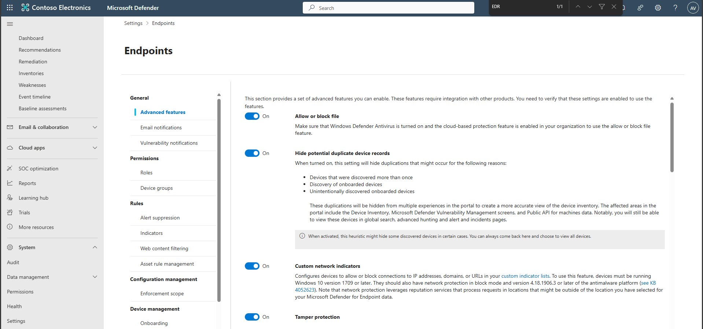
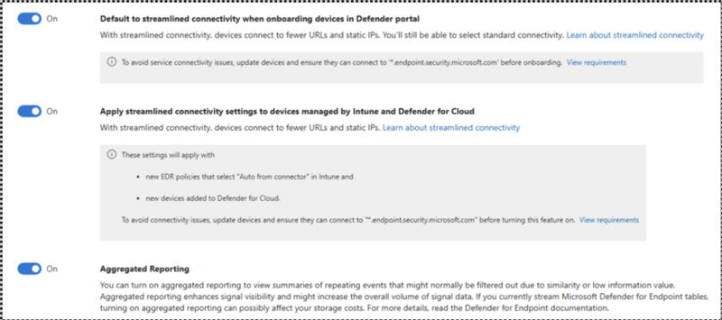
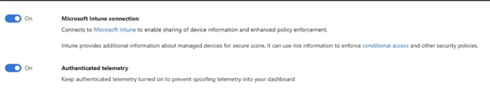
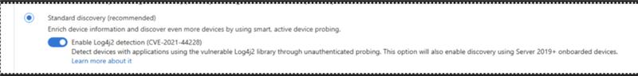

## Task 01: Enable Microsoft Defender for Endpoint (MDE) advanced features

1. If necessary, open a browser, go to +++security.microsoft.com+++ and sign in with your credentials.  

1. In the leftmost pane, select **System** > **Settings**.

1. Select **Endpoints** and then select **Advanced features**.  
     

1. Turn on the following advanced features (Microsoft recommended defaults).

    

    
Expand here for which features to enable and why

    | Setting | Purpose (why enable) |
    |:--------|:----------------------|
    | **Enable EDR in block Mode**      (Applies to Windows only)    | [Endpoint detection and response](https://learn.microsoft.com/en-us/defender-endpoint/overview-endpoint-detection-response "Endpoint detection and response") (EDR) in block mode provides added protection from malicious artifacts when Microsoft Defender Antivirus is not the primary antivirus product and is running in passive mode. EDR in block mode is available in Defender for Endpoint Plan 2.                        |
    | **Allow or block file** | File blocking is only available if your organization fulfils these requirements: *Uses Microsoft Defender Antivirus as the active antimalware solution.* *The cloud-based protection feature is enabled.* This feature enables you to block potentially malicious files in your network. Blocking a file will prevent it from being read, written, or executed on devices in your organization.   |
    | **Hide potential duplicate device records** | Suppresses duplicates because of device re-imaging/re-onboarding to keep device inventory in Defender portal clean and Exposure/Secure Score accurate. |
    | **Custom network indicators** | Allows blocking/allowing IPs, URLs, and domains tenant-wide to rapidly enforce indicators of compromise found in threat intelligence sources.  |
    ||
    | **Tamper protection** | Prevents attempts (malware or misuse) to disable Defender protections; improves ransomware resistance. |
    | **Microsoft Defender for Cloud Apps (integration)** | Sends endpoint application usage signals to Defender for Cloud Apps for discovery, governance, and risk scoring. |
    | **Web content filtering** | Block access to websites containing unwanted content and tracks web activity across all domains.  Requires network protection in block mode. |
    | **Default to streamlined devices when onboarding devices** | Uses consolidated endpoints ( *.endpoint.security.microsoft.com or approved static ranges) to simplify your organization’s firewall egress rules and MDE onboarding. |
    | **Apply streamlined connectivity to Intune/Defender for Cloud-managed devices** | Extends simplified egress to MDM/Defender for Cloud paths for consistency. |
    | **Aggregated reporting** | Aggregated reporting addresses existing constraints on event reporting in Microsoft Defender for Endpoint by extending signal reporting intervals (1 hour) to significantly reduce the size of reported events whilst preserving essential event properties.  When aggregated reporting is turned on, you can query for a summary of all supported event types, including low-efficacy telemetry, that you can use for investigation and hunting activities.  |
    |  |
    | **Microsoft Intune connection**  | Connects to [Microsoft Intune](https://go.microsoft.com/fwlink/?linkid=866571 "Microsoft Intune") to enable sharing of device information and enhanced policy enforcement. Intune provides additional information about managed devices for secure score. It can use risk information to enforce [conditional access](https://go.microsoft.com/fwlink/?linkid=866572 "conditional access") and other security policies.  |
    
    {: .note }
    > Turning on aggregated reporting improves signal visibility, which might incur higher storage costs if you are streaming Defender for Endpoint advanced hunting tables to your SIEM or storage solutions

    {: .note }
    > If a toggle isn't available in your tenant/SKU, proceed with the rest and continue the exercise.

    

1. Select **Save preferences**.

    

1. If necessary, open a browser, go to [MD Defender](https://security.microsoft.com) and sign in with your credentials. 

1. In the leftmost pane, select **System** > **Settings**. 

1. Select **Device discovery**.

    > **Device discovery (Standard mode)**: Finds unmanaged devices using onboarded endpoints as sensors to reveal observability blind spots.
    >
    > 