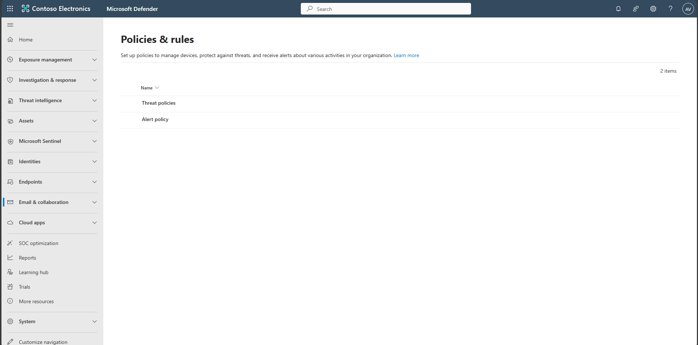

## Task 02: Configure Microsoft Defender for Office 365 Safe Links and Safe Attachments

Protect users from malicious email links and attachments by enabling preset security policies in Microsoft Defender for Office 365.

1. In the leftmost pane, select **Email & collaboration** > **Policies & rules**. 

    

1. Select **Threat policies**.

1. Select **Preset Security Policies**.

    

1. Under **Standard protection**, select **Manage protection settings** to start the wizard.

    

    

    
Expand here to configure Safe Links and Safe Attachments

    - On the **Exchange Online Protection** page, select **All recipients**, then select **Next**.  
      
      

    - On the **Defender for Office 365 Protection** page, select **All recipients**, then select **Next**.  
      
      

      {: .note }
      > The assignments above create or update Safe Links and Safe Attachments policies for everyone in the organization.

    - On the **Impersonation Protection** page, select **Next**.

      
    
    - Optionally add VIP mailboxes, domains, and trusted senders, then select **Next**.  
      
      

        
    
      

    - On the **Policy mode** page, select **Turn on the policy when finished** and select **Next**.

      

    - Select **Confirm** to submit and then select **Done**.  
      
      

    
