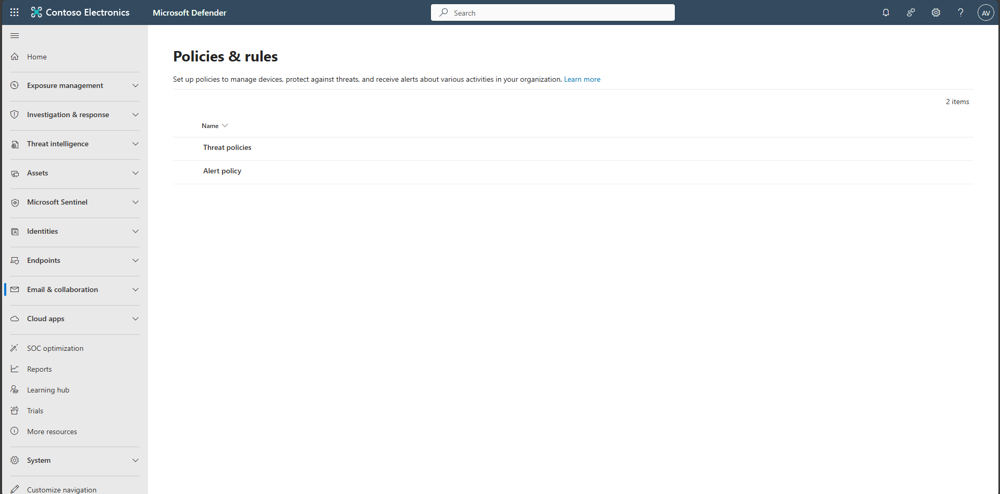
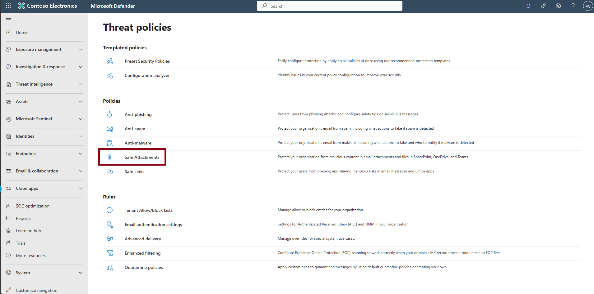
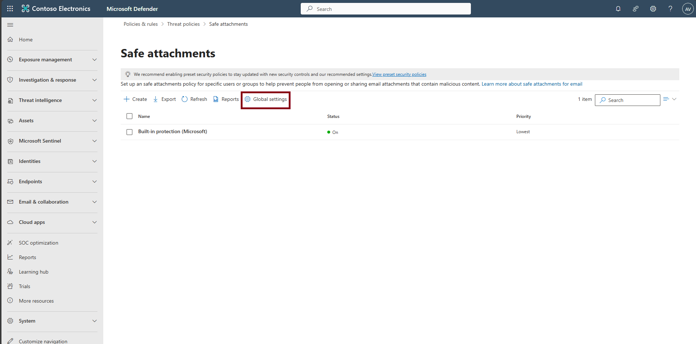
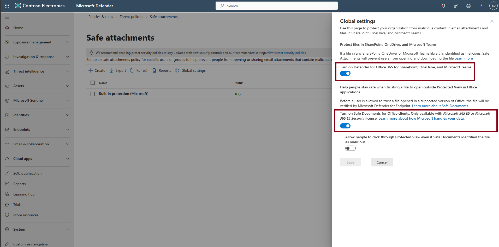
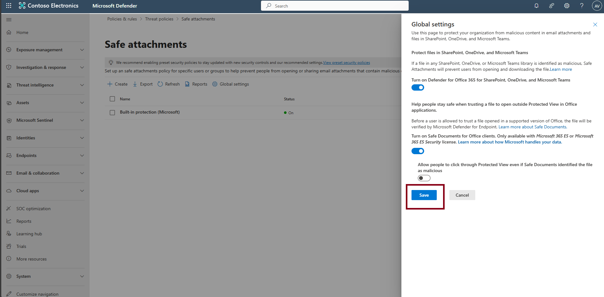

## Task 03: Configure Microsoft Defender Safe Attachments

Enable Safe Attachments to scan and detonate email and collaboration-file attachments in a secure sandbox, blocking malicious content before it reaches users.

1. In the leftmost pane, select **Email & collaboration** > **Policies & rules** > **Threat policies**.

    

1. Select **Safe Attachments**.

    

1. Select **Global settings**.

    

1. Ensure the following options are enabled: 

      - **Defender for Office 365 for SharePoint, OneDrive, and Microsoft Teams**  
      - **Safe Documents for Office clients**  
      
    

1. If necessary, select **Save**.  
      
    

    {: .note }
    > Confirm Safe Attachments is active. It detonates attachments at delivery time to detect and block malicious files across Exchange, SharePoint, OneDrive, and Teams.