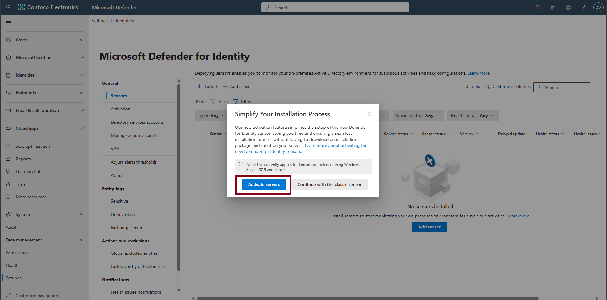
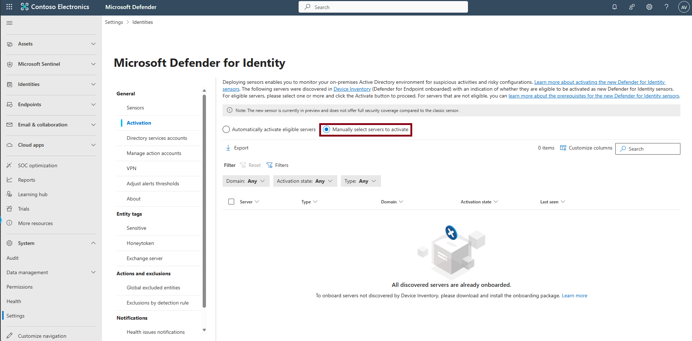

## Task 04: Apply risk-based identities in Microsoft Entra aligned with Zero Trust and configure Microsoft Defender for Identity to stream risk signals into XDR

{: .note }
> No on-premises Domain Controllers were onboarded as part of this lab, the following steps apply only if a Domain Controller is available. In such cases, proceed with these instructions to deploy Microsoft Defender for Identity sensors for hybrid identity monitoring.

Align identities with Zero Trust principles by applying risk-based identity protection in Microsoft Entra. Stream identity risk signals into XDR by deploying Microsoft Defender for Identity sensors.

1. In the leftmost pane, select **System** > **Settings**.

1. Select **Identities**.

    {: .note }
    > This will take you to **General** > **Sensors**.

1. Select **Add sensor**.

1. In the **Simplify your installation process** window, select **Activate servers** to go to the Activation page.  
      
    

1. Choose **Manually select servers to activate**.

    

1. Select the Domain Controller server. Activation will push the sensor to the selected DC (no reboot required). 

1. After the green success banner appears, select **Click here to see the onboarded servers**.