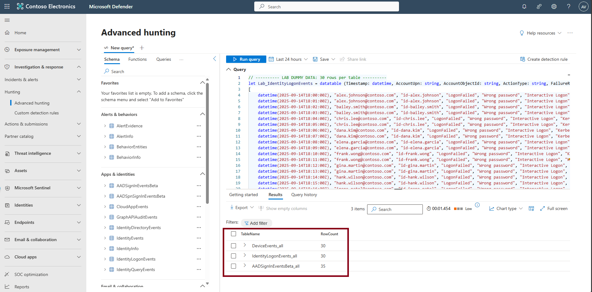

## Task 01: Load sample data

1. Return to the browser tab that is signed into Microsoft Defender.

1. In the leftmost pane, select **Investigation & response** > **Hunting** > **Advanced hunting**.  

    {: .note }
    > In the following tasks, copy/paste the provided query file contents from the code blocks into the query editor. After pasting, highlight the entire query by selecting **Ctrl+A**, then select **Run query** to review the results.  

    {: .warning }
    > You'll run into an error if you don't highlight the entire query, as it will try to run just one block of the query by default.
    
    <!-- > -->

1. Copy the following KQL into the query window, select the entire query, then select **Run query**.  

    <details markdown='block'>
    <summary>
    Expand here to copy the KQLQuery-1
    </summary>
    
    {: .note }
    > Selecting the **Copy** option in the upper-right corner of the code block and pasting with **Ctrl+V** will be significantly faster than selecting **Type**!

    ```KQLQuery-1.txt-wrap
    // ---------- DYNAMIC LAB CLOCK ----------
    let T0 = now(-45m);        // window start: 45 minutes ago
    let Window = 60m;          // 60-minute window [T0 .. T0+60m]

    // ---------- LAB DUMMY DATA: 30 rows per table (dynamic timestamps) ----------
    let Lab_IdentityLogonEvents_seed =
    datatable (OffsetM:int, AccountUpn:string, AccountObjectId:string, ActionType:string,   FailureReason:string, LogonType:string, Protocol:string, Application:string,  DeviceName:string, IPAddress:string, Location:string, ReportId:string)
    [
        // 20 failed (minute 0..19)
        0,  "AlexW@LODSM200522.OnMicrosoft.com", "id-alex.johnson", "LogonFailed",      "Wrong password", "Interactive Logon", "Kerberos", "Microsoft Teams",       "SEA-WKS-001.contoso.com", "198.51.100.23", "Seattle, United States", "9001",
        1,  "AlexW@LODSM200522.OnMicrosoft.com", "id-alex.johnson", "LogonFailed",      "Wrong password", "Interactive Logon", "Kerberos", "Microsoft Teams",       "SEA-WKS-001.contoso.com", "198.51.100.23", "Seattle, United States", "9002",
        2,  "bailey.smith@contoso.com",          "id-bailey.smith", "LogonFailed",      "Wrong password", "Interactive Logon", "Kerberos", "Microsoft Teams",       "SEA-WKS-002.contoso.com", "198.51.100.23", "Seattle, United States", "9003",
        3,  "bailey.smith@contoso.com",          "id-bailey.smith", "LogonFailed",      "Wrong password", "Interactive Logon", "Kerberos", "Microsoft Teams",       "SEA-WKS-002.contoso.com", "198.51.100.23", "Seattle, United States", "9004",
        4,  "chris.lee@contoso.com",             "id-chris.lee",    "LogonFailed",      "Wrong password", "Interactive Logon", "Kerberos", "Microsoft Teams",       "SEA-LAP-003.contoso.com", "198.51.100.23", "Seattle, United States", "9005",
        5,  "chris.lee@contoso.com",             "id-chris.lee",    "LogonFailed",      "Wrong password", "Interactive Logon", "Kerberos", "Microsoft Teams",       "SEA-LAP-003.contoso.com", "198.51.100.23", "Seattle, United States", "9006",
        6,  "dana.kim@contoso.com",              "id-dana.kim",     "LogonFailed",      "Wrong password", "Interactive Logon", "Kerberos", "Microsoft Teams",       "SEA-WKS-001.contoso.com", "198.51.100.23", "Seattle, United States", "9007",
        7,  "dana.kim@contoso.com",              "id-dana.kim",     "LogonFailed",      "Wrong password", "Interactive Logon", "Kerberos", "Microsoft Teams",       "SEA-WKS-001.contoso.com", "198.51.100.23", "Seattle, United States", "9008",
        8,  "elena.garcia@contoso.com",          "id-elena.garcia", "LogonFailed",      "Wrong password", "Interactive Logon", "Kerberos", "Microsoft Teams",       "SEA-WKS-002.contoso.com", "198.51.100.23", "Seattle, United States", "9009",
        9,  "elena.garcia@contoso.com",          "id-elena.garcia", "LogonFailed",      "Wrong password", "Interactive Logon", "Kerberos", "Microsoft Teams",       "SEA-WKS-002.contoso.com", "198.51.100.23", "Seattle, United States", "9010",
        10, "frank.wong@contoso.com",            "id-frank.wong",   "LogonFailed",      "Wrong password", "Interactive Logon", "Kerberos", "Microsoft Teams",       "SEA-LAP-003.contoso.com", "198.51.100.23", "Seattle, United States", "9011",
        11, "frank.wong@contoso.com",            "id-frank.wong",   "LogonFailed",      "Wrong password", "Interactive Logon", "Kerberos", "Microsoft Teams",       "SEA-LAP-003.contoso.com", "198.51.100.23", "Seattle, United States", "9012",
        12, "gina.martin@contoso.com",           "id-gina.martin",  "LogonFailed",      "Wrong password", "Interactive Logon", "Kerberos", "Microsoft Teams",       "SEA-WKS-001.contoso.com", "198.51.100.23", "Seattle, United States", "9013",
        13, "gina.martin@contoso.com",           "id-gina.martin",  "LogonFailed",      "Wrong password", "Interactive Logon", "Kerberos", "Microsoft Teams",       "SEA-WKS-001.contoso.com", "198.51.100.23", "Seattle, United States", "9014",
        14, "hank.wilson@contoso.com",           "id-hank.wilson",  "LogonFailed",      "Wrong password", "Interactive Logon", "Kerberos", "Microsoft Teams",       "SEA-WKS-002.contoso.com", "198.51.100.23", "Seattle, United States", "9015",
        15, "hank.wilson@contoso.com",           "id-hank.wilson",  "LogonFailed",      "Wrong password", "Interactive Logon", "Kerberos", "Microsoft Teams",       "SEA-WKS-002.contoso.com", "198.51.100.23", "Seattle, United States", "9016",
        16, "irene.patel@contoso.com",           "id-irene.patel",  "LogonFailed",      "Wrong password", "Interactive Logon", "Kerberos", "Microsoft Teams",       "SEA-LAP-003.contoso.com", "198.51.100.23", "Seattle, United States", "9017",
        17, "irene.patel@contoso.com",           "id-irene.patel",  "LogonFailed",      "Wrong password", "Interactive Logon", "Kerberos", "Microsoft Teams",       "SEA-LAP-003.contoso.com", "198.51.100.23", "Seattle, United States", "9018",
        18, "jason.ng@contoso.com",              "id-jason.ng",     "LogonFailed",      "Wrong password", "Interactive Logon", "Kerberos", "Microsoft Teams",       "SEA-WKS-001.contoso.com", "198.51.100.23", "Seattle, United States", "9019",
        19, "jason.ng@contoso.com",              "id-jason.ng",     "LogonFailed",      "Wrong password", "Interactive Logon", "Kerberos", "Microsoft Teams",       "SEA-WKS-001.contoso.com", "198.51.100.23", "Seattle, United States", "9020",
        // 10 benign successes (minute 30..39)
        30, "user1@contoso.com",                 "id-user1",        "LogonSuccess", "",                "Interactive Logon", "Kerberos", "SharePoint Online",  "SEA-WKS-001.contoso.com", "203.0.113.10", "Seattle, United States", "9021",
        31, "user2@contoso.com",                 "id-user2",        "LogonSuccess", "",                "Interactive Logon", "Kerberos", "SharePoint Online",  "SEA-WKS-002.contoso.com", "203.0.113.10", "Seattle, United States", "9022",
        32, "user3@contoso.com",                 "id-user3",        "LogonSuccess", "",                "Interactive Logon", "Kerberos", "SharePoint Online",  "SEA-LAP-003.contoso.com", "203.0.113.10", "Seattle, United States", "9023",
        33, "user4@contoso.com",                 "id-user4",        "LogonSuccess", "",                "Interactive Logon", "Kerberos", "SharePoint Online",  "SEA-WKS-001.contoso.com", "203.0.113.10", "Seattle, United States", "9024",
        34, "user5@contoso.com",                 "id-user5",        "LogonSuccess", "",                "Interactive Logon", "Kerberos", "SharePoint Online",  "SEA-WKS-002.contoso.com", "203.0.113.10", "Seattle, United States", "9025",
        35, "user6@contoso.com",                 "id-user6",        "LogonSuccess", "",                "Interactive Logon", "Kerberos", "SharePoint Online",  "SEA-LAP-003.contoso.com", "203.0.113.10", "Seattle, United States", "9026",
        36, "user7@contoso.com",                 "id-user7",        "LogonSuccess", "",                "Interactive Logon", "Kerberos", "SharePoint Online",  "SEA-WKS-001.contoso.com", "203.0.113.10", "Seattle, United States", "9027",
        37, "user8@contoso.com",                 "id-user8",        "LogonSuccess", "",                "Interactive Logon", "Kerberos", "SharePoint Online",  "SEA-WKS-002.contoso.com", "203.0.113.10", "Seattle, United States", "9028",
        38, "user9@contoso.com",                 "id-user9",        "LogonSuccess", "",                "Interactive Logon", "Kerberos", "SharePoint Online",  "SEA-LAP-003.contoso.com", "203.0.113.10", "Seattle, United States", "9029",
        39, "user10@contoso.com",                "id-user10",       "LogonSuccess", "",                "Interactive Logon", "Kerberos", "SharePoint Online",  "SEA-WKS-001.contoso.com", "203.0.113.10", "Seattle, United States", "9030"
    ];
    let Lab_IdentityLogonEvents =
        Lab_IdentityLogonEvents_seed
        | extend Timestamp = T0 + totimespan(OffsetM*1m)
        | project Timestamp, AccountUpn, AccountObjectId, ActionType, FailureReason,    LogonType, Protocol, Application, DeviceName, IPAddress, Location, ReportId;

    let Lab_AADSignInEventsBeta_seed =
    datatable (OffsetM:int, Application:string, ApplicationId:string, LogonType:string,     ErrorCode:int, AccountUpn:string, AccountObjectId:string, DeviceName:string,    OSPlatform:string, AuthenticationRequirement:string, RiskLevelAggregated:int,  UserAgent:string, ClientAppUsed:string, Browser:string, IPAddress:string,    Country:string, State:string, City:string, ReportId:string)
    [
        // 20 failures (minute 1..20)
        1,  "Office 365 Exchange Online", "00000002-0000-0ff1-ce00-000000000000",   "interactive", 50126, "AlexW@LODSM200522.OnMicrosoft.com", "id-alex.johnson",     "SEA-WKS-001.contoso.com", "Windows 11", "singleFactorAuthentication", 50,  "Mozilla/5.0 (Windows NT 10.0; Win64; x64) AppleWebKit/537.36 Edge/120.0", "Browser",    "Edge", "198.51.100.23", "US", "WA", "Seattle", "9101",
        2,  "Office 365 Exchange Online", "00000002-0000-0ff1-ce00-000000000000",   "interactive", 50126, "AlexW@LODSM200522.OnMicrosoft.com", "id-alex.johnson",     "SEA-WKS-001.contoso.com", "Windows 11", "singleFactorAuthentication", 50,  "Mozilla/5.0 (Windows NT 10.0; Win64; x64) AppleWebKit/537.36 Edge/120.0", "Browser",    "Edge", "198.51.100.23", "US", "WA", "Seattle", "9102",
        3,  "Office 365 Exchange Online", "00000002-0000-0ff1-ce00-000000000000",   "interactive", 50126, "bailey.smith@contoso.com",          "id-bailey.smith",     "SEA-WKS-002.contoso.com", "Windows 11", "singleFactorAuthentication", 50,  "Mozilla/5.0 (Windows NT 10.0; Win64; x64) AppleWebKit/537.36 Edge/120.0", "Browser",    "Edge", "198.51.100.23", "US", "WA", "Seattle", "9103",
        4,  "Office 365 Exchange Online", "00000002-0000-0ff1-ce00-000000000000",   "interactive", 50126, "bailey.smith@contoso.com",          "id-bailey.smith",     "SEA-WKS-002.contoso.com", "Windows 11", "singleFactorAuthentication", 50,  "Mozilla/5.0 (Windows NT 10.0; Win64; x64) AppleWebKit/537.36 Edge/120.0", "Browser",    "Edge", "198.51.100.23", "US", "WA", "Seattle", "9104",
        5,  "Office 365 Exchange Online", "00000002-0000-0ff1-ce00-000000000000",   "interactive", 50126, "chris.lee@contoso.com",             "id-chris.lee",        "SEA-LAP-003.contoso.com", "Windows 11", "singleFactorAuthentication", 50,  "Mozilla/5.0 (Windows NT 10.0; Win64; x64) AppleWebKit/537.36 Edge/120.0", "Browser",    "Edge", "198.51.100.23", "US", "WA", "Seattle", "9105",
        6,  "Office 365 Exchange Online", "00000002-0000-0ff1-ce00-000000000000",   "interactive", 50126, "chris.lee@contoso.com",             "id-chris.lee",        "SEA-LAP-003.contoso.com", "Windows 11", "singleFactorAuthentication", 50,  "Mozilla/5.0 (Windows NT 10.0; Win64; x64) AppleWebKit/537.36 Edge/120.0", "Browser",    "Edge", "198.51.100.23", "US", "WA", "Seattle", "9106",
        7,  "Office 365 Exchange Online", "00000002-0000-0ff1-ce00-000000000000",   "interactive", 50126, "dana.kim@contoso.com",              "id-dana.kim",         "SEA-WKS-001.contoso.com", "Windows 11", "singleFactorAuthentication", 50,  "Mozilla/5.0 (Windows NT 10.0; Win64; x64) AppleWebKit/537.36 Edge/120.0", "Browser",    "Edge", "198.51.100.23", "US", "WA", "Seattle", "9107",
        8,  "Office 365 Exchange Online", "00000002-0000-0ff1-ce00-000000000000",   "interactive", 50126, "dana.kim@contoso.com",              "id-dana.kim",         "SEA-WKS-001.contoso.com", "Windows 11", "singleFactorAuthentication", 50,  "Mozilla/5.0 (Windows NT 10.0; Win64; x64) AppleWebKit/537.36 Edge/120.0", "Browser",    "Edge", "198.51.100.23", "US", "WA", "Seattle", "9108",
        9,  "Office 365 Exchange Online", "00000002-0000-0ff1-ce00-000000000000",   "interactive", 50126, "elena.garcia@contoso.com",          "id-elena.garcia",     "SEA-WKS-002.contoso.com", "Windows 11", "singleFactorAuthentication", 50,  "Mozilla/5.0 (Windows NT 10.0; Win64; x64) AppleWebKit/537.36 Edge/120.0", "Browser",    "Edge", "198.51.100.23", "US", "WA", "Seattle", "9109",
        10, "Office 365 Exchange Online", "00000002-0000-0ff1-ce00-000000000000",   "interactive", 50126, "elena.garcia@contoso.com",          "id-elena.garcia",     "SEA-WKS-002.contoso.com", "Windows 11", "singleFactorAuthentication", 50,  "Mozilla/5.0 (Windows NT 10.0; Win64; x64) AppleWebKit/537.36 Edge/120.0", "Browser",    "Edge", "198.51.100.23", "US", "WA", "Seattle", "9110",
        11, "Office 365 Exchange Online", "00000002-0000-0ff1-ce00-000000000000",   "interactive", 50126, "frank.wong@contoso.com",            "id-frank.wong",       "SEA-LAP-003.contoso.com", "Windows 11", "singleFactorAuthentication", 50,  "Mozilla/5.0 (Windows NT 10.0; Win64; x64) AppleWebKit/537.36 Edge/120.0", "Browser",    "Edge", "198.51.100.23", "US", "WA", "Seattle", "9111",
        12, "Office 365 Exchange Online", "00000002-0000-0ff1-ce00-000000000000",   "interactive", 50126, "frank.wong@contoso.com",            "id-frank.wong",       "SEA-LAP-003.contoso.com", "Windows 11", "singleFactorAuthentication", 50,  "Mozilla/5.0 (Windows NT 10.0; Win64; x64) AppleWebKit/537.36 Edge/120.0", "Browser",    "Edge", "198.51.100.23", "US", "WA", "Seattle", "9112",
        13, "Office 365 Exchange Online", "00000002-0000-0ff1-ce00-000000000000",   "interactive", 50126, "gina.martin@contoso.com",           "id-gina.martin",      "SEA-WKS-001.contoso.com", "Windows 11", "singleFactorAuthentication", 50,  "Mozilla/5.0 (Windows NT 10.0; Win64; x64) AppleWebKit/537.36 Edge/120.0", "Browser",    "Edge", "198.51.100.23", "US", "WA", "Seattle", "9113",
        14, "Office 365 Exchange Online", "00000002-0000-0ff1-ce00-000000000000",   "interactive", 50126, "gina.martin@contoso.com",           "id-gina.martin",      "SEA-WKS-001.contoso.com", "Windows 11", "singleFactorAuthentication", 50,  "Mozilla/5.0 (Windows NT 10.0; Win64; x64) AppleWebKit/537.36 Edge/120.0", "Browser",    "Edge", "198.51.100.23", "US", "WA", "Seattle", "9114",
        15, "Office 365 Exchange Online", "00000002-0000-0ff1-ce00-000000000000",   "interactive", 50126, "hank.wilson@contoso.com",           "id-hank.wilson",      "SEA-WKS-002.contoso.com", "Windows 11", "singleFactorAuthentication", 50,  "Mozilla/5.0 (Windows NT 10.0; Win64; x64) AppleWebKit/537.36 Edge/120.0", "Browser",    "Edge", "198.51.100.23", "US", "WA", "Seattle", "9115",
        16, "Office 365 Exchange Online", "00000002-0000-0ff1-ce00-000000000000",   "interactive", 50126, "hank.wilson@contoso.com",           "id-hank.wilson",      "SEA-WKS-002.contoso.com", "Windows 11", "singleFactorAuthentication", 50,  "Mozilla/5.0 (Windows NT 10.0; Win64; x64) AppleWebKit/537.36 Edge/120.0", "Browser",    "Edge", "198.51.100.23", "US", "WA", "Seattle", "9116",
        17, "Office 365 Exchange Online", "00000002-0000-0ff1-ce00-000000000000",   "interactive", 50126, "irene.patel@contoso.com",           "id-irene.patel",      "SEA-LAP-003.contoso.com", "Windows 11", "singleFactorAuthentication", 50,  "Mozilla/5.0 (Windows NT 10.0; Win64; x64) AppleWebKit/537.36 Edge/120.0", "Browser",    "Edge", "198.51.100.23", "US", "WA", "Seattle", "9117",
        18, "Office 365 Exchange Online", "00000002-0000-0ff1-ce00-000000000000",   "interactive", 50126, "irene.patel@contoso.com",           "id-irene.patel",      "SEA-LAP-003.contoso.com", "Windows 11", "singleFactorAuthentication", 50,  "Mozilla/5.0 (Windows NT 10.0; Win64; x64) AppleWebKit/537.36 Edge/120.0", "Browser",    "Edge", "198.51.100.23", "US", "WA", "Seattle", "9118",
        19, "Office 365 Exchange Online", "00000002-0000-0ff1-ce00-000000000000",   "interactive", 50126, "jason.ng@contoso.com",              "id-jason.ng",         "SEA-WKS-001.contoso.com", "Windows 11", "singleFactorAuthentication", 50,  "Mozilla/5.0 (Windows NT 10.0; Win64; x64) AppleWebKit/537.36 Edge/120.0", "Browser",    "Edge", "198.51.100.23", "US", "WA", "Seattle", "9119",
        20, "Office 365 Exchange Online", "00000002-0000-0ff1-ce00-000000000000",   "interactive", 50126, "jason.ng@contoso.com",              "id-jason.ng",         "SEA-WKS-001.contoso.com", "Windows 11", "singleFactorAuthentication", 50,  "Mozilla/5.0 (Windows NT 10.0; Win64; x64) AppleWebKit/537.36 Edge/120.0", "Browser",    "Edge", "198.51.100.23", "US", "WA", "Seattle", "9120",
        // 10 benign successes (minute 35..44)
        35, "Microsoft Teams",                   "1fec8e78-bce4-4aaf-ab1b-5451cc387264",    "interactive", 0, "user1@contoso.com",  "id-user1",  "SEA-WKS-001.contoso.com",    "Windows 11", "multiFactorAuthentication", 1, "Mozilla/5.0 (Windows NT 10.0; Win64;    x64) AppleWebKit/537.36 Edge/120.0", "Browser", "Edge", "203.0.113.10", "US", "WA",    "Seattle", "9121",
        36, "Microsoft Teams",                   "1fec8e78-bce4-4aaf-ab1b-5451cc387264",    "interactive", 0, "user2@contoso.com",  "id-user2",  "SEA-WKS-002.contoso.com",    "Windows 11", "multiFactorAuthentication", 1, "Mozilla/5.0 (Windows NT 10.0; Win64;    x64) AppleWebKit/537.36 Edge/120.0", "Browser", "Edge", "203.0.113.10", "US", "WA",    "Seattle", "9122",
        37, "Microsoft Teams",                   "1fec8e78-bce4-4aaf-ab1b-5451cc387264",    "interactive", 0, "user3@contoso.com",  "id-user3",  "SEA-LAP-003.contoso.com",    "Windows 11", "multiFactorAuthentication", 1, "Mozilla/5.0 (Windows NT 10.0; Win64;    x64) AppleWebKit/537.36 Edge/120.0", "Browser", "Edge", "203.0.113.10", "US", "WA",    "Seattle", "9123",
        38, "Microsoft Teams",                   "1fec8e78-bce4-4aaf-ab1b-5451cc387264",    "interactive", 0, "user4@contoso.com",  "id-user4",  "SEA-WKS-001.contoso.com",    "Windows 11", "multiFactorAuthentication", 1, "Mozilla/5.0 (Windows NT 10.0; Win64;    x64) AppleWebKit/537.36 Edge/120.0", "Browser", "Edge", "203.0.113.10", "US", "WA",    "Seattle", "9124",
        39, "Microsoft Teams",                   "1fec8e78-bce4-4aaf-ab1b-5451cc387264",    "interactive", 0, "user5@contoso.com",  "id-user5",  "SEA-WKS-002.contoso.com",    "Windows 11", "multiFactorAuthentication", 1, "Mozilla/5.0 (Windows NT 10.0; Win64;    x64) AppleWebKit/537.36 Edge/120.0", "Browser", "Edge", "203.0.113.10", "US", "WA",    "Seattle", "9125",
        40, "Microsoft Teams",                   "1fec8e78-bce4-4aaf-ab1b-5451cc387264",    "interactive", 0, "user6@contoso.com",  "id-user6",  "SEA-LAP-003.contoso.com",    "Windows 11", "multiFactorAuthentication", 1, "Mozilla/5.0 (Windows NT 10.0; Win64;    x64) AppleWebKit/537.36 Edge/120.0", "Browser", "Edge", "203.0.113.10", "US", "WA",    "Seattle", "9126",
        41, "Microsoft Teams",                   "1fec8e78-bce4-4aaf-ab1b-5451cc387264",    "interactive", 0, "user7@contoso.com",  "id-user7",  "SEA-WKS-001.contoso.com",    "Windows 11", "multiFactorAuthentication", 1, "Mozilla/5.0 (Windows NT 10.0; Win64;    x64) AppleWebKit/537.36 Edge/120.0", "Browser", "Edge", "203.0.113.10", "US", "WA",    "Seattle", "9127",
        42, "Microsoft Teams",                   "1fec8e78-bce4-4aaf-ab1b-5451cc387264",    "interactive", 0, "user8@contoso.com",  "id-user8",  "SEA-WKS-002.contoso.com",    "Windows 11", "multiFactorAuthentication", 1, "Mozilla/5.0 (Windows NT 10.0; Win64;    x64) AppleWebKit/537.36 Edge/120.0", "Browser", "Edge", "203.0.113.10", "US", "WA",    "Seattle", "9128",
        43, "Microsoft Teams",                   "1fec8e78-bce4-4aaf-ab1b-5451cc387264",    "interactive", 0, "user9@contoso.com",  "id-user9",  "SEA-LAP-003.contoso.com",    "Windows 11", "multiFactorAuthentication", 1, "Mozilla/5.0 (Windows NT 10.0; Win64;    x64) AppleWebKit/537.36 Edge/120.0", "Browser", "Edge", "203.0.113.10", "US", "WA",    "Seattle", "9129",
        44, "Microsoft Teams",                   "1fec8e78-bce4-4aaf-ab1b-5451cc387264",    "interactive", 0, "user10@contoso.com", "id-user10", "SEA-WKS-001.contoso.com",    "Windows 11", "multiFactorAuthentication", 1, "Mozilla/5.0 (Windows NT 10.0; Win64;    x64) AppleWebKit/537.36 Edge/120.0", "Browser", "Edge", "203.0.113.10", "US", "WA",    "Seattle", "9130"
    ];
    let Lab_AADSignInEventsBeta =
        Lab_AADSignInEventsBeta_seed
        | extend Timestamp = T0 + totimespan(OffsetM*1m)
        | project Timestamp, Application, ApplicationId, LogonType, ErrorCode, AccountUpn,   AccountObjectId, DeviceName, OSPlatform, AuthenticationRequirement,  RiskLevelAggregated, UserAgent, ClientAppUsed, Browser, IPAddress, Country, State,   City, ReportId;

    let Lab_DeviceEvents_seed =
    datatable (OffsetM:int, DeviceName:string, ActionType:string, AccountName:string,   ReportId:long, RemoteIP:string, LocalIP:string)
    [
        // 10 detections (minute 5..14)
        5,  "SEA-WKS-001.contoso.com", "AntivirusDetection",        "alex.johnson", 9001,   "198.51.100.23", "10.0.0.10",
        6,  "SEA-WKS-002.contoso.com", "AntivirusDetection",        "bailey.smith", 9002,   "198.51.100.23", "10.0.0.11",
        7,  "SEA-LAP-003.contoso.com", "AntivirusDetection",        "chris.lee",    9003,   "198.51.100.23", "10.0.0.12",
        8,  "SEA-WKS-001.contoso.com", "AntivirusDetection",        "dana.kim",     9004,   "198.51.100.23", "10.0.0.13",
        9,  "SEA-WKS-002.contoso.com", "AntivirusDetection",        "elena.garcia", 9005,   "198.51.100.23", "10.0.0.14",
        10, "SEA-LAP-003.contoso.com", "AntivirusDetection",        "frank.wong",   9006,   "198.51.100.23", "10.0.0.15",
        11, "SEA-WKS-001.contoso.com", "AntivirusDetection",        "gina.martin",  9007,   "198.51.100.23", "10.0.0.16",
        12, "SEA-WKS-002.contoso.com", "AntivirusDetection",        "hank.wilson",  9008,   "198.51.100.23", "10.0.0.17",
        13, "SEA-LAP-003.contoso.com", "AntivirusDetection",        "irene.patel",  9009,   "198.51.100.23", "10.0.0.18",
        14, "SEA-WKS-001.contoso.com", "AntivirusDetection",        "jason.ng",     9010,   "198.51.100.23", "10.0.0.19",
        // 20 benign signature updates (minute 40..59)
        40, "SEA-WKS-001.contoso.com", "AntivirusSignatureUpdated", "user1",        9101,   "203.0.113.10", "10.0.1.10",
        41, "SEA-WKS-002.contoso.com", "AntivirusSignatureUpdated", "user2",        9102,   "203.0.113.10", "10.0.1.11",
        42, "SEA-LAP-003.contoso.com", "AntivirusSignatureUpdated", "user3",        9103,   "203.0.113.10", "10.0.1.12",
        43, "SEA-WKS-001.contoso.com", "AntivirusSignatureUpdated", "user4",        9104,   "203.0.113.10", "10.0.1.13",
        44, "SEA-WKS-002.contoso.com", "AntivirusSignatureUpdated", "user5",        9105,   "203.0.113.10", "10.0.1.14",
        45, "SEA-LAP-003.contoso.com", "AntivirusSignatureUpdated", "user6",        9106,   "203.0.113.10", "10.0.1.15",
        46, "SEA-WKS-001.contoso.com", "AntivirusSignatureUpdated", "user7",        9107,   "203.0.113.10", "10.0.1.16",
        47, "SEA-WKS-002.contoso.com", "AntivirusSignatureUpdated", "user8",        9108,   "203.0.113.10", "10.0.1.17",
        48, "SEA-LAP-003.contoso.com", "AntivirusSignatureUpdated", "user9",        9109,   "203.0.113.10", "10.0.1.18",
        49, "SEA-WKS-001.contoso.com", "AntivirusSignatureUpdated", "user10",       9110,   "203.0.113.10", "10.0.1.19",
        50, "SEA-WKS-001.contoso.com", "AntivirusSignatureUpdated", "user1",        9111,   "203.0.113.10", "10.0.1.20",
        51, "SEA-WKS-002.contoso.com", "AntivirusSignatureUpdated", "user2",        9112,   "203.0.113.10", "10.0.1.21",
        52, "SEA-LAP-003.contoso.com", "AntivirusSignatureUpdated", "user3",        9113,   "203.0.113.10", "10.0.1.22",
        53, "SEA-WKS-001.contoso.com", "AntivirusSignatureUpdated", "user4",        9114,   "203.0.113.10", "10.0.1.23",
        54, "SEA-WKS-002.contoso.com", "AntivirusSignatureUpdated", "user5",        9115,   "203.0.113.10", "10.0.1.24",
        55, "SEA-LAP-003.contoso.com", "AntivirusSignatureUpdated", "user6",        9116,   "203.0.113.10", "10.0.1.25",
        56, "SEA-WKS-001.contoso.com", "AntivirusSignatureUpdated", "user7",        9117,   "203.0.113.10", "10.0.1.26",
        57, "SEA-WKS-002.contoso.com", "AntivirusSignatureUpdated", "user8",        9118,   "203.0.113.10", "10.0.1.27",
        58, "SEA-LAP-003.contoso.com", "AntivirusSignatureUpdated", "user9",        9119,   "203.0.113.10", "10.0.1.28",
        59, "SEA-WKS-001.contoso.com", "AntivirusSignatureUpdated", "user10",       9120,   "203.0.113.10", "10.0.1.29"
    ];
    let Lab_DeviceEvents =
        Lab_DeviceEvents_seed
        | extend Timestamp = T0 + totimespan(OffsetM*1m)
        | project Timestamp, DeviceName, ActionType, AccountName, ReportId, RemoteIP,   LocalIP;

    // ---------- FRIENDLY UNIONS (use these in all queries) ----------
    let IdentityLogonEvents_all = union isfuzzy=true IdentityLogonEvents,   Lab_IdentityLogonEvents;
    let AADSignInEventsBeta_all = union isfuzzy=true AADSignInEventsBeta,   Lab_AADSignInEventsBeta;
    let DeviceEvents_all        = union isfuzzy=true DeviceEvents, Lab_DeviceEvents;

    // ---------- DYNAMIC WINDOW FILTER + COUNTS ----------
    let t1 = IdentityLogonEvents_all
    | where Timestamp between (T0 .. T0 + Window)
    | summarize RowCount = count()
    | extend TableName = "IdentityLogonEvents_all";

    let t2 = AADSignInEventsBeta_all
    | where Timestamp between (T0 .. T0 + Window)
    | summarize RowCount = count()
    | extend TableName = "AADSignInEventsBeta_all";

    let t3 = DeviceEvents_all
    | where Timestamp between (T0 .. T0 + Window)
    | summarize RowCount = count()
    | extend TableName = "DeviceEvents_all";

    union t1, t2, t3
    | project TableName, RowCount
    ```
    </details>

    {: .note }
    > The KQL uses demo **Lab_tables** to simulate telemetry, not your production logs. We populate the Lab_IdentityLogonEvents, Lab_AADSignInEventsBeta, and Lab_DeviceEvents with realistic fields and timestamps generated relative to now() so the scenarios always produce results. To run against real data, replace the Lab_* references (currently pointing at the lab tables) with your actual tables.



{: .note }
> The query will show row counts for **DeviceEvents_all**, **IdentityLogonEvents_all**, and **AADSignInEventsBeta_all** for the given timestamp range.