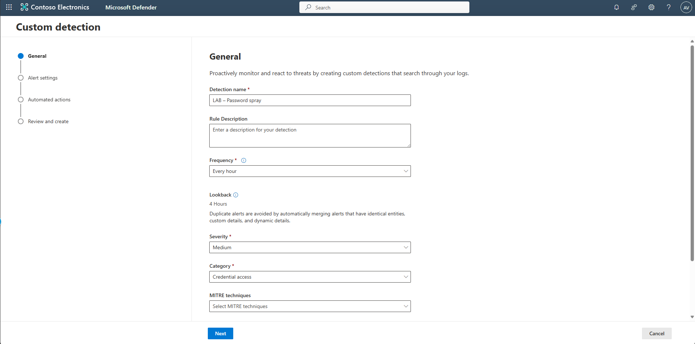

## Task 03: Create a custom detection rule

1. Clear the query editor.


1. Copy the following into the query window, select the entire query, then select **Run query**.  

    <details markdown='block'>
    <summary>
    Expand here to copy the KQLQuery-3
    </summary>

    {: .note }
    > Selecting the **Copy** option in the upper-right corner of the code block  and pasting with **Ctrl+V** will be significantly faster than selecting **Type**!
    
    ```KQLQuery-3.txt-wrap
    // Password spray detector (built-in tables only)
    let Start = ago(60m);
    let FailAad =
        AADSignInEventsBeta
        | where Timestamp between (Start .. now())
        | where ErrorCode != 0
        | extend ReportId = coalesce(
            tolong(ReportId),
            abs(tolong(hash(strcat(AccountUpn, IPAddress, tostring(Timestamp)))))
          )
        | project Timestamp, IPAddress, AccountUpn, ReportId, SrcTable="AAD";
    let FailId =
        IdentityLogonEvents
        | where Timestamp between (Start .. now())
        | where ActionType =~ "LogonFailed" or isempty(FailureReason)==false
        | extend ReportId = coalesce(
            tolong(ReportId),
            abs(tolong(hash(strcat(AccountUpn, IPAddress, tostring(Timestamp)))))
          )
        | project Timestamp, IPAddress, AccountUpn, ReportId, SrcTable="ID";

    let Failures = union isfuzzy=true FailAad, FailId;
    // Find spray IPs (≥10 attempts across ≥5 accounts)
    let SprayIPs =
        Failures
        | summarize Attempts = count(), DistinctAccounts = dcount(AccountUpn) by IPAddress
        | where DistinctAccounts >= 5 and Attempts >= 10;

    // Final result: one row per impacted account/IP with required columns
    Failures
    | where IPAddress in (SprayIPs | project IPAddress)
    | summarize SprayAttempts = count(), LastSeen = max(Timestamp) by IPAddress, AccountUpn
    | join kind=leftouter (
        Failures
        | summarize arg_max(Timestamp, ReportId) by IPAddress, AccountUpn
    ) on IPAddress, AccountUpn
    | project Timestamp = LastSeen, IPAddress, AccountUpn, ReportId, SprayAttempts
    ```
    </details>

   

1. With results loaded, in the upper-right part of the query window, select **Create detection rule**.  

1. On the **General** page, enter the following details, then select **Next**.

    | Item | Value |
    |:---------|:---------|
    | Detection name   | **LAB - Password spray**  | 
    | Frequency   | **Every hour**  |
    | Severity | **Medium**  |
    | Category | **Credential access**  |

    

1. On the **Alert settings** page, enter the following for both **Alert title** and **Description**: 

    ```
    Password spray detected from {IPAddress} targeting multiple accounts
    ```

    

1. Under the **Entity mapping** section, configure the impacted assets and related evidence.

    

1. Select **Next** until the **Review and create** page.

1. Select **Submit**.

    