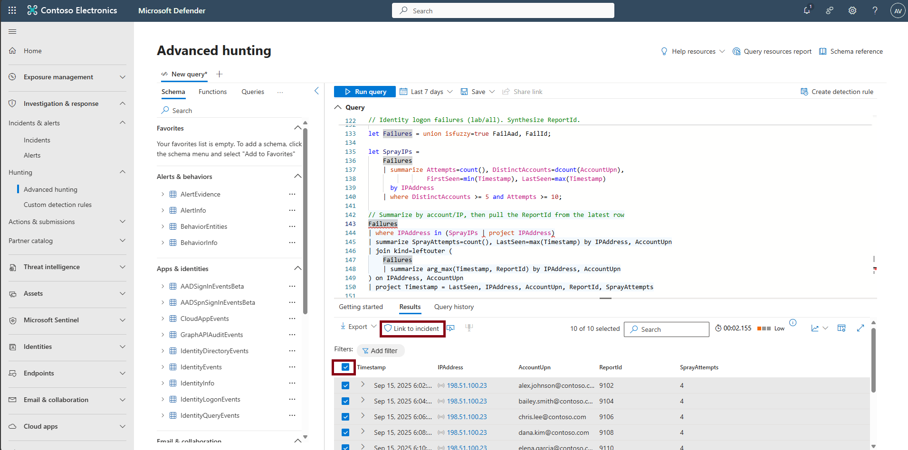
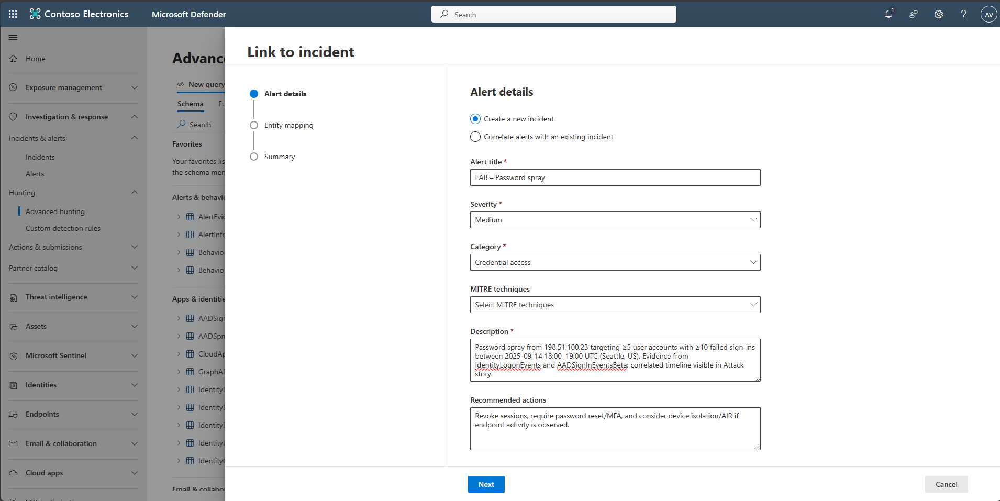
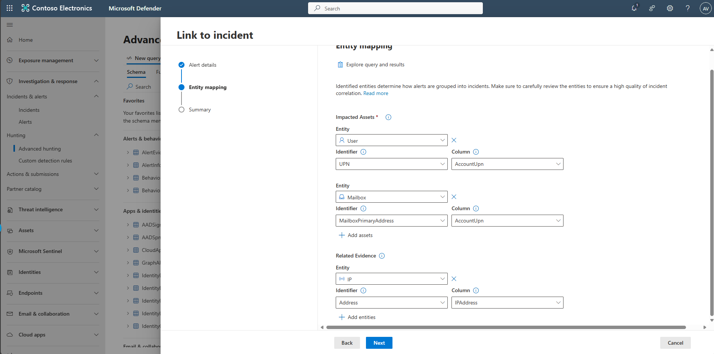
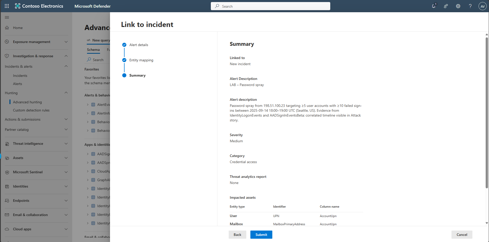
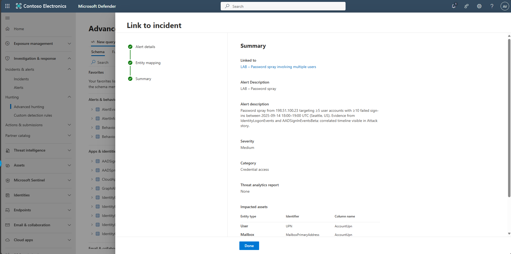

## Task 04: Create an incident

1. In the leftmost pane, select **Investigation & response** > **Hunting** > **Advanced hunting**.  

1. Copy the following KQL into the query window, select the entire query, then select **Run query**.  

    <details markdown='block'>
    <summary>
    Expand here to copy the KQLQuery-4
    </summary>
    
    {: .note }
    > Selecting the **Copy** option in the upper-right corner of the code block  and pasting with **Ctrl+V** will be significantly faster than selecting **Type**!

    ```KQLQuery-4.txt-wrap
    // ---------- LAB CLOCK: dynamic window ----------
    let T0      = now(-45m);   // window start (adjust as you like)
    let Window  = 60m;         // 60-minute window
    let Start   = T0;
    let End     = T0 + Window;

    // ---------- YOUR LAB DUMMY DATA (unchanged schemas) ----------
    let Lab_IdentityLogonEvents = datatable (Timestamp: datetime, AccountUpn: string, AccountObjectId: string, ActionType: string, FailureReason: string, LogonType:    string, Protocol: string, Application: string, DeviceName: string, IPAddress: string, Location: string, ReportId: string)
    [
        // timestamps will be overwritten dynamically below
        datetime(2000-01-01), "AlexW@LODSM200522.OnMicrosoft.com", "id-alex.johnson", "LogonFailed", "Wrong password", "Interactive Logon", "Kerberos", "Microsoft  Teams", "SEA-WKS-001.contoso.com", "198.51.100.23", "Seattle, United States", "9001",
        datetime(2000-01-01), "AlexW@LODSM200522.OnMicrosoft.com", "id-alex.johnson", "LogonFailed", "Wrong password", "Interactive Logon", "Kerberos", "Microsoft  Teams", "SEA-WKS-001.contoso.com", "198.51.100.23", "Seattle, United States", "9002",
        datetime(2000-01-01), "bailey.smith@contoso.com", "id-bailey.smith", "LogonFailed", "Wrong password", "Interactive Logon", "Kerberos", "Microsoft Teams",   "SEA-WKS-002.contoso.com", "198.51.100.23", "Seattle, United States", "9003",
        datetime(2000-01-01), "bailey.smith@contoso.com", "id-bailey.smith", "LogonFailed", "Wrong password", "Interactive Logon", "Kerberos", "Microsoft Teams",   "SEA-WKS-002.contoso.com", "198.51.100.23", "Seattle, United States", "9004",
        datetime(2000-01-01), "chris.lee@contoso.com", "id-chris.lee", "LogonFailed", "Wrong password", "Interactive Logon", "Kerberos", "Microsoft Teams",     "SEA-LAP-003.contoso.com", "198.51.100.23", "Seattle, United States", "9005",
        datetime(2000-01-01), "chris.lee@contoso.com", "id-chris.lee", "LogonFailed", "Wrong password", "Interactive Logon", "Kerberos", "Microsoft Teams",     "SEA-LAP-003.contoso.com", "198.51.100.23", "Seattle, United States", "9006",
        datetime(2000-01-01), "dana.kim@contoso.com", "id-dana.kim", "LogonFailed", "Wrong password", "Interactive Logon", "Kerberos", "Microsoft Teams",   "SEA-WKS-001.contoso.com", "198.51.100.23", "Seattle, United States", "9007",
        datetime(2000-01-01), "dana.kim@contoso.com", "id-dana.kim", "LogonFailed", "Wrong password", "Interactive Logon", "Kerberos", "Microsoft Teams",   "SEA-WKS-001.contoso.com", "198.51.100.23", "Seattle, United States", "9008",
        datetime(2000-01-01), "elena.garcia@contoso.com", "id-elena.garcia", "LogonFailed", "Wrong password", "Interactive Logon", "Kerberos", "Microsoft Teams",   "SEA-WKS-002.contoso.com", "198.51.100.23", "Seattle, United States", "9009",
        datetime(2000-01-01), "elena.garcia@contoso.com", "id-elena.garcia", "LogonFailed", "Wrong password", "Interactive Logon", "Kerberos", "Microsoft Teams",   "SEA-WKS-002.contoso.com", "198.51.100.23", "Seattle, United States", "9010",
        datetime(2000-01-01), "frank.wong@contoso.com", "id-frank.wong", "LogonFailed", "Wrong password", "Interactive Logon", "Kerberos", "Microsoft Teams",   "SEA-LAP-003.contoso.com", "198.51.100.23", "Seattle, United States", "9011",
        datetime(2000-01-01), "frank.wong@contoso.com", "id-frank.wong", "LogonFailed", "Wrong password", "Interactive Logon", "Kerberos", "Microsoft Teams",   "SEA-LAP-003.contoso.com", "198.51.100.23", "Seattle, United States", "9012",
        datetime(2000-01-01), "gina.martin@contoso.com", "id-gina.martin", "LogonFailed", "Wrong password", "Interactive Logon", "Kerberos", "Microsoft Teams",     "SEA-WKS-001.contoso.com", "198.51.100.23", "Seattle, United States", "9013",
        datetime(2000-01-01), "gina.martin@contoso.com", "id-gina.martin", "LogonFailed", "Wrong password", "Interactive Logon", "Kerberos", "Microsoft Teams",     "SEA-WKS-001.contoso.com", "198.51.100.23", "Seattle, United States", "9014",
        datetime(2000-01-01), "hank.wilson@contoso.com", "id-hank.wilson", "LogonFailed", "Wrong password", "Interactive Logon", "Kerberos", "Microsoft Teams",     "SEA-WKS-002.contoso.com", "198.51.100.23", "Seattle, United States", "9015",
        datetime(2000-01-01), "hank.wilson@contoso.com", "id-hank.wilson", "LogonFailed", "Wrong password", "Interactive Logon", "Kerberos", "Microsoft Teams",     "SEA-WKS-002.contoso.com", "198.51.100.23", "Seattle, United States", "9016",
        datetime(2000-01-01), "irene.patel@contoso.com", "id-irene.patel", "LogonFailed", "Wrong password", "Interactive Logon", "Kerberos", "Microsoft Teams",     "SEA-LAP-003.contoso.com", "198.51.100.23", "Seattle, United States", "9017",
        datetime(2000-01-01), "irene.patel@contoso.com", "id-irene.patel", "LogonFailed", "Wrong password", "Interactive Logon", "Kerberos", "Microsoft Teams",     "SEA-LAP-003.contoso.com", "198.51.100.23", "Seattle, United States", "9018",
        datetime(2000-01-01), "jason.ng@contoso.com", "id-jason.ng", "LogonFailed", "Wrong password", "Interactive Logon", "Kerberos", "Microsoft Teams",   "SEA-WKS-001.contoso.com", "198.51.100.23", "Seattle, United States", "9019",
        datetime(2000-01-01), "jason.ng@contoso.com", "id-jason.ng", "LogonFailed", "Wrong password", "Interactive Logon", "Kerberos", "Microsoft Teams",   "SEA-WKS-001.contoso.com", "198.51.100.23", "Seattle, United States", "9020",
        // benign successes
        datetime(2000-01-01), "user1@contoso.com", "id-user1", "LogonSuccess", "", "Interactive Logon", "Kerberos", "SharePoint Online", "SEA-WKS-001.contoso.com",     "203.0.113.10", "Seattle, United States", "9021",
        datetime(2000-01-01), "user2@contoso.com", "id-user2", "LogonSuccess", "", "Interactive Logon", "Kerberos", "SharePoint Online", "SEA-WKS-002.contoso.com",     "203.0.113.10", "Seattle, United States", "9022",
        datetime(2000-01-01), "user3@contoso.com", "id-user3", "LogonSuccess", "", "Interactive Logon", "Kerberos", "SharePoint Online", "SEA-LAP-003.contoso.com",     "203.0.113.10", "Seattle, United States", "9023",
        datetime(2000-01-01), "user4@contoso.com", "id-user4", "LogonSuccess", "", "Interactive Logon", "Kerberos", "SharePoint Online", "SEA-WKS-001.contoso.com",     "203.0.113.10", "Seattle, United States", "9024",
        datetime(2000-01-01), "user5@contoso.com", "id-user5", "LogonSuccess", "", "Interactive Logon", "Kerberos", "SharePoint Online", "SEA-WKS-002.contoso.com",     "203.0.113.10", "Seattle, United States", "9025",
        datetime(2000-01-01), "user6@contoso.com", "id-user6", "LogonSuccess", "", "Interactive Logon", "Kerberos", "SharePoint Online", "SEA-LAP-003.contoso.com",     "203.0.113.10", "Seattle, United States", "9026",
        datetime(2000-01-01), "user7@contoso.com", "id-user7", "LogonSuccess", "", "Interactive Logon", "Kerberos", "SharePoint Online", "SEA-WKS-001.contoso.com",     "203.0.113.10", "Seattle, United States", "9027",
        datetime(2000-01-01), "user8@contoso.com", "id-user8", "LogonSuccess", "", "Interactive Logon", "Kerberos", "SharePoint Online", "SEA-WKS-002.contoso.com",     "203.0.113.10", "Seattle, United States", "9028",
        datetime(2000-01-01), "user9@contoso.com", "id-user9", "LogonSuccess", "", "Interactive Logon", "Kerberos", "SharePoint Online", "SEA-LAP-003.contoso.com",     "203.0.113.10", "Seattle, United States", "9029",
        datetime(2000-01-01), "user10@contoso.com", "id-user10", "LogonSuccess", "", "Interactive Logon", "Kerberos", "SharePoint Online", "SEA-WKS-001.contoso.com",   "203.0.113.10", "Seattle, United States", "9030"
    ];

    let Lab_AADSignInEventsBeta = datatable (Timestamp: datetime, Application: string, ApplicationId: string, LogonType: string, ErrorCode: int, AccountUpn: string,    AccountObjectId: string, DeviceName: string, OSPlatform: string, AuthenticationRequirement: string, RiskLevelAggregated: int, UserAgent: string, ClientAppUsed:    string, Browser: string, IPAddress: string, Country: string, State: string, City: string, ReportId: string)
    [
        // timestamps will be overwritten dynamically below
        datetime(2000-01-01), "Office 365 Exchange Online", "00000002-0000-0ff1-ce00-000000000000", "interactive", 50126, "AlexW@LODSM200522.OnMicrosoft.com",  "id-alex.johnson", "SEA-WKS-001.contoso.com", "Windows 11", "singleFactorAuthentication", 50, "UA", "Browser", "Edge", "198.51.100.23", "US", "WA", "Seattle",   "9101",
        datetime(2000-01-01), "Office 365 Exchange Online", "00000002-0000-0ff1-ce00-000000000000", "interactive", 50126, "AlexW@LODSM200522.OnMicrosoft.com",  "id-alex.johnson", "SEA-WKS-001.contoso.com", "Windows 11", "singleFactorAuthentication", 50, "UA", "Browser", "Edge", "198.51.100.23", "US", "WA", "Seattle",   "9102",
        datetime(2000-01-01), "Office 365 Exchange Online", "00000002-0000-0ff1-ce00-000000000000", "interactive", 50126, "bailey.smith@contoso.com", "id-bailey.smith",    "SEA-WKS-002.contoso.com", "Windows 11", "singleFactorAuthentication", 50, "UA", "Browser", "Edge", "198.51.100.23", "US", "WA", "Seattle", "9103",
        datetime(2000-01-01), "Office 365 Exchange Online", "00000002-0000-0ff1-ce00-000000000000", "interactive", 50126, "bailey.smith@contoso.com", "id-bailey.smith",    "SEA-WKS-002.contoso.com", "Windows 11", "singleFactorAuthentication", 50, "UA", "Browser", "Edge", "198.51.100.23", "US", "WA", "Seattle", "9104",
        datetime(2000-01-01), "Office 365 Exchange Online", "00000002-0000-0ff1-ce00-000000000000", "interactive", 50126, "chris.lee@contoso.com", "id-chris.lee",  "SEA-LAP-003.contoso.com", "Windows 11", "singleFactorAuthentication", 50, "UA", "Browser", "Edge", "198.51.100.23", "US", "WA", "Seattle", "9105",
        datetime(2000-01-01), "Office 365 Exchange Online", "00000002-0000-0ff1-ce00-000000000000", "interactive", 50126, "chris.lee@contoso.com", "id-chris.lee",  "SEA-LAP-003.contoso.com", "Windows 11", "singleFactorAuthentication", 50, "UA", "Browser", "Edge", "198.51.100.23", "US", "WA", "Seattle", "9106",
        datetime(2000-01-01), "Office 365 Exchange Online", "00000002-0000-0ff1-ce00-000000000000", "interactive", 50126, "dana.kim@contoso.com", "id-dana.kim",    "SEA-WKS-001.contoso.com", "Windows 11", "singleFactorAuthentication", 50, "UA", "Browser", "Edge", "198.51.100.23", "US", "WA", "Seattle", "9107",
        datetime(2000-01-01), "Office 365 Exchange Online", "00000002-0000-0ff1-ce00-000000000000", "interactive", 50126, "dana.kim@contoso.com", "id-dana.kim",    "SEA-WKS-001.contoso.com", "Windows 11", "singleFactorAuthentication", 50, "UA", "Browser", "Edge", "198.51.100.23", "US", "WA", "Seattle", "9108",
        datetime(2000-01-01), "Office 365 Exchange Online", "00000002-0000-0ff1-ce00-000000000000", "interactive", 50126, "elena.garcia@contoso.com", "id-elena.garcia",    "SEA-WKS-002.contoso.com", "Windows 11", "singleFactorAuthentication", 50, "UA", "Browser", "Edge", "198.51.100.23", "US", "WA", "Seattle", "9109",
        datetime(2000-01-01), "Office 365 Exchange Online", "00000002-0000-0ff1-ce00-000000000000", "interactive", 50126, "elena.garcia@contoso.com", "id-elena.garcia",    "SEA-WKS-002.contoso.com", "Windows 11", "singleFactorAuthentication", 50, "UA", "Browser", "Edge", "198.51.100.23", "US", "WA", "Seattle", "9110",
        datetime(2000-01-01), "Office 365 Exchange Online", "00000002-0000-0ff1-ce00-000000000000", "interactive", 50126, "frank.wong@contoso.com", "id-frank.wong",    "SEA-LAP-003.contoso.com", "Windows 11", "singleFactorAuthentication", 50, "UA", "Browser", "Edge", "198.51.100.23", "US", "WA", "Seattle", "9111",
        datetime(2000-01-01), "Office 365 Exchange Online", "00000002-0000-0ff1-ce00-000000000000", "interactive", 50126, "frank.wong@contoso.com", "id-frank.wong",    "SEA-LAP-003.contoso.com", "Windows 11", "singleFactorAuthentication", 50, "UA", "Browser", "Edge", "198.51.100.23", "US", "WA", "Seattle", "9112",
        datetime(2000-01-01), "Office 365 Exchange Online", "00000002-0000-0ff1-ce00-000000000000", "interactive", 50126, "gina.martin@contoso.com", "id-gina.martin",  "SEA-WKS-001.contoso.com", "Windows 11", "singleFactorAuthentication", 50, "UA", "Browser", "Edge", "198.51.100.23", "US", "WA", "Seattle", "9113",
        datetime(2000-01-01), "Office 365 Exchange Online", "00000002-0000-0ff1-ce00-000000000000", "interactive", 50126, "gina.martin@contoso.com", "id-gina.martin",  "SEA-WKS-001.contoso.com", "Windows 11", "singleFactorAuthentication", 50, "UA", "Browser", "Edge", "198.51.100.23", "US", "WA", "Seattle", "9114",
        datetime(2000-01-01), "Office 365 Exchange Online", "00000002-0000-0ff1-ce00-000000000000", "interactive", 50126, "hank.wilson@contoso.com", "id-hank.wilson",  "SEA-WKS-002.contoso.com", "Windows 11", "singleFactorAuthentication", 50, "UA", "Browser", "Edge", "198.51.100.23", "US", "WA", "Seattle", "9115",
        datetime(2000-01-01), "Office 365 Exchange Online", "00000002-0000-0ff1-ce00-000000000000", "interactive", 50126, "hank.wilson@contoso.com", "id-hank.wilson",  "SEA-WKS-002.contoso.com", "Windows 11", "singleFactorAuthentication", 50, "UA", "Browser", "Edge", "198.51.100.23", "US", "WA", "Seattle", "9116",
        datetime(2000-01-01), "Office 365 Exchange Online", "00000002-0000-0ff1-ce00-000000000000", "interactive", 50126, "irene.patel@contoso.com", "id-irene.patel",  "SEA-LAP-003.contoso.com", "Windows 11", "singleFactorAuthentication", 50, "UA", "Browser", "Edge", "198.51.100.23", "US", "WA", "Seattle", "9117",
        datetime(2000-01-01), "Office 365 Exchange Online", "00000002-0000-0ff1-ce00-000000000000", "interactive", 50126, "irene.patel@contoso.com", "id-irene.patel",  "SEA-LAP-003.contoso.com", "Windows 11", "singleFactorAuthentication", 50, "UA", "Browser", "Edge", "198.51.100.23", "US", "WA", "Seattle", "9118",
        datetime(2000-01-01), "Office 365 Exchange Online", "00000002-0000-0ff1-ce00-000000000000", "interactive", 50126, "jason.ng@contoso.com", "id-jason.ng",    "SEA-WKS-001.contoso.com", "Windows 11", "singleFactorAuthentication", 50, "UA", "Browser", "Edge", "198.51.100.23", "US", "WA", "Seattle", "9119",
        datetime(2000-01-01), "Office 365 Exchange Online", "00000002-0000-0ff1-ce00-000000000000", "interactive", 50126, "jason.ng@contoso.com", "id-jason.ng",    "SEA-WKS-001.contoso.com", "Windows 11", "singleFactorAuthentication", 50, "UA", "Browser", "Edge", "198.51.100.23", "US", "WA", "Seattle", "9120",
        // benign successes
        datetime(2000-01-01), "Microsoft Teams", "1fec8e78-bce4-4aaf-ab1b-5451cc387264", "interactive", 0, "user1@contoso.com", "id-user1", "SEA-WKS-001.contoso.com",  "Windows 11", "multiFactorAuthentication", 1, "UA", "Browser", "Edge", "203.0.113.10", "US", "WA", "Seattle", "9121",
        datetime(2000-01-01), "Microsoft Teams", "1fec8e78-bce4-4aaf-ab1b-5451cc387264", "interactive", 0, "user2@contoso.com", "id-user2", "SEA-WKS-002.contoso.com",  "Windows 11", "multiFactorAuthentication", 1, "UA", "Browser", "Edge", "203.0.113.10", "US", "WA", "Seattle", "9122",
        datetime(2000-01-01), "Microsoft Teams", "1fec8e78-bce4-4aaf-ab1b-5451cc387264", "interactive", 0, "user3@contoso.com", "id-user3", "SEA-LAP-003.contoso.com",  "Windows 11", "multiFactorAuthentication", 1, "UA", "Browser", "Edge", "203.0.113.10", "US", "WA", "Seattle", "9123",
        datetime(2000-01-01), "Microsoft Teams", "1fec8e78-bce4-4aaf-ab1b-5451cc387264", "interactive", 0, "user4@contoso.com", "id-user4", "SEA-WKS-001.contoso.com",  "Windows 11", "multiFactorAuthentication", 1, "UA", "Browser", "Edge", "203.0.113.10", "US", "WA", "Seattle", "9124",
        datetime(2000-01-01), "Microsoft Teams", "1fec8e78-bce4-4aaf-ab1b-5451cc387264", "interactive", 0, "user5@contoso.com", "id-user5", "SEA-WKS-002.contoso.com",  "Windows 11", "multiFactorAuthentication", 1, "UA", "Browser", "Edge", "203.0.113.10", "US", "WA", "Seattle", "9125",
        datetime(2000-01-01), "Microsoft Teams", "1fec8e78-bce4-4aaf-ab1b-5451cc387264", "interactive", 0, "user6@contoso.com", "id-user6", "SEA-LAP-003.contoso.com",  "Windows 11", "multiFactorAuthentication", 1, "UA", "Browser", "Edge", "203.0.113.10", "US", "WA", "Seattle", "9126",
        datetime(2000-01-01), "Microsoft Teams", "1fec8e78-bce4-4aaf-ab1b-5451cc387264", "interactive", 0, "user7@contoso.com", "id-user7", "SEA-WKS-001.contoso.com",  "Windows 11", "multiFactorAuthentication", 1, "UA", "Browser", "Edge", "203.0.113.10", "US", "WA", "Seattle", "9127",
        datetime(2000-01-01), "Microsoft Teams", "1fec8e78-bce4-4aaf-ab1b-5451cc387264", "interactive", 0, "user8@contoso.com", "id-user8", "SEA-WKS-002.contoso.com",  "Windows 11", "multiFactorAuthentication", 1, "UA", "Browser", "Edge", "203.0.113.10", "US", "WA", "Seattle", "9128",
        datetime(2000-01-01), "Microsoft Teams", "1fec8e78-bce4-4aaf-ab1b-5451cc387264", "interactive", 0, "user9@contoso.com", "id-user9", "SEA-LAP-003.contoso.com",  "Windows 11", "multiFactorAuthentication", 1, "UA", "Browser", "Edge", "203.0.113.10", "US", "WA", "Seattle", "9129",
        datetime(2000-01-01), "Microsoft Teams", "1fec8e78-bce4-4aaf-ab1b-5451cc387264", "interactive", 0, "user10@contoso.com", "id-user10", "SEA-WKS-001.contoso.com",    "Windows 11", "multiFactorAuthentication", 1, "UA", "Browser", "Edge", "203.0.113.10", "US", "WA", "Seattle", "9130"
    ];

    let Lab_DeviceEvents = datatable (Timestamp: datetime, DeviceName: string, ActionType: string, AccountName: string, ReportId: long, RemoteIP: string, LocalIP:  string)
    [
        // timestamps will be overwritten dynamically below
        datetime(2000-01-01), "SEA-WKS-001.contoso.com", "AntivirusDetection", "alex.johnson", 9001, "198.51.100.23", "10.0.0.10",
        datetime(2000-01-01), "SEA-WKS-002.contoso.com", "AntivirusDetection", "bailey.smith", 9002, "198.51.100.23", "10.0.0.11",
        datetime(2000-01-01), "SEA-LAP-003.contoso.com", "AntivirusDetection", "chris.lee", 9003, "198.51.100.23", "10.0.0.12",
        datetime(2000-01-01), "SEA-WKS-001.contoso.com", "AntivirusDetection", "dana.kim", 9004, "198.51.100.23", "10.0.0.13",
        datetime(2000-01-01), "SEA-WKS-002.contoso.com", "AntivirusDetection", "elena.garcia", 9005, "198.51.100.23", "10.0.0.14",
        datetime(2000-01-01), "SEA-LAP-003.contoso.com", "AntivirusDetection", "frank.wong", 9006, "198.51.100.23", "10.0.0.15",
        datetime(2000-01-01), "SEA-WKS-001.contoso.com", "AntivirusDetection", "gina.martin", 9007, "198.51.100.23", "10.0.0.16",
        datetime(2000-01-01), "SEA-WKS-002.contoso.com", "AntivirusDetection", "hank.wilson", 9008, "198.51.100.23", "10.0.0.17",
        datetime(2000-01-01), "SEA-LAP-003.contoso.com", "AntivirusDetection", "irene.patel", 9009, "198.51.100.23", "10.0.0.18",
        datetime(2000-01-01), "SEA-WKS-001.contoso.com", "AntivirusDetection", "jason.ng", 9010, "198.51.100.23", "10.0.0.19",
        // benign device events
        datetime(2000-01-01), "SEA-WKS-001.contoso.com", "AntivirusSignatureUpdated", "user1", 9101, "203.0.113.10", "10.0.1.10",
        datetime(2000-01-01), "SEA-WKS-002.contoso.com", "AntivirusSignatureUpdated", "user2", 9102, "203.0.113.10", "10.0.1.11",
        datetime(2000-01-01), "SEA-LAP-003.contoso.com", "AntivirusSignatureUpdated", "user3", 9103, "203.0.113.10", "10.0.1.12",
        datetime(2000-01-01), "SEA-WKS-001.contoso.com", "AntivirusSignatureUpdated", "user4", 9104, "203.0.113.10", "10.0.1.13",
        datetime(2000-01-01), "SEA-WKS-002.contoso.com", "AntivirusSignatureUpdated", "user5", 9105, "203.0.113.10", "10.0.1.14",
        datetime(2000-01-01), "SEA-LAP-003.contoso.com", "AntivirusSignatureUpdated", "user6", 9106, "203.0.113.10", "10.0.1.15",
        datetime(2000-01-01), "SEA-WKS-001.contoso.com", "AntivirusSignatureUpdated", "user7", 9107, "203.0.113.10", "10.0.1.16",
        datetime(2000-01-01), "SEA-WKS-002.contoso.com", "AntivirusSignatureUpdated", "user8", 9108, "203.0.113.10", "10.0.1.17",
        datetime(2000-01-01), "SEA-LAP-003.contoso.com", "AntivirusSignatureUpdated", "user9", 9109, "203.0.113.10", "10.0.1.18",
        datetime(2000-01-01), "SEA-WKS-001.contoso.com", "AntivirusSignatureUpdated", "user10", 9120, "203.0.113.10", "10.0.1.29"
    ];

    // ---------- MAKE LAB DATES DYNAMIC (shift into [Start..End]) ----------
    let Lab_IdentityLogonEvents_dyn =
        Lab_IdentityLogonEvents
        | order by Timestamp asc
        | serialize idx = row_number() - 1
        | extend Timestamp = Start + idx*1m;

    let Lab_AADSignInEventsBeta_dyn =
        Lab_AADSignInEventsBeta
        | order by Timestamp asc
        | serialize idx = row_number() - 1
        | extend Timestamp = Start + idx*1m;

    let Lab_DeviceEvents_dyn =
        Lab_DeviceEvents
        | order by Timestamp asc
        | serialize idx = row_number() - 1
        | extend Timestamp = Start + idx*1m;

    // ---------- FRIENDLY UNIONS (use these in all queries) ----------
    // In Defender AH, the real tables exist; isfuzzy handles column drift.
    let IdentityLogonEvents_all = union isfuzzy=true IdentityLogonEvents, Lab_IdentityLogonEvents_dyn;
    let AADSignInEventsBeta_all = union isfuzzy=true AADSignInEventsBeta, Lab_AADSignInEventsBeta_dyn;
    let DeviceEvents_all        = union isfuzzy=true DeviceEvents, Lab_DeviceEvents_dyn;

    // ---------- SPRAY FINDER ----------
    let FailAad =
        AADSignInEventsBeta_all
        | where Timestamp between (Start .. End)
        | where ErrorCode != 0
        | where isnotempty(IPAddress)
        | extend ReportId = coalesce(tolong(ReportId), abs(tolong(hash(strcat(AccountUpn, IPAddress, tostring(Timestamp))))))
        | project Timestamp, IPAddress, AccountUpn, ReportId, SrcTable = "AAD";

    let FailId =
        IdentityLogonEvents_all
        | where Timestamp between (Start .. End)
        | where ActionType =~ "LogonFailed" or isnotempty(FailureReason)
        | where isnotempty(IPAddress)
        | extend ReportId = coalesce(tolong(ReportId), abs(tolong(hash(strcat(AccountUpn, IPAddress, tostring(Timestamp))))))
        | project Timestamp, IPAddress, AccountUpn, ReportId, SrcTable = "ID";

    let Failures = union isfuzzy=true FailAad, FailId;

    let SprayIPs =
        Failures
        | summarize Attempts = count(), DistinctAccounts = dcount(AccountUpn), FirstSeen = min(Timestamp), LastSeen = max(Timestamp) by IPAddress
        | where DistinctAccounts >= 5 and Attempts >= 10;

    Failures
    | where IPAddress in (SprayIPs | project IPAddress)
    | summarize SprayAttempts = count(), LastSeen = max(Timestamp) by IPAddress, AccountUpn
    | join kind=leftouter (
        Failures
        | summarize arg_max(Timestamp, ReportId) by IPAddress, AccountUpn
    ) on IPAddress, AccountUpn
    | project Timestamp = LastSeen, IPAddress, AccountUpn, ReportId, SprayAttempts
    | order by Timestamp desc, IPAddress, AccountUpn
    ```
    </details>

    {: .note }
    > The KQL uses demo **Lab_tables** to simulate telemetry, not your production logs. We populate the Lab_IdentityLogonEvents, Lab_AADSignInEventsBeta, and Lab_DeviceEvents with realistic fields and timestamps generated relative to now() so the scenarios always produce results. To run against real data, replace the Lab_* references (currently pointing at the lab tables) with your actual tables.

1. Below the query, on the **Results** tab, select the top checkbox to select all results, then select **Link to incident**.  

    

1. On the **Alert details** page, enter the following, then select **Next**.

    | Item | Value |
    |:---------|:---------|
    | Alert title   | `LAB - Password spray`  | 
    | Severity | **Medium**  |
    | Category | **Credential access**  |
    | Description | `Password spray from 198.51.100.23 targeting ≥5 accounts with ≥10 failed sign-ins (Seattle, US). Evidence from IdentityLogonEvents and AADSignInEventsBeta; correlated timeline visible in Attack story.`  |
    | Recommended actions | `Revoke sessions, enforce password reset/MFA, consider AIR/device isolation if endpoints are involved. `  |

    

1. Leave the defaults for the **Entity mapping** page and select **Next**.

    

1. Select **Submit**, then select **Done**.  

    

    