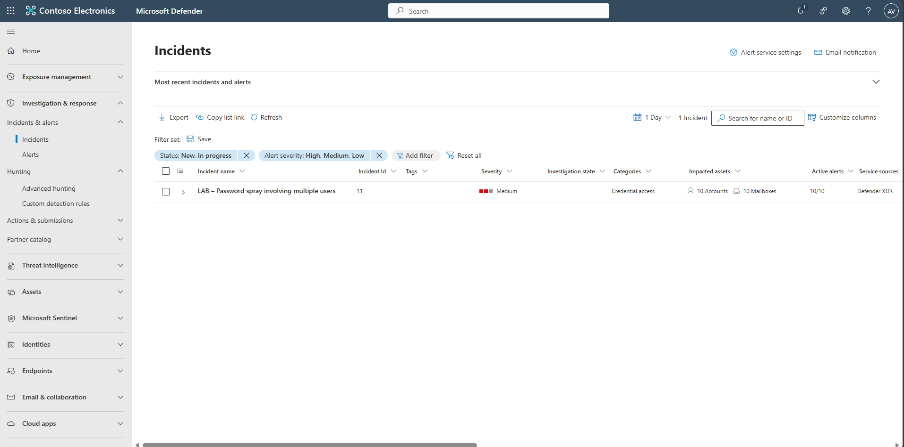
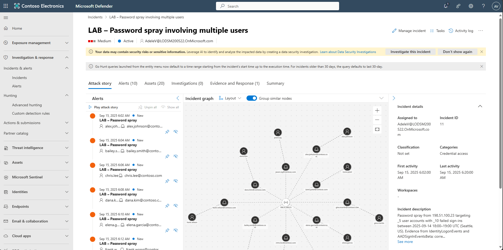
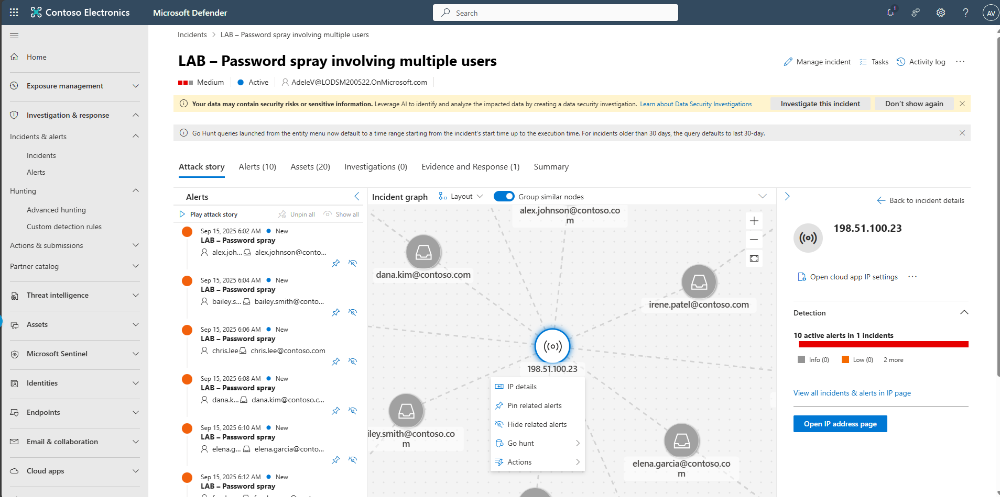
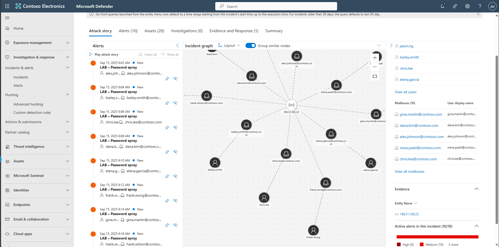
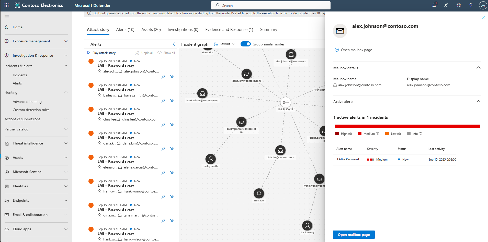

## Task 05: Investigate the incident with Attack Story

1. In the leftmost pane, select **Investigation & response** > **Incidents & alerts** > **Incidents**.  

1. Select the incident: **LAB - Password spray involving multiple users**.  

   

1. In the incident, select the **Attack Story** tab.  

   

1. In the **Incident graph**, select the IP node and select **IP details**, review the information and then select **Back to Incident details**.  

   

1. Scroll down to impacted mailboxes, select a user, and view alerts.

   
     
   
