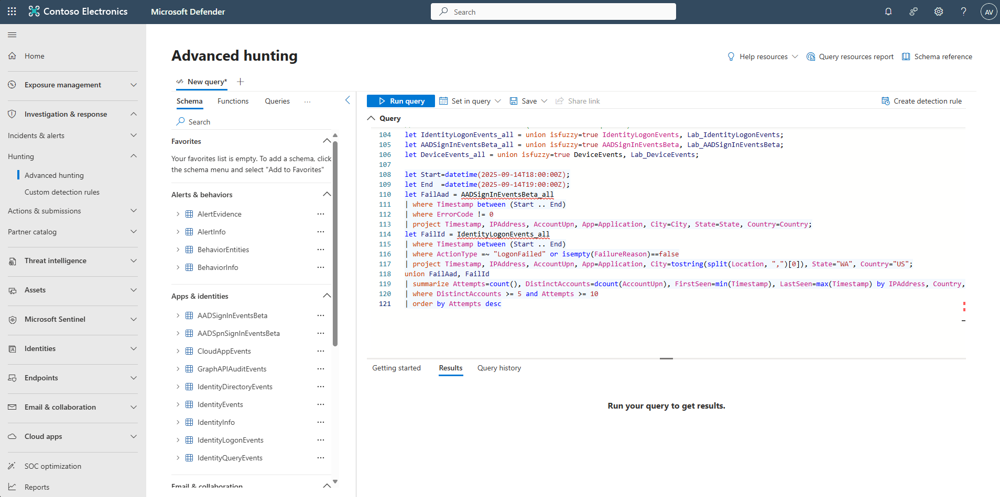
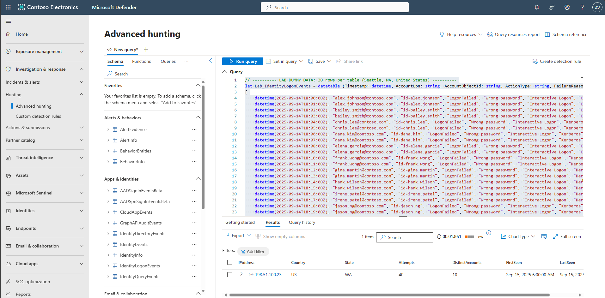
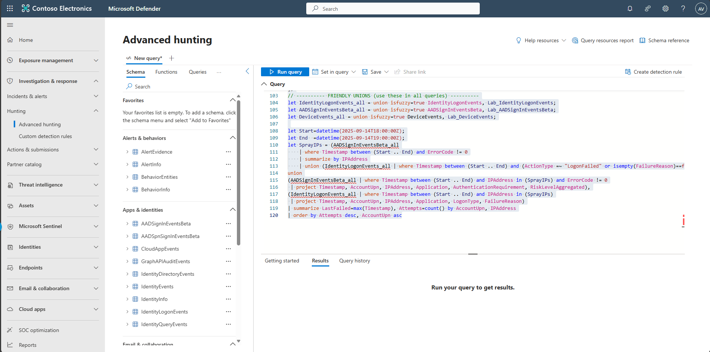
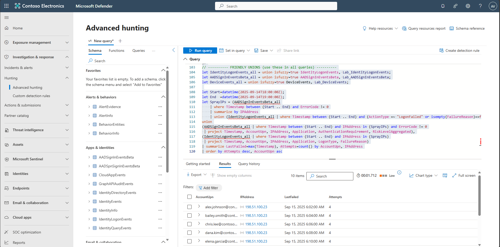
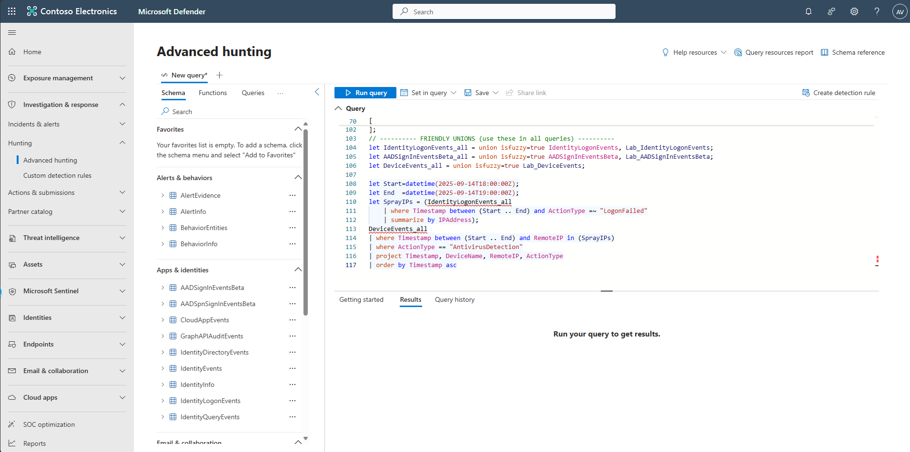
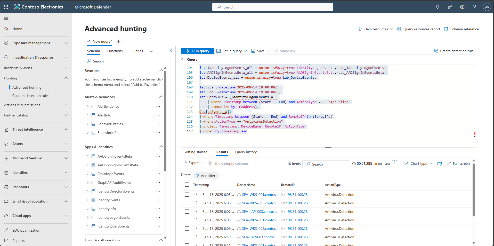

## Task 06: Validate spray patterns with Advanced Hunting

1. In the leftmost pane, select **Investigation & response** > **Hunting** > **Advanced hunting**.  

1. Copy the following KQL into the query window, select the entire query, then select **Run query**. 

    <details markdown='block'>
    <summary>
    Expand here to copy the KQLQuery-5
    </summary>
    
    {: .note }
    > Selecting the **Copy** option in the upper-right corner of the code block  and pasting with **Ctrl+V** will be significantly faster than selecting **Type**!

    ```KQLQuery-5.txt-wrap
    // ---------- LAB CLOCK: dynamic window ----------
    let T0      = now(-45m);   // window start (adjust as you like)
    let Window  = 60m;         // window length
    let Start   = T0;
    let End     = T0 + Window;

    // ---------- LAB DUMMY DATA: 30 rows per table (timestamps are placeholders & will be re-timed) ----------
    let Lab_IdentityLogonEvents = datatable (Timestamp: datetime, AccountUpn: string, AccountObjectId: string, ActionType: string, FailureReason: string, LogonType: string, Protocol: string, Application: string, DeviceName: string, IPAddress: string, Location:    string, ReportId: string)
    [
        datetime(2000-01-01), "AlexW@LODSM200522.OnMicrosoft.com", "id-alex.johnson", "LogonFailed", "Wrong password", "Interactive Logon", "Kerberos", "Microsoft Teams", "SEA-WKS-001.contoso.com", "198.51.100.23", "Seattle, United States", "9001",
        datetime(2000-01-01), "AlexW@LODSM200522.OnMicrosoft.com", "id-alex.johnson", "LogonFailed", "Wrong password", "Interactive Logon", "Kerberos", "Microsoft Teams", "SEA-WKS-001.contoso.com", "198.51.100.23", "Seattle, United States", "9002",
        datetime(2000-01-01), "bailey.smith@contoso.com", "id-bailey.smith", "LogonFailed", "Wrong password", "Interactive Logon", "Kerberos", "Microsoft Teams", "SEA-WKS-002.contoso.com", "198.51.100.23", "Seattle, United States", "9003",
        datetime(2000-01-01), "bailey.smith@contoso.com", "id-bailey.smith", "LogonFailed", "Wrong password", "Interactive Logon", "Kerberos", "Microsoft Teams", "SEA-WKS-002.contoso.com", "198.51.100.23", "Seattle, United States", "9004",
        datetime(2000-01-01), "chris.lee@contoso.com", "id-chris.lee", "LogonFailed", "Wrong password", "Interactive Logon", "Kerberos", "Microsoft Teams", "SEA-LAP-003.contoso.com", "198.51.100.23", "Seattle, United States", "9005",
        datetime(2000-01-01), "chris.lee@contoso.com", "id-chris.lee", "LogonFailed", "Wrong password", "Interactive Logon", "Kerberos", "Microsoft Teams", "SEA-LAP-003.contoso.com", "198.51.100.23", "Seattle, United States", "9006",
        datetime(2000-01-01), "dana.kim@contoso.com", "id-dana.kim", "LogonFailed", "Wrong password", "Interactive Logon", "Kerberos", "Microsoft Teams", "SEA-WKS-001.contoso.com", "198.51.100.23", "Seattle, United States", "9007",
        datetime(2000-01-01), "dana.kim@contoso.com", "id-dana.kim", "LogonFailed", "Wrong password", "Interactive Logon", "Kerberos", "Microsoft Teams", "SEA-WKS-001.contoso.com", "198.51.100.23", "Seattle, United States", "9008",
        datetime(2000-01-01), "elena.garcia@contoso.com", "id-elena.garcia", "LogonFailed", "Wrong password", "Interactive Logon", "Kerberos", "Microsoft Teams", "SEA-WKS-002.contoso.com", "198.51.100.23", "Seattle, United States", "9009",
        datetime(2000-01-01), "elena.garcia@contoso.com", "id-elena.garcia", "LogonFailed", "Wrong password", "Interactive Logon", "Kerberos", "Microsoft Teams", "SEA-WKS-002.contoso.com", "198.51.100.23", "Seattle, United States", "9010",
        datetime(2000-01-01), "frank.wong@contoso.com", "id-frank.wong", "LogonFailed", "Wrong password", "Interactive Logon", "Kerberos", "Microsoft Teams", "SEA-LAP-003.contoso.com", "198.51.100.23", "Seattle, United States", "9011",
        datetime(2000-01-01), "frank.wong@contoso.com", "id-frank.wong", "LogonFailed", "Wrong password", "Interactive Logon", "Kerberos", "Microsoft Teams", "SEA-LAP-003.contoso.com", "198.51.100.23", "Seattle, United States", "9012",
        datetime(2000-01-01), "gina.martin@contoso.com", "id-gina.martin", "LogonFailed", "Wrong password", "Interactive Logon", "Kerberos", "Microsoft Teams", "SEA-WKS-001.contoso.com", "198.51.100.23", "Seattle, United States", "9013",
        datetime(2000-01-01), "gina.martin@contoso.com", "id-gina.martin", "LogonFailed", "Wrong password", "Interactive Logon", "Kerberos", "Microsoft Teams", "SEA-WKS-001.contoso.com", "198.51.100.23", "Seattle, United States", "9014",
        datetime(2000-01-01), "hank.wilson@contoso.com", "id-hank.wilson", "LogonFailed", "Wrong password", "Interactive Logon", "Kerberos", "Microsoft Teams", "SEA-WKS-002.contoso.com", "198.51.100.23", "Seattle, United States", "9015",
        datetime(2000-01-01), "hank.wilson@contoso.com", "id-hank.wilson", "LogonFailed", "Wrong password", "Interactive Logon", "Kerberos", "Microsoft Teams", "SEA-WKS-002.contoso.com", "198.51.100.23", "Seattle, United States", "9016",
        datetime(2000-01-01), "irene.patel@contoso.com", "id-irene.patel", "LogonFailed", "Wrong password", "Interactive Logon", "Kerberos", "Microsoft Teams", "SEA-LAP-003.contoso.com", "198.51.100.23", "Seattle, United States", "9017",
        datetime(2000-01-01), "irene.patel@contoso.com", "id-irene.patel", "LogonFailed", "Wrong password", "Interactive Logon", "Kerberos", "Microsoft Teams", "SEA-LAP-003.contoso.com", "198.51.100.23", "Seattle, United States", "9018",
        datetime(2000-01-01), "jason.ng@contoso.com", "id-jason.ng", "LogonFailed", "Wrong password", "Interactive Logon", "Kerberos", "Microsoft Teams", "SEA-WKS-001.contoso.com", "198.51.100.23", "Seattle, United States", "9019",
        datetime(2000-01-01), "jason.ng@contoso.com", "id-jason.ng", "LogonFailed", "Wrong password", "Interactive Logon", "Kerberos", "Microsoft Teams", "SEA-WKS-001.contoso.com", "198.51.100.23", "Seattle, United States", "9020",
        datetime(2000-01-01), "user1@contoso.com", "id-user1", "LogonSuccess", "", "Interactive Logon", "Kerberos", "SharePoint Online", "SEA-WKS-001.contoso.com", "203.0.113.10", "Seattle, United States", "9021",
        datetime(2000-01-01), "user2@contoso.com", "id-user2", "LogonSuccess", "", "Interactive Logon", "Kerberos", "SharePoint Online", "SEA-WKS-002.contoso.com", "203.0.113.10", "Seattle, United States", "9022",
        datetime(2000-01-01), "user3@contoso.com", "id-user3", "LogonSuccess", "", "Interactive Logon", "Kerberos", "SharePoint Online", "SEA-LAP-003.contoso.com", "203.0.113.10", "Seattle, United States", "9023",
        datetime(2000-01-01), "user4@contoso.com", "id-user4", "LogonSuccess", "", "Interactive Logon", "Kerberos", "SharePoint Online", "SEA-WKS-001.contoso.com", "203.0.113.10", "Seattle, United States", "9024",
        datetime(2000-01-01), "user5@contoso.com", "id-user5", "LogonSuccess", "", "Interactive Logon", "Kerberos", "SharePoint Online", "SEA-WKS-002.contoso.com", "203.0.113.10", "Seattle, United States", "9025",
        datetime(2000-01-01), "user6@contoso.com", "id-user6", "LogonSuccess", "", "Interactive Logon", "Kerberos", "SharePoint Online", "SEA-LAP-003.contoso.com", "203.0.113.10", "Seattle, United States", "9026",
        datetime(2000-01-01), "user7@contoso.com", "id-user7", "LogonSuccess", "", "Interactive Logon", "Kerberos", "SharePoint Online", "SEA-WKS-001.contoso.com", "203.0.113.10", "Seattle, United States", "9027",
        datetime(2000-01-01), "user8@contoso.com", "id-user8", "LogonSuccess", "", "Interactive Logon", "Kerberos", "SharePoint Online", "SEA-WKS-002.contoso.com", "203.0.113.10", "Seattle, United States", "9028",
        datetime(2000-01-01), "user9@contoso.com", "id-user9", "LogonSuccess", "", "Interactive Logon", "Kerberos", "SharePoint Online", "SEA-LAP-003.contoso.com", "203.0.113.10", "Seattle, United States", "9029",
        datetime(2000-01-01), "user10@contoso.com", "id-user10", "LogonSuccess", "", "Interactive Logon", "Kerberos", "SharePoint Online", "SEA-WKS-001.contoso.com", "203.0.113.10", "Seattle, United States", "9030"
    ];

    let Lab_AADSignInEventsBeta = datatable (Timestamp: datetime, Application: string, ApplicationId: string, LogonType: string, ErrorCode: int, AccountUpn: string, AccountObjectId: string, DeviceName: string, OSPlatform: string, AuthenticationRequirement: string,    RiskLevelAggregated: int, UserAgent: string, ClientAppUsed: string, Browser: string, IPAddress: string, Country: string, State: string, City: string, ReportId: string)
    [
        datetime(2000-01-01), "Office 365 Exchange Online", "00000002-0000-0ff1-ce00-000000000000", "interactive", 50126, "AlexW@LODSM200522.OnMicrosoft.com", "id-alex.johnson", "SEA-WKS-001.contoso.com", "Windows 11", "singleFactorAuthentication", 50,    "Mozilla/5.0 (Windows NT 10.0; Win64; x64) AppleWebKit/537.36 Edge/120.0", "Browser", "Edge", "198.51.100.23", "US", "WA", "Seattle", "9101",
        datetime(2000-01-01), "Office 365 Exchange Online", "00000002-0000-0ff1-ce00-000000000000", "interactive", 50126, "AlexW@LODSM200522.OnMicrosoft.com", "id-alex.johnson", "SEA-WKS-001.contoso.com", "Windows 11", "singleFactorAuthentication", 50,    "Mozilla/5.0 (Windows NT 10.0; Win64; x64) AppleWebKit/537.36 Edge/120.0", "Browser", "Edge", "198.51.100.23", "US", "WA", "Seattle", "9102",
        datetime(2000-01-01), "Office 365 Exchange Online", "00000002-0000-0ff1-ce00-000000000000", "interactive", 50126, "bailey.smith@contoso.com", "id-bailey.smith", "SEA-WKS-002.contoso.com", "Windows 11", "singleFactorAuthentication", 50, "Mozilla/5.0    (Windows NT 10.0; Win64; x64) AppleWebKit/537.36 Edge/120.0", "Browser", "Edge", "198.51.100.23", "US", "WA", "Seattle", "9103",
        datetime(2000-01-01), "Office 365 Exchange Online", "00000002-0000-0ff1-ce00-000000000000", "interactive", 50126, "bailey.smith@contoso.com", "id-bailey.smith", "SEA-WKS-002.contoso.com", "Windows 11", "singleFactorAuthentication", 50, "Mozilla/5.0    (Windows NT 10.0; Win64; x64) AppleWebKit/537.36 Edge/120.0", "Browser", "Edge", "198.51.100.23", "US", "WA", "Seattle", "9104",
        datetime(2000-01-01), "Office 365 Exchange Online", "00000002-0000-0ff1-ce00-000000000000", "interactive", 50126, "chris.lee@contoso.com", "id-chris.lee", "SEA-LAP-003.contoso.com", "Windows 11", "singleFactorAuthentication", 50, "Mozilla/5.0 (Windows NT  10.0; Win64; x64) AppleWebKit/537.36 Edge/120.0", "Browser", "Edge", "198.51.100.23", "US", "WA", "Seattle", "9105",
        datetime(2000-01-01), "Office 365 Exchange Online", "00000002-0000-0ff1-ce00-000000000000", "interactive", 50126, "chris.lee@contoso.com", "id-chris.lee", "SEA-LAP-003.contoso.com", "Windows 11", "singleFactorAuthentication", 50, "Mozilla/5.0 (Windows NT  10.0; Win64; x64) AppleWebKit/537.36 Edge/120.0", "Browser", "Edge", "198.51.100.23", "US", "WA", "Seattle", "9106",
        datetime(2000-01-01), "Office 365 Exchange Online", "00000002-0000-0ff1-ce00-000000000000", "interactive", 50126, "dana.kim@contoso.com", "id-dana.kim", "SEA-WKS-001.contoso.com", "Windows 11", "singleFactorAuthentication", 50, "Mozilla/5.0 (Windows NT    10.0; Win64; x64) AppleWebKit/537.36 Edge/120.0", "Browser", "Edge", "198.51.100.23", "US", "WA", "Seattle", "9107",
        datetime(2000-01-01), "Office 365 Exchange Online", "00000002-0000-0ff1-ce00-000000000000", "interactive", 50126, "dana.kim@contoso.com", "id-dana.kim", "SEA-WKS-001.contoso.com", "Windows 11", "singleFactorAuthentication", 50, "Mozilla/5.0 (Windows NT    10.0; Win64; x64) AppleWebKit/537.36 Edge/120.0", "Browser", "Edge", "198.51.100.23", "US", "WA", "Seattle", "9108",
        datetime(2000-01-01), "Office 365 Exchange Online", "00000002-0000-0ff1-ce00-000000000000", "interactive", 50126, "elena.garcia@contoso.com", "id-elena.garcia", "SEA-WKS-002.contoso.com", "Windows 11", "singleFactorAuthentication", 50, "Mozilla/5.0    (Windows NT 10.0; Win64; x64) AppleWebKit/537.36 Edge/120.0", "Browser", "Edge", "198.51.100.23", "US", "WA", "Seattle", "9109",
        datetime(2000-01-01), "Office 365 Exchange Online", "00000002-0000-0ff1-ce00-000000000000", "interactive", 50126, "elena.garcia@contoso.com", "id-elena.garcia", "SEA-WKS-002.contoso.com", "Windows 11", "singleFactorAuthentication", 50, "Mozilla/5.0    (Windows NT 10.0; Win64; x64) AppleWebKit/537.36 Edge/120.0", "Browser", "Edge", "198.51.100.23", "US", "WA", "Seattle", "9110",
        datetime(2000-01-01), "Office 365 Exchange Online", "00000002-0000-0ff1-ce00-000000000000", "interactive", 50126, "frank.wong@contoso.com", "id-frank.wong", "SEA-LAP-003.contoso.com", "Windows 11", "singleFactorAuthentication", 50, "Mozilla/5.0 (Windows NT    10.0; Win64; x64) AppleWebKit/537.36 Edge/120.0", "Browser", "Edge", "198.51.100.23", "US", "WA", "Seattle", "9111",
        datetime(2000-01-01), "Office 365 Exchange Online", "00000002-0000-0ff1-ce00-000000000000", "interactive", 50126, "frank.wong@contoso.com", "id-frank.wong", "SEA-LAP-003.contoso.com", "Windows 11", "singleFactorAuthentication", 50, "Mozilla/5.0 (Windows NT    10.0; Win64; x64) AppleWebKit/537.36 Edge/120.0", "Browser", "Edge", "198.51.100.23", "US", "WA", "Seattle", "9112",
        datetime(2000-01-01), "Office 365 Exchange Online", "00000002-0000-0ff1-ce00-000000000000", "interactive", 50126, "gina.martin@contoso.com", "id-gina.martin", "SEA-WKS-001.contoso.com", "Windows 11", "singleFactorAuthentication", 50, "Mozilla/5.0 (Windows     NT 10.0; Win64; x64) AppleWebKit/537.36 Edge/120.0", "Browser", "Edge", "198.51.100.23", "US", "WA", "Seattle", "9113",
        datetime(2000-01-01), "Office 365 Exchange Online", "00000002-0000-0ff1-ce00-000000000000", "interactive", 50126, "gina.martin@contoso.com", "id-gina.martin", "SEA-WKS-001.contoso.com", "Windows 11", "singleFactorAuthentication", 50, "Mozilla/5.0 (Windows     NT 10.0; Win64; x64) AppleWebKit/537.36 Edge/120.0", "Browser", "Edge", "198.51.100.23", "US", "WA", "Seattle", "9114",
        datetime(2000-01-01), "Office 365 Exchange Online", "00000002-0000-0ff1-ce00-000000000000", "interactive", 50126, "hank.wilson@contoso.com", "id-hank.wilson", "SEA-WKS-002.contoso.com", "Windows 11", "singleFactorAuthentication", 50, "Mozilla/5.0 (Windows     NT 10.0; Win64; x64) AppleWebKit/537.36 Edge/120.0", "Browser", "Edge", "198.51.100.23", "US", "WA", "Seattle", "9115",
        datetime(2000-01-01), "Office 365 Exchange Online", "00000002-0000-0ff1-ce00-000000000000", "interactive", 50126, "hank.wilson@contoso.com", "id-hank.wilson", "SEA-WKS-002.contoso.com", "Windows 11", "singleFactorAuthentication", 50, "Mozilla/5.0 (Windows     NT 10.0; Win64; x64) AppleWebKit/537.36 Edge/120.0", "Browser", "Edge", "198.51.100.23", "US", "WA", "Seattle", "9116",
        datetime(2000-01-01), "Office 365 Exchange Online", "00000002-0000-0ff1-ce00-000000000000", "interactive", 50126, "irene.patel@contoso.com", "id-irene.patel", "SEA-LAP-003.contoso.com", "Windows 11", "singleFactorAuthentication", 50, "Mozilla/5.0 (Windows     NT 10.0; Win64; x64) AppleWebKit/537.36 Edge/120.0", "Browser", "Edge", "198.51.100.23", "US", "WA", "Seattle", "9117",
        datetime(2000-01-01), "Office 365 Exchange Online", "00000002-0000-0ff1-ce00-000000000000", "interactive", 50126, "irene.patel@contoso.com", "id-irene.patel", "SEA-LAP-003.contoso.com", "Windows 11", "singleFactorAuthentication", 50, "Mozilla/5.0 (Windows     NT 10.0; Win64; x64) AppleWebKit/537.36 Edge/120.0", "Browser", "Edge", "198.51.100.23", "US", "WA", "Seattle", "9118",
        datetime(2000-01-01), "Office 365 Exchange Online", "00000002-0000-0ff1-ce00-000000000000", "interactive", 50126, "jason.ng@contoso.com", "id-jason.ng", "SEA-WKS-001.contoso.com", "Windows 11", "singleFactorAuthentication", 50, "Mozilla/5.0 (Windows NT    10.0; Win64; x64) AppleWebKit/537.36 Edge/120.0", "Browser", "Edge", "198.51.100.23", "US", "WA", "Seattle", "9119",
        datetime(2000-01-01), "Office 365 Exchange Online", "00000002-0000-0ff1-ce00-000000000000", "interactive", 50126, "jason.ng@contoso.com", "id-jason.ng", "SEA-WKS-001.contoso.com", "Windows 11", "singleFactorAuthentication", 50, "Mozilla/5.0 (Windows NT    10.0; Win64; x64) AppleWebKit/537.36 Edge/120.0", "Browser", "Edge", "198.51.100.23", "US", "WA", "Seattle", "9120",
        // benign successes
        datetime(2000-01-01), "Microsoft Teams", "1fec8e78-bce4-4aaf-ab1b-5451cc387264", "interactive", 0, "user1@contoso.com", "id-user1", "SEA-WKS-001.contoso.com", "Windows 11", "multiFactorAuthentication", 1, "Mozilla/5.0 (Windows NT 10.0; Win64; x64)     AppleWebKit/537.36 Edge/120.0", "Browser", "Edge", "203.0.113.10", "US", "WA", "Seattle", "9121",
        datetime(2000-01-01), "Microsoft Teams", "1fec8e78-bce4-4aaf-ab1b-5451cc387264", "interactive", 0, "user2@contoso.com", "id-user2", "SEA-WKS-002.contoso.com", "Windows 11", "multiFactorAuthentication", 1, "Mozilla/5.0 (Windows NT 10.0; Win64; x64)     AppleWebKit/537.36 Edge/120.0", "Browser", "Edge", "203.0.113.10", "US", "WA", "Seattle", "9122",
        datetime(2000-01-01), "Microsoft Teams", "1fec8e78-bce4-4aaf-ab1b-5451cc387264", "interactive", 0, "user3@contoso.com", "id-user3", "SEA-LAP-003.contoso.com", "Windows 11", "multiFactorAuthentication", 1, "Mozilla/5.0 (Windows NT 10.0; Win64; x64)     AppleWebKit/537.36 Edge/120.0", "Browser", "Edge", "203.0.113.10", "US", "WA", "Seattle", "9123",
        datetime(2000-01-01), "Microsoft Teams", "1fec8e78-bce4-4aaf-ab1b-5451cc387264", "interactive", 0, "user4@contoso.com", "id-user4", "SEA-WKS-001.contoso.com", "Windows 11", "multiFactorAuthentication", 1, "Mozilla/5.0 (Windows NT 10.0; Win64; x64)     AppleWebKit/537.36 Edge/120.0", "Browser", "Edge", "203.0.113.10", "US", "WA", "Seattle", "9124",
        datetime(2000-01-01), "Microsoft Teams", "1fec8e78-bce4-4aaf-ab1b-5451cc387264", "interactive", 0, "user5@contoso.com", "id-user5", "SEA-WKS-002.contoso.com", "Windows 11", "multiFactorAuthentication", 1, "Mozilla/5.0 (Windows NT 10.0; Win64; x64)     AppleWebKit/537.36 Edge/120.0", "Browser", "Edge", "203.0.113.10", "US", "WA", "Seattle", "9125",
        datetime(2000-01-01), "Microsoft Teams", "1fec8e78-bce4-4aaf-ab1b-5451cc387264", "interactive", 0, "user6@contoso.com", "id-user6", "SEA-LAP-003.contoso.com", "Windows 11", "multiFactorAuthentication", 1, "Mozilla/5.0 (Windows NT 10.0; Win64; x64)     AppleWebKit/537.36 Edge/120.0", "Browser", "Edge", "203.0.113.10", "US", "WA", "Seattle", "9126",
        datetime(2000-01-01), "Microsoft Teams", "1fec8e78-bce4-4aaf-ab1b-5451cc387264", "interactive", 0, "user7@contoso.com", "id-user7", "SEA-WKS-001.contoso.com", "Windows 11", "multiFactorAuthentication", 1, "Mozilla/5.0 (Windows NT 10.0; Win64; x64)     AppleWebKit/537.36 Edge/120.0", "Browser", "Edge", "203.0.113.10", "US", "WA", "Seattle", "9127",
        datetime(2000-01-01), "Microsoft Teams", "1fec8e78-bce4-4aaf-ab1b-5451cc387264", "interactive", 0, "user8@contoso.com", "id-user8", "SEA-WKS-002.contoso.com", "Windows 11", "multiFactorAuthentication", 1, "Mozilla/5.0 (Windows NT 10.0; Win64; x64)     AppleWebKit/537.36 Edge/120.0", "Browser", "Edge", "203.0.113.10", "US", "WA", "Seattle", "9128",
        datetime(2000-01-01), "Microsoft Teams", "1fec8e78-bce4-4aaf-ab1b-5451cc387264", "interactive", 0, "user9@contoso.com", "id-user9", "SEA-LAP-003.contoso.com", "Windows 11", "multiFactorAuthentication", 1, "Mozilla/5.0 (Windows NT 10.0; Win64; x64)     AppleWebKit/537.36 Edge/120.0", "Browser", "Edge", "203.0.113.10", "US", "WA", "Seattle", "9129",
        datetime(2000-01-01), "Microsoft Teams", "1fec8e78-bce4-4aaf-ab1b-5451cc387264", "interactive", 0, "user10@contoso.com", "id-user10", "SEA-WKS-001.contoso.com", "Windows 11", "multiFactorAuthentication", 1, "Mozilla/5.0 (Windows NT 10.0; Win64; x64)   AppleWebKit/537.36 Edge/120.0", "Browser", "Edge", "203.0.113.10", "US", "WA", "Seattle", "9130"
    ];

    let Lab_DeviceEvents = datatable (Timestamp: datetime, DeviceName: string, ActionType: string, AccountName: string, ReportId: long, RemoteIP: string, LocalIP: string)
    [
        datetime(2000-01-01), "SEA-WKS-001.contoso.com", "AntivirusDetection", "alex.johnson", 9001, "198.51.100.23", "10.0.0.10",
        datetime(2000-01-01), "SEA-WKS-002.contoso.com", "AntivirusDetection", "bailey.smith", 9002, "198.51.100.23", "10.0.0.11",
        datetime(2000-01-01), "SEA-LAP-003.contoso.com", "AntivirusDetection", "chris.lee", 9003, "198.51.100.23", "10.0.0.12",
        datetime(2000-01-01), "SEA-WKS-001.contoso.com", "AntivirusDetection", "dana.kim", 9004, "198.51.100.23", "10.0.0.13",
        datetime(2000-01-01), "SEA-WKS-002.contoso.com", "AntivirusDetection", "elena.garcia", 9005, "198.51.100.23", "10.0.0.14",
        datetime(2000-01-01), "SEA-LAP-003.contoso.com", "AntivirusDetection", "frank.wong", 9006, "198.51.100.23", "10.0.0.15",
        datetime(2000-01-01), "SEA-WKS-001.contoso.com", "AntivirusDetection", "gina.martin", 9007, "198.51.100.23", "10.0.0.16",
        datetime(2000-01-01), "SEA-WKS-002.contoso.com", "AntivirusDetection", "hank.wilson", 9008, "198.51.100.23", "10.0.0.17",
        datetime(2000-01-01), "SEA-LAP-003.contoso.com", "AntivirusDetection", "irene.patel", 9009, "198.51.100.23", "10.0.0.18",
        datetime(2000-01-01), "SEA-WKS-001.contoso.com", "AntivirusDetection", "jason.ng", 9010, "198.51.100.23", "10.0.0.19",
        // benign device events
        datetime(2000-01-01), "SEA-WKS-001.contoso.com", "AntivirusSignatureUpdated", "user1", 9101, "203.0.113.10", "10.0.1.10",
        datetime(2000-01-01), "SEA-WKS-002.contoso.com", "AntivirusSignatureUpdated", "user2", 9102, "203.0.113.10", "10.0.1.11",
        datetime(2000-01-01), "SEA-LAP-003.contoso.com", "AntivirusSignatureUpdated", "user3", 9103, "203.0.113.10", "10.0.1.12",
        datetime(2000-01-01), "SEA-WKS-001.contoso.com", "AntivirusSignatureUpdated", "user4", 9104, "203.0.113.10", "10.0.1.13",
        datetime(2000-01-01), "SEA-WKS-002.contoso.com", "AntivirusSignatureUpdated", "user5", 9105, "203.0.113.10", "10.0.1.14",
        datetime(2000-01-01), "SEA-LAP-003.contoso.com", "AntivirusSignatureUpdated", "user6", 9106, "203.0.113.10", "10.0.1.15",
        datetime(2000-01-01), "SEA-WKS-001.contoso.com", "AntivirusSignatureUpdated", "user7", 9107, "203.0.113.10", "10.0.1.16",
        datetime(2000-01-01), "SEA-WKS-002.contoso.com", "AntivirusSignatureUpdated", "user8", 9108, "203.0.113.10", "10.0.1.17",
        datetime(2000-01-01), "SEA-LAP-003.contoso.com", "AntivirusSignatureUpdated", "user9", 9109, "203.0.113.10", "10.0.1.18",
        datetime(2000-01-01), "SEA-WKS-001.contoso.com", "AntivirusSignatureUpdated", "user10", 9120, "203.0.113.10", "10.0.1.29"
    ];

    // ---------- MAKE LAB DATES DYNAMIC (shift into [Start..End]) ----------
    let Lab_IdentityLogonEvents_dyn =
        Lab_IdentityLogonEvents
        | order by Timestamp asc
        | serialize idx = row_number() - 1
        | extend Timestamp = Start + idx*1m;

    let Lab_AADSignInEventsBeta_dyn =
        Lab_AADSignInEventsBeta
        | order by Timestamp asc
        | serialize idx = row_number() - 1
        | extend Timestamp = Start + idx*1m;

    let Lab_DeviceEvents_dyn =
        Lab_DeviceEvents
        | order by Timestamp asc
        | serialize idx = row_number() - 1
        | extend Timestamp = Start + idx*1m;

    // ---------- FRIENDLY UNIONS (use these in all queries) ----------
    let IdentityLogonEvents_all = union isfuzzy=true IdentityLogonEvents, Lab_IdentityLogonEvents_dyn;
    let AADSignInEventsBeta_all = union isfuzzy=true AADSignInEventsBeta, Lab_AADSignInEventsBeta_dyn;
    let DeviceEvents_all        = union isfuzzy=true DeviceEvents, Lab_DeviceEvents_dyn;

    // ---------- SPRAY FINDER (normalize to US) ----------
    let FailAad =
        AADSignInEventsBeta_all
        | where Timestamp between (Start .. End)
        | where ErrorCode != 0
        | where isnotempty(IPAddress)
        | extend Country = iff(Country =~ "United States", "US", Country)
        | project Timestamp, IPAddress, AccountUpn, App=Application, City, State, Country;

    let FailId =
        IdentityLogonEvents_all
        | where Timestamp between (Start .. End)
        | where ActionType =~ "LogonFailed" or isnotempty(FailureReason)
        | where isnotempty(IPAddress)
        | extend City = trim(' ', tostring(split(Location, ",")[0]))
        | extend State = "WA", Country = "US"
        | project Timestamp, IPAddress, AccountUpn, App=Application, City, State, Country;

    union isfuzzy=true FailAad, FailId
    | summarize Attempts=count(), DistinctAccounts=dcount(AccountUpn), FirstSeen=min(Timestamp), LastSeen=max(Timestamp)
              by IPAddress, Country, State
    | where DistinctAccounts >= 5 and Attempts >= 10
    | order by Attempts desc, LastSeen desc
    ```
    </details>

    {: .warning }
    > Update the first 2 KQL entries email address domain to match your domain. e.g. AlexW@LODSM200522.OnMicrosoft.com to AlexW@ *&lt;the domain name associated with your Admin account email address gt;* for KQLQuery-5 and KQLQuery-6 before executing the query. 

    {: .note }
    > The KQL uses demo **tables_all** to simulate telemetry, not your production logs. We populate the IdentityLogonEvents_all, AADSignInEventsBeta_all, and DeviceEvents_all with realistic fields and timestamps generated relative to now() so the scenarios always produce results. To run against real data, replace the *_all references (currently pointing at the lab tables) with your actual tables.

      

    {: .note }
    > Results will show 198.51.100.23 (US-WA) with ≥10 attempts across ≥5 accounts.
    >
    > 

1. Copy the following KQL into the query window, select the entire query, then select **Run query**. 

    <details markdown='block'>
    <summary>
    Expand here to copy the KQLQuery-6
    </summary>

    {: .note }
    > Selecting the **Copy** option in the upper-right corner of the code block  and pasting with **Ctrl+V** will be significantly faster than selecting **Type**!

    ```KQLQuery-6.txt-wrap
    // ---------- LAB CLOCK: dynamic window ----------
    let T0      = now(-45m);     // window start (adjust as needed)
    let Window  = 60m;           // window length
    let Start   = T0;
    let End     = T0 + Window;

    // ---------- LAB DUMMY DATA: 30 rows per table (timestamps are placeholders) ----------
    let Lab_IdentityLogonEvents = datatable (Timestamp: datetime, AccountUpn: string, AccountObjectId: string, ActionType: string, FailureReason: string, LogonType: string, Protocol: string, Application: string, DeviceName: string, IPAddress: string, Location:    string, ReportId: string)
    [
        datetime(2000-01-01), "AlexW@LODSM200522.OnMicrosoft.com", "id-alex.johnson", "LogonFailed", "Wrong password", "Interactive Logon", "Kerberos", "Microsoft Teams", "SEA-WKS-001.contoso.com", "198.51.100.23", "Seattle, United States", "9001",
        datetime(2000-01-01), "AlexW@LODSM200522.OnMicrosoft.com", "id-alex.johnson", "LogonFailed", "Wrong password", "Interactive Logon", "Kerberos", "Microsoft Teams", "SEA-WKS-001.contoso.com", "198.51.100.23", "Seattle, United States", "9002",
        datetime(2000-01-01), "bailey.smith@contoso.com", "id-bailey.smith", "LogonFailed", "Wrong password", "Interactive Logon", "Kerberos", "Microsoft Teams", "SEA-WKS-002.contoso.com", "198.51.100.23", "Seattle, United States", "9003",
        datetime(2000-01-01), "bailey.smith@contoso.com", "id-bailey.smith", "LogonFailed", "Wrong password", "Interactive Logon", "Kerberos", "Microsoft Teams", "SEA-WKS-002.contoso.com", "198.51.100.23", "Seattle, United States", "9004",
        datetime(2000-01-01), "chris.lee@contoso.com", "id-chris.lee", "LogonFailed", "Wrong password", "Interactive Logon", "Kerberos", "Microsoft Teams", "SEA-LAP-003.contoso.com", "198.51.100.23", "Seattle, United States", "9005",
        datetime(2000-01-01), "chris.lee@contoso.com", "id-chris.lee", "LogonFailed", "Wrong password", "Interactive Logon", "Kerberos", "Microsoft Teams", "SEA-LAP-003.contoso.com", "198.51.100.23", "Seattle, United States", "9006",
        datetime(2000-01-01), "dana.kim@contoso.com", "id-dana.kim", "LogonFailed", "Wrong password", "Interactive Logon", "Kerberos", "Microsoft Teams", "SEA-WKS-001.contoso.com", "198.51.100.23", "Seattle, United States", "9007",
        datetime(2000-01-01), "dana.kim@contoso.com", "id-dana.kim", "LogonFailed", "Wrong password", "Interactive Logon", "Kerberos", "Microsoft Teams", "SEA-WKS-001.contoso.com", "198.51.100.23", "Seattle, United States", "9008",
        datetime(2000-01-01), "elena.garcia@contoso.com", "id-elena.garcia", "LogonFailed", "Wrong password", "Interactive Logon", "Kerberos", "Microsoft Teams", "SEA-WKS-002.contoso.com", "198.51.100.23", "Seattle, United States", "9009",
        datetime(2000-01-01), "elena.garcia@contoso.com", "id-elena.garcia", "LogonFailed", "Wrong password", "Interactive Logon", "Kerberos", "Microsoft Teams", "SEA-WKS-002.contoso.com", "198.51.100.23", "Seattle, United States", "9010",
        datetime(2000-01-01), "frank.wong@contoso.com", "id-frank.wong", "LogonFailed", "Wrong password", "Interactive Logon", "Kerberos", "Microsoft Teams", "SEA-LAP-003.contoso.com", "198.51.100.23", "Seattle, United States", "9011",
        datetime(2000-01-01), "frank.wong@contoso.com", "id-frank.wong", "LogonFailed", "Wrong password", "Interactive Logon", "Kerberos", "Microsoft Teams", "SEA-LAP-003.contoso.com", "198.51.100.23", "Seattle, United States", "9012",
        datetime(2000-01-01), "gina.martin@contoso.com", "id-gina.martin", "LogonFailed", "Wrong password", "Interactive Logon", "Kerberos", "Microsoft Teams", "SEA-WKS-001.contoso.com", "198.51.100.23", "Seattle, United States", "9013",
        datetime(2000-01-01), "gina.martin@contoso.com", "id-gina.martin", "LogonFailed", "Wrong password", "Interactive Logon", "Kerberos", "Microsoft Teams", "SEA-WKS-001.contoso.com", "198.51.100.23", "Seattle, United States", "9014",
        datetime(2000-01-01), "hank.wilson@contoso.com", "id-hank.wilson", "LogonFailed", "Wrong password", "Interactive Logon", "Kerberos", "Microsoft Teams", "SEA-WKS-002.contoso.com", "198.51.100.23", "Seattle, United States", "9015",
        datetime(2000-01-01), "hank.wilson@contoso.com", "id-hank.wilson", "LogonFailed", "Wrong password", "Interactive Logon", "Kerberos", "Microsoft Teams", "SEA-WKS-002.contoso.com", "198.51.100.23", "Seattle, United States", "9016",
        datetime(2000-01-01), "irene.patel@contoso.com", "id-irene.patel", "LogonFailed", "Wrong password", "Interactive Logon", "Kerberos", "Microsoft Teams", "SEA-LAP-003.contoso.com", "198.51.100.23", "Seattle, United States", "9017",
        datetime(2000-01-01), "irene.patel@contoso.com", "id-irene.patel", "LogonFailed", "Wrong password", "Interactive Logon", "Kerberos", "Microsoft Teams", "SEA-LAP-003.contoso.com", "198.51.100.23", "Seattle, United States", "9018",
        datetime(2000-01-01), "jason.ng@contoso.com", "id-jason.ng", "LogonFailed", "Wrong password", "Interactive Logon", "Kerberos", "Microsoft Teams", "SEA-WKS-001.contoso.com", "198.51.100.23", "Seattle, United States", "9019",
        datetime(2000-01-01), "jason.ng@contoso.com", "id-jason.ng", "LogonFailed", "Wrong password", "Interactive Logon", "Kerberos", "Microsoft Teams", "SEA-WKS-001.contoso.com", "198.51.100.23", "Seattle, United States", "9020",
        datetime(2000-01-01), "user1@contoso.com", "id-user1", "LogonSuccess", "", "Interactive Logon", "Kerberos", "SharePoint Online", "SEA-WKS-001.contoso.com", "203.0.113.10", "Seattle, United States", "9021",
        datetime(2000-01-01), "user2@contoso.com", "id-user2", "LogonSuccess", "", "Interactive Logon", "Kerberos", "SharePoint Online", "SEA-WKS-002.contoso.com", "203.0.113.10", "Seattle, United States", "9022",
        datetime(2000-01-01), "user3@contoso.com", "id-user3", "LogonSuccess", "", "Interactive Logon", "Kerberos", "SharePoint Online", "SEA-LAP-003.contoso.com", "203.0.113.10", "Seattle, United States", "9023",
        datetime(2000-01-01), "user4@contoso.com", "id-user4", "LogonSuccess", "", "Interactive Logon", "Kerberos", "SharePoint Online", "SEA-WKS-001.contoso.com", "203.0.113.10", "Seattle, United States", "9024",
        datetime(2000-01-01), "user5@contoso.com", "id-user5", "LogonSuccess", "", "Interactive Logon", "Kerberos", "SharePoint Online", "SEA-WKS-002.contoso.com", "203.0.113.10", "Seattle, United States", "9025",
        datetime(2000-01-01), "user6@contoso.com", "id-user6", "LogonSuccess", "", "Interactive Logon", "Kerberos", "SharePoint Online", "SEA-LAP-003.contoso.com", "203.0.113.10", "Seattle, United States", "9026",
        datetime(2000-01-01), "user7@contoso.com", "id-user7", "LogonSuccess", "", "Interactive Logon", "Kerberos", "SharePoint Online", "SEA-WKS-001.contoso.com", "203.0.113.10", "Seattle, United States", "9027",
        datetime(2000-01-01), "user8@contoso.com", "id-user8", "LogonSuccess", "", "Interactive Logon", "Kerberos", "SharePoint Online", "SEA-WKS-002.contoso.com", "203.0.113.10", "Seattle, United States", "9028",
        datetime(2000-01-01), "user9@contoso.com", "id-user9", "LogonSuccess", "", "Interactive Logon", "Kerberos", "SharePoint Online", "SEA-LAP-003.contoso.com", "203.0.113.10", "Seattle, United States", "9029",
        datetime(2000-01-01), "user10@contoso.com", "id-user10", "LogonSuccess", "", "Interactive Logon", "Kerberos", "SharePoint Online", "SEA-WKS-001.contoso.com", "203.0.113.10", "Seattle, United States", "9030"
    ];

    let Lab_AADSignInEventsBeta = datatable (Timestamp: datetime, Application: string, ApplicationId: string, LogonType: string, ErrorCode: int, AccountUpn: string, AccountObjectId: string, DeviceName: string, OSPlatform: string, AuthenticationRequirement: string,    RiskLevelAggregated: int, UserAgent: string, ClientAppUsed: string, Browser: string, IPAddress: string, Country: string, State: string, City: string, ReportId: string)
    [
        datetime(2000-01-01), "Office 365 Exchange Online", "00000002-0000-0ff1-ce00-000000000000", "interactive", 50126, "AlexW@LODSM200522.OnMicrosoft.com", "id-alex.johnson", "SEA-WKS-001.contoso.com", "Windows 11", "singleFactorAuthentication", 50,    "Mozilla/5.0 (Windows NT 10.0; Win64; x64) AppleWebKit/537.36 Edge/120.0", "Browser", "Edge", "198.51.100.23", "US", "WA", "Seattle", "9101",
        datetime(2000-01-01), "Office 365 Exchange Online", "00000002-0000-0ff1-ce00-000000000000", "interactive", 50126, "AlexW@LODSM200522.OnMicrosoft.com", "id-alex.johnson", "SEA-WKS-001.contoso.com", "Windows 11", "singleFactorAuthentication", 50,    "Mozilla/5.0 (Windows NT 10.0; Win64; x64) AppleWebKit/537.36 Edge/120.0", "Browser", "Edge", "198.51.100.23", "US", "WA", "Seattle", "9102",
        datetime(2000-01-01), "Office 365 Exchange Online", "00000002-0000-0ff1-ce00-000000000000", "interactive", 50126, "bailey.smith@contoso.com", "id-bailey.smith", "SEA-WKS-002.contoso.com", "Windows 11", "singleFactorAuthentication", 50, "Mozilla/5.0    (Windows NT 10.0; Win64; x64) AppleWebKit/537.36 Edge/120.0", "Browser", "Edge", "198.51.100.23", "US", "WA", "Seattle", "9103",
        datetime(2000-01-01), "Office 365 Exchange Online", "00000002-0000-0ff1-ce00-000000000000", "interactive", 50126, "bailey.smith@contoso.com", "id-bailey.smith", "SEA-WKS-002.contoso.com", "Windows 11", "singleFactorAuthentication", 50, "Mozilla/5.0    (Windows NT 10.0; Win64; x64) AppleWebKit/537.36 Edge/120.0", "Browser", "Edge", "198.51.100.23", "US", "WA", "Seattle", "9104",
        datetime(2000-01-01), "Office 365 Exchange Online", "00000002-0000-0ff1-ce00-000000000000", "interactive", 50126, "chris.lee@contoso.com", "id-chris.lee", "SEA-LAP-003.contoso.com", "Windows 11", "singleFactorAuthentication", 50, "Mozilla/5.0 (Windows NT  10.0; Win64; x64) AppleWebKit/537.36 Edge/120.0", "Browser", "Edge", "198.51.100.23", "US", "WA", "Seattle", "9105",
        datetime(2000-01-01), "Office 365 Exchange Online", "00000002-0000-0ff1-ce00-000000000000", "interactive", 50126, "chris.lee@contoso.com", "id-chris.lee", "SEA-LAP-003.contoso.com", "Windows 11", "singleFactorAuthentication", 50, "Mozilla/5.0 (Windows NT  10.0; Win64; x64) AppleWebKit/537.36 Edge/120.0", "Browser", "Edge", "198.51.100.23", "US", "WA", "Seattle", "9106",
        datetime(2000-01-01), "Office 365 Exchange Online", "00000002-0000-0ff1-ce00-000000000000", "interactive", 50126, "dana.kim@contoso.com", "id-dana.kim", "SEA-WKS-001.contoso.com", "Windows 11", "singleFactorAuthentication", 50, "Mozilla/5.0 (Windows NT    10.0; Win64; x64) AppleWebKit/537.36 Edge/120.0", "Browser", "Edge", "198.51.100.23", "US", "WA", "Seattle", "9107",
        datetime(2000-01-01), "Office 365 Exchange Online", "00000002-0000-0ff1-ce00-000000000000", "interactive", 50126, "dana.kim@contoso.com", "id-dana.kim", "SEA-WKS-001.contoso.com", "Windows 11", "singleFactorAuthentication", 50, "Mozilla/5.0 (Windows NT    10.0; Win64; x64) AppleWebKit/537.36 Edge/120.0", "Browser", "Edge", "198.51.100.23", "US", "WA", "Seattle", "9108",
        datetime(2000-01-01), "Office 365 Exchange Online", "00000002-0000-0ff1-ce00-000000000000", "interactive", 50126, "elena.garcia@contoso.com", "id-elena.garcia", "SEA-WKS-002.contoso.com", "Windows 11", "singleFactorAuthentication", 50, "Mozilla/5.0    (Windows NT 10.0; Win64; x64) AppleWebKit/537.36 Edge/120.0", "Browser", "Edge", "198.51.100.23", "US", "WA", "Seattle", "9109",
        datetime(2000-01-01), "Office 365 Exchange Online", "00000002-0000-0ff1-ce00-000000000000", "interactive", 50126, "elena.garcia@contoso.com", "id-elena.garcia", "SEA-WKS-002.contoso.com", "Windows 11", "singleFactorAuthentication", 50, "Mozilla/5.0    (Windows NT 10.0; Win64; x64) AppleWebKit/537.36 Edge/120.0", "Browser", "Edge", "198.51.100.23", "US", "WA", "Seattle", "9110",
        datetime(2000-01-01), "Office 365 Exchange Online", "00000002-0000-0ff1-ce00-000000000000", "interactive", 50126, "frank.wong@contoso.com", "id-frank.wong", "SEA-LAP-003.contoso.com", "Windows 11", "singleFactorAuthentication", 50, "Mozilla/5.0 (Windows NT    10.0; Win64; x64) AppleWebKit/537.36 Edge/120.0", "Browser", "Edge", "198.51.100.23", "US", "WA", "Seattle", "9111",
        datetime(2000-01-01), "Office 365 Exchange Online", "00000002-0000-0ff1-ce00-000000000000", "interactive", 50126, "frank.wong@contoso.com", "id-frank.wong", "SEA-LAP-003.contoso.com", "Windows 11", "singleFactorAuthentication", 50, "Mozilla/5.0 (Windows NT    10.0; Win64; x64) AppleWebKit/537.36 Edge/120.0", "Browser", "Edge", "198.51.100.23", "US", "WA", "Seattle", "9112",
        datetime(2000-01-01), "Office 365 Exchange Online", "00000002-0000-0ff1-ce00-000000000000", "interactive", 50126, "gina.martin@contoso.com", "id-gina.martin", "SEA-WKS-001.contoso.com", "Windows 11", "singleFactorAuthentication", 50, "Mozilla/5.0 (Windows     NT 10.0; Win64; x64) AppleWebKit/537.36 Edge/120.0", "Browser", "Edge", "198.51.100.23", "US", "WA", "Seattle", "9113",
        datetime(2000-01-01), "Office 365 Exchange Online", "00000002-0000-0ff1-ce00-000000000000", "interactive", 50126, "gina.martin@contoso.com", "id-gina.martin", "SEA-WKS-001.contoso.com", "Windows 11", "singleFactorAuthentication", 50, "Mozilla/5.0 (Windows     NT 10.0; Win64; x64) AppleWebKit/537.36 Edge/120.0", "Browser", "Edge", "198.51.100.23", "US", "WA", "Seattle", "9114",
        datetime(2000-01-01), "Office 365 Exchange Online", "00000002-0000-0ff1-ce00-000000000000", "interactive", 50126, "hank.wilson@contoso.com", "id-hank.wilson", "SEA-WKS-002.contoso.com", "Windows 11", "singleFactorAuthentication", 50, "Mozilla/5.0 (Windows     NT 10.0; Win64; x64) AppleWebKit/537.36 Edge/120.0", "Browser", "Edge", "198.51.100.23", "US", "WA", "Seattle", "9115",
        datetime(2000-01-01), "Office 365 Exchange Online", "00000002-0000-0ff1-ce00-000000000000", "interactive", 50126, "hank.wilson@contoso.com", "id-hank.wilson", "SEA-WKS-002.contoso.com", "Windows 11", "singleFactorAuthentication", 50, "Mozilla/5.0 (Windows     NT 10.0; Win64; x64) AppleWebKit/537.36 Edge/120.0", "Browser", "Edge", "198.51.100.23", "US", "WA", "Seattle", "9116",
        datetime(2000-01-01), "Office 365 Exchange Online", "00000002-0000-0ff1-ce00-000000000000", "interactive", 50126, "irene.patel@contoso.com", "id-irene.patel", "SEA-LAP-003.contoso.com", "Windows 11", "singleFactorAuthentication", 50, "Mozilla/5.0 (Windows     NT 10.0; Win64; x64) AppleWebKit/537.36 Edge/120.0", "Browser", "Edge", "198.51.100.23", "US", "WA", "Seattle", "9117",
        datetime(2000-01-01), "Office 365 Exchange Online", "00000002-0000-0ff1-ce00-000000000000", "interactive", 50126, "irene.patel@contoso.com", "id-irene.patel", "SEA-LAP-003.contoso.com", "Windows 11", "singleFactorAuthentication", 50, "Mozilla/5.0 (Windows     NT 10.0; Win64; x64) AppleWebKit/537.36 Edge/120.0", "Browser", "Edge", "198.51.100.23", "US", "WA", "Seattle", "9118",
        datetime(2000-01-01), "Office 365 Exchange Online", "00000002-0000-0ff1-ce00-000000000000", "interactive", 50126, "jason.ng@contoso.com", "id-jason.ng", "SEA-WKS-001.contoso.com", "Windows 11", "singleFactorAuthentication", 50, "Mozilla/5.0 (Windows NT    10.0; Win64; x64) AppleWebKit/537.36 Edge/120.0", "Browser", "Edge", "198.51.100.23", "US", "WA", "Seattle", "9119",
        datetime(2000-01-01), "Office 365 Exchange Online", "00000002-0000-0ff1-ce00-000000000000", "interactive", 50126, "jason.ng@contoso.com", "id-jason.ng", "SEA-WKS-001.contoso.com", "Windows 11", "singleFactorAuthentication", 50, "Mozilla/5.0 (Windows NT    10.0; Win64; x64) AppleWebKit/537.36 Edge/120.0", "Browser", "Edge", "198.51.100.23", "US", "WA", "Seattle", "9120",
        // benign successes
        datetime(2000-01-01), "Microsoft Teams", "1fec8e78-bce4-4aaf-ab1b-5451cc387264", "interactive", 0, "user1@contoso.com", "id-user1", "SEA-WKS-001.contoso.com", "Windows 11", "multiFactorAuthentication", 1, "Mozilla/5.0 (Windows NT 10.0; Win64; x64)     AppleWebKit/537.36 Edge/120.0", "Browser", "Edge", "203.0.113.10", "US", "WA", "Seattle", "9121",
        datetime(2000-01-01), "Microsoft Teams", "1fec8e78-bce4-4aaf-ab1b-5451cc387264", "interactive", 0, "user2@contoso.com", "id-user2", "SEA-WKS-002.contoso.com", "Windows 11", "multiFactorAuthentication", 1, "Mozilla/5.0 (Windows NT 10.0; Win64; x64)     AppleWebKit/537.36 Edge/120.0", "Browser", "Edge", "203.0.113.10", "US", "WA", "Seattle", "9122",
        datetime(2000-01-01), "Microsoft Teams", "1fec8e78-bce4-4aaf-ab1b-5451cc387264", "interactive", 0, "user3@contoso.com", "id-user3", "SEA-LAP-003.contoso.com", "Windows 11", "multiFactorAuthentication", 1, "Mozilla/5.0 (Windows NT 10.0; Win64; x64)     AppleWebKit/537.36 Edge/120.0", "Browser", "Edge", "203.0.113.10", "US", "WA", "Seattle", "9123",
        datetime(2000-01-01), "Microsoft Teams", "1fec8e78-bce4-4aaf-ab1b-5451cc387264", "interactive", 0, "user4@contoso.com", "id-user4", "SEA-WKS-001.contoso.com", "Windows 11", "multiFactorAuthentication", 1, "Mozilla/5.0 (Windows NT 10.0; Win64; x64)     AppleWebKit/537.36 Edge/120.0", "Browser", "Edge", "203.0.113.10", "US", "WA", "Seattle", "9124",
        datetime(2000-01-01), "Microsoft Teams", "1fec8e78-bce4-4aaf-ab1b-5451cc387264", "interactive", 0, "user5@contoso.com", "id-user5", "SEA-WKS-002.contoso.com", "Windows 11", "multiFactorAuthentication", 1, "Mozilla/5.0 (Windows NT 10.0; Win64; x64)     AppleWebKit/537.36 Edge/120.0", "Browser", "Edge", "203.0.113.10", "US", "WA", "Seattle", "9125",
        datetime(2000-01-01), "Microsoft Teams", "1fec8e78-bce4-4aaf-ab1b-5451cc387264", "interactive", 0, "user6@contoso.com", "id-user6", "SEA-LAP-003.contoso.com", "Windows 11", "multiFactorAuthentication", 1, "Mozilla/5.0 (Windows NT 10.0; Win64; x64)     AppleWebKit/537.36 Edge/120.0", "Browser", "Edge", "203.0.113.10", "US", "WA", "Seattle", "9126",
        datetime(2000-01-01), "Microsoft Teams", "1fec8e78-bce4-4aaf-ab1b-5451cc387264", "interactive", 0, "user7@contoso.com", "id-user7", "SEA-WKS-001.contoso.com", "Windows 11", "multiFactorAuthentication", 1, "Mozilla/5.0 (Windows NT 10.0; Win64; x64)     AppleWebKit/537.36 Edge/120.0", "Browser", "Edge", "203.0.113.10", "US", "WA", "Seattle", "9127",
        datetime(2000-01-01), "Microsoft Teams", "1fec8e78-bce4-4aaf-ab1b-5451cc387264", "interactive", 0, "user8@contoso.com", "id-user8", "SEA-WKS-002.contoso.com", "Windows 11", "multiFactorAuthentication", 1, "Mozilla/5.0 (Windows NT 10.0; Win64; x64)     AppleWebKit/537.36 Edge/120.0", "Browser", "Edge", "203.0.113.10", "US", "WA", "Seattle", "9128",
        datetime(2000-01-01), "Microsoft Teams", "1fec8e78-bce4-4aaf-ab1b-5451cc387264", "interactive", 0, "user9@contoso.com", "id-user9", "SEA-LAP-003.contoso.com", "Windows 11", "multiFactorAuthentication", 1, "Mozilla/5.0 (Windows NT 10.0; Win64; x64)     AppleWebKit/537.36 Edge/120.0", "Browser", "Edge", "203.0.113.10", "US", "WA", "Seattle", "9129",
        datetime(2000-01-01), "Microsoft Teams", "1fec8e78-bce4-4aaf-ab1b-5451cc387264", "interactive", 0, "user10@contoso.com", "id-user10", "SEA-WKS-001.contoso.com", "Windows 11", "multiFactorAuthentication", 1, "Mozilla/5.0 (Windows NT 10.0; Win64; x64)   AppleWebKit/537.36 Edge/120.0", "Browser", "Edge", "203.0.113.10", "US", "WA", "Seattle", "9130"
    ];

    let Lab_DeviceEvents = datatable (Timestamp: datetime, DeviceName: string, ActionType: string, AccountName: string, ReportId: long, RemoteIP: string, LocalIP: string)
    [
        datetime(2000-01-01), "SEA-WKS-001.contoso.com", "AntivirusDetection", "alex.johnson", 9001, "198.51.100.23", "10.0.0.10",
        datetime(2000-01-01), "SEA-WKS-002.contoso.com", "AntivirusDetection", "bailey.smith", 9002, "198.51.100.23", "10.0.0.11",
        datetime(2000-01-01), "SEA-LAP-003.contoso.com", "AntivirusDetection", "chris.lee", 9003, "198.51.100.23", "10.0.0.12",
        datetime(2000-01-01), "SEA-WKS-001.contoso.com", "AntivirusDetection", "dana.kim", 9004, "198.51.100.23", "10.0.0.13",
        datetime(2000-01-01), "SEA-WKS-002.contoso.com", "AntivirusDetection", "elena.garcia", 9005, "198.51.100.23", "10.0.0.14",
        datetime(2000-01-01), "SEA-LAP-003.contoso.com", "AntivirusDetection", "frank.wong", 9006, "198.51.100.23", "10.0.0.15",
        datetime(2000-01-01), "SEA-WKS-001.contoso.com", "AntivirusDetection", "gina.martin", 9007, "198.51.100.23", "10.0.0.16",
        datetime(2000-01-01), "SEA-WKS-002.contoso.com", "AntivirusDetection", "hank.wilson", 9008, "198.51.100.23", "10.0.0.17",
        datetime(2000-01-01), "SEA-LAP-003.contoso.com", "AntivirusDetection", "irene.patel", 9009, "198.51.100.23", "10.0.0.18",
        datetime(2000-01-01), "SEA-WKS-001.contoso.com", "AntivirusDetection", "jason.ng", 9010, "198.51.100.23", "10.0.0.19",
        // benign device events (shortened)
        datetime(2000-01-01), "SEA-WKS-001.contoso.com", "AntivirusSignatureUpdated", "user1", 9101, "203.0.113.10", "10.0.1.10",
        datetime(2000-01-01), "SEA-WKS-002.contoso.com", "AntivirusSignatureUpdated", "user2", 9102, "203.0.113.10", "10.0.1.11",
        datetime(2000-01-01), "SEA-LAP-003.contoso.com", "AntivirusSignatureUpdated", "user3", 9103, "203.0.113.10", "10.0.1.12",
        datetime(2000-01-01), "SEA-WKS-001.contoso.com", "AntivirusSignatureUpdated", "user4", 9104, "203.0.113.10", "10.0.1.13",
        datetime(2000-01-01), "SEA-WKS-002.contoso.com", "AntivirusSignatureUpdated", "user5", 9105, "203.0.113.10", "10.0.1.14"
    ];

    // ---------- MAKE LAB DATES DYNAMIC (shift into [Start..End]) ----------
    let Lab_IdentityLogonEvents_dyn =
        Lab_IdentityLogonEvents
        | order by Timestamp asc
        | serialize idx = row_number() - 1
        | extend Timestamp = Start + idx*1m;

    let Lab_AADSignInEventsBeta_dyn =
        Lab_AADSignInEventsBeta
        | order by Timestamp asc
        | serialize idx = row_number() - 1
        | extend Timestamp = Start + idx*1m;

    let Lab_DeviceEvents_dyn =
        Lab_DeviceEvents
        | order by Timestamp asc
        | serialize idx = row_number() - 1
        | extend Timestamp = Start + idx*1m;

    // ---------- FRIENDLY UNIONS (use these in all queries) ----------
    let IdentityLogonEvents_all = union isfuzzy=true IdentityLogonEvents, Lab_IdentityLogonEvents_dyn;
    let AADSignInEventsBeta_all = union isfuzzy=true AADSignInEventsBeta, Lab_AADSignInEventsBeta_dyn;
    let DeviceEvents_all        = union isfuzzy=true DeviceEvents, Lab_DeviceEvents_dyn;

    // ---------- SPRAY IP CANDIDATES ----------
    let SprayIPs =
        union isfuzzy=true
            (AADSignInEventsBeta_all
                | where Timestamp between (Start .. End)
                | where ErrorCode != 0
                | project IPAddress),
            (IdentityLogonEvents_all
                | where Timestamp between (Start .. End)
                | where ActionType =~ "LogonFailed" or isnotempty(FailureReason)
                | project IPAddress)
        | where isnotempty(IPAddress)
        | summarize by IPAddress;

    // ---------- RESULTS (normalize "United States" -> "US" when shown) ----------
    union
    (
        AADSignInEventsBeta_all
        | where Timestamp between (Start .. End)
        | where ErrorCode != 0
        | where IPAddress in (SprayIPs | project IPAddress)
        | project Timestamp, AccountUpn, IPAddress, Application, AuthenticationRequirement, RiskLevelAggregated
    ),
    (
        IdentityLogonEvents_all
        | where Timestamp between (Start .. End)
        | where ActionType =~ "LogonFailed" or isnotempty(FailureReason)
        | where IPAddress in (SprayIPs | project IPAddress)
        | extend Location = replace_string(Location, "United States", "US")
        | project Timestamp, AccountUpn, IPAddress, Application, LogonType, FailureReason
    )
    | summarize LastFailed=max(Timestamp), Attempts=count() by AccountUpn, IPAddress
    | order by Attempts desc, AccountUpn asc
    ```
    </details>

    {: .warning }
    > Update the first 2 KQL entries email address domain to match your domain. e.g. AlexW@LODSM200522.OnMicrosoft.com to AlexW@ *&lt;the domain name associated with your Admin account email address gt;* for KQLQuery-5 and KQLQuery-6 before executing the query.

    {: .note }
    > The KQL uses demo **tables_all** to simulate telemetry, not your production logs. We populate the IdentityLogonEvents_all, AADSignInEventsBeta_all, and DeviceEvents_all with realistic fields and timestamps generated relative to now() so the scenarios always produce results. To run against real data, replace the *_all references (currently pointing at the lab tables) with your actual tables.

      
    
    {: .note }
    > Results will show impacted accounts and last failed datetime.
    >
    > 

1. Copy the following KQL into the query window, select the entire query, then select **Run query**. 

    <details markdown='block'>
    <summary>
    Expand here to copy the KQLQuery-7
    </summary>

    {: .note }
    > Selecting the **Copy** option in the upper-right corner of the code block and pasting with **Ctrl+V** will be significantly faster than selecting **Type**!

    ```KQLQuery-7.txt-wrap
    // ---------- LAB CLOCK (dynamic) ----------
    let T0     = now(-45m);   // window start
    let Window = 60m;         // window size
    let Start  = T0;
    let End    = T0 + Window;

    // ---------- LAB DUMMY DATA: 30 rows per table (generated, no hard-coded dates) ----------

    // Identity logons: first 20 = failures from 198.51.100.23, last 10 = successes from 203.0.113.10
    let Lab_IdentityLogonEvents =
    range i from 0 to 29 step 1
    | extend Timestamp = Start + i*1m
    , AccountUpn = tostring(dynamic([
        "AlexW@LODSM200522.OnMicrosoft.com","bailey.smith@contoso.com","chris.lee@contoso.com",
        "dana.kim@contoso.com","elena.garcia@contoso.com","frank.wong@contoso.com",
        "gina.martin@contoso.com","hank.wilson@contoso.com","irene.patel@contoso.com","jason.ng@contoso.com"
    ])[i % 10])
    | extend AccountObjectId = strcat("id-", tostring(split(AccountUpn, "@")[0]))
    | extend ActionType    = iff(i < 20, "LogonFailed", "LogonSuccess")
    , FailureReason        = iff(i < 20, "Wrong password", "")
    , LogonType            = "Interactive Logon"
    , Protocol             = "Kerberos"
    , Application          = iff(i < 20, "Microsoft Teams", "SharePoint Online")
    , DeviceName           = tostring(dynamic(["SEA-WKS-001.contoso.com","SEA-WKS-002.contoso.com","SEA-LAP-003.contoso.com"])[i % 3])
    , IPAddress            = iff(i < 20, "198.51.100.23", "203.0.113.10")
    , Location             = "Seattle, US"
    , ReportId             = tostring(9001 + i)
    | project Timestamp, AccountUpn, AccountObjectId, ActionType, FailureReason, LogonType, Protocol, Application, DeviceName, IPAddress, Location, ReportId;

    // AAD sign-ins: first 20 = failures (ErrorCode 50126) from 198.51.100.23, last 10 = benign successes from 203.0.113.10
    let Lab_AADSignInEventsBeta =
    range i from 0 to 29 step 1
    | extend Timestamp    = Start + (i+1)*1m
    , Application         = iff(i < 20, "Office 365 Exchange Online", "Microsoft Teams")
    , ApplicationId       = iff(i < 20, "00000002-0000-0ff1-ce00-000000000000", "1fec8e78-bce4-4aaf-ab1b-5451cc387264")
    , LogonType           = "interactive"
    , ErrorCode           = iff(i < 20, 50126, 0)
    , AccountUpn          = tostring(dynamic([
        "AlexW@LODSM200522.OnMicrosoft.com","bailey.smith@contoso.com","chris.lee@contoso.com","dana.kim@contoso.com",
        "elena.garcia@contoso.com","frank.wong@contoso.com","gina.martin@contoso.com","hank.wilson@contoso.com",
        "irene.patel@contoso.com","jason.ng@contoso.com","user1@contoso.com","user2@contoso.com","user3@contoso.com",
        "user4@contoso.com","user5@contoso.com","user6@contoso.com","user7@contoso.com","user8@contoso.com",
        "user9@contoso.com","user10@contoso.com"
    ])[i % 20])
    | extend AccountObjectId           = strcat("id-", tostring(split(AccountUpn, "@")[0]))
    , DeviceName                       = tostring(dynamic(["SEA-WKS-001.contoso.com","SEA-WKS-002.contoso.com","SEA-LAP-003.contoso.com"])[i % 3])
    , OSPlatform                       = "Windows 11"
    , AuthenticationRequirement        = iff(i < 20, "singleFactorAuthentication", "multiFactorAuthentication")
    , RiskLevelAggregated              = iff(i < 20, 50, 1)
    , UserAgent                        = "Mozilla/5.0 (Windows NT 10.0; Win64; x64) AppleWebKit/537.36 Edge/120.0"
    , ClientAppUsed                    = "Browser"
    , Browser                          = "Edge"
    , IPAddress                        = iff(i < 20, "198.51.100.23", "203.0.113.10")
    , Country                          = "US"
    , State                            = "WA"
    , City                             = "Seattle"
    , ReportId                         = tostring(9101 + i)
    | project Timestamp, Application, ApplicationId, LogonType, ErrorCode, AccountUpn, AccountObjectId, DeviceName, OSPlatform, AuthenticationRequirement, RiskLevelAggregated, UserAgent, ClientAppUsed, Browser, IPAddress, Country, State, City, ReportId;

    // Device events: 10 detections (map to 198.51.100.23) + 20 benign signature updates (203.0.113.10)
    let Lab_DeviceEvents =
    range i from 0 to 29 step 1
    | extend Timestamp   = Start + (i+5)*1m
    , DeviceName         = tostring(dynamic(["SEA-WKS-001.contoso.com","SEA-WKS-002.contoso.com","SEA-LAP-003.contoso.com"])[i % 3])
    , ActionType         = iff(i < 10, "AntivirusDetection", "AntivirusSignatureUpdated")
    , AccountName        = tostring(dynamic([
        "alex.johnson","bailey.smith","chris.lee","dana.kim","elena.garcia","frank.wong","gina.martin","hank.wilson","irene.patel","jason.ng",
        "user1","user2","user3","user4","user5","user6","user7","user8","user9","user10"
    ])[i % 20])
    , ReportId           = tolong(9001 + i)
    , RemoteIP           = iff(i < 10, "198.51.100.23", "203.0.113.10")
    | extend Subnet = 1 + toint(i/10)              // define in its own extend
    | extend LocalIP = strcat("10.0.", tostring(Subnet), ".", tostring(10 + (i % 10)))  // use Subnet after it exists
    | project Timestamp, DeviceName, ActionType, AccountName, ReportId, RemoteIP, LocalIP;

    // ---------- FRIENDLY UNIONS (lab-only) ----------
    let IdentityLogonEvents_all = Lab_IdentityLogonEvents;
    let AADSignInEventsBeta_all = Lab_AADSignInEventsBeta;
    let DeviceEvents_all        = Lab_DeviceEvents;

    // ---------- SPRAY SOURCE IPs (failures across AAD + Identity) ----------
    let SprayIPs =
        (AADSignInEventsBeta_all
         | where Timestamp between (Start .. End) and ErrorCode != 0
         | summarize by IPAddress)
        | union
        (IdentityLogonEvents_all
         | where Timestamp between (Start .. End)
         | where ActionType =~ "LogonFailed" or isnotempty(FailureReason)
         | summarize by IPAddress)
        | distinct IPAddress;

    // ---------- CORRELATE TO DEVICE DETECTIONS FROM THOSE IPs ----------
    DeviceEvents_all
    | where Timestamp between (Start .. End)
    | where ActionType == "AntivirusDetection"
    | where RemoteIP in (SprayIPs | project IPAddress)
    | project Timestamp, DeviceName, RemoteIP, ActionType
    | order by Timestamp asc
    ```
    </details>

    {: .warning }
    > For KQLQuery-7, KQLQuery-8, KQLQuery-9 update AlexW@LODSM200522.OnMicrosoft.com to AlexW@ *&lt;the domain name associated with your Admin account email address&gt;* before executing the query.

    {: .note }
    > The KQL uses demo **tables_all** to simulate telemetry, not your production logs. We populate the IdentityLogonEvents_all, AADSignInEventsBeta_all, and DeviceEvents_all with realistic fields and timestamps generated relative to now() so the scenarios always produce results. To run against real data, replace the *_all references (currently pointing at the lab tables) with your actual tables.

      
        
    {: .note }
    > Results will show impacted devices.
    >
    > 