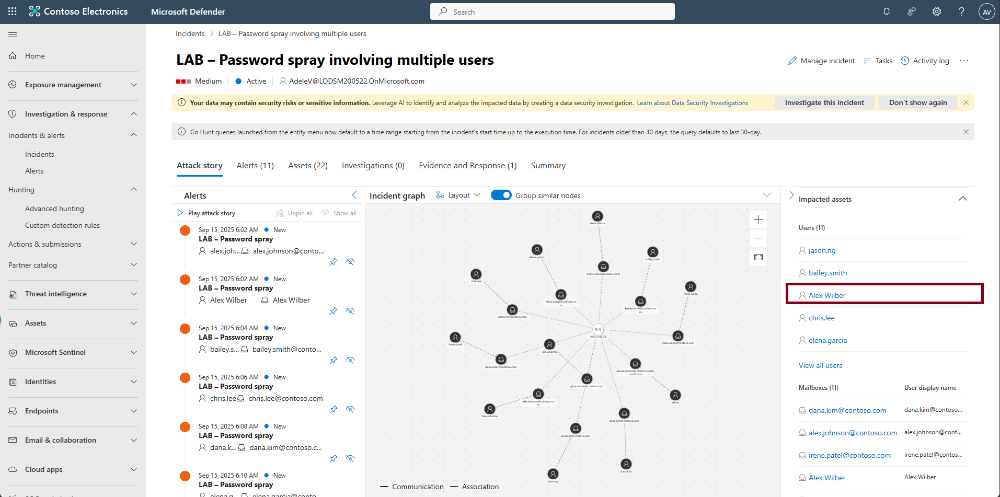
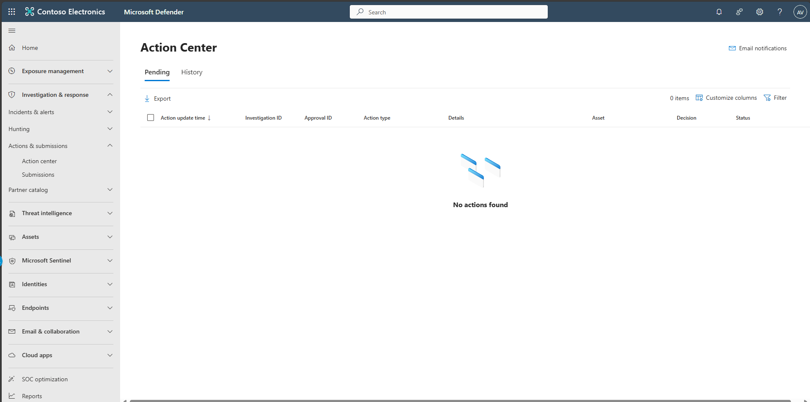

## Task 07: Contain the attack

1. In the leftmost pane, select **Investigation & response** > **Incidents & alerts** > **Incidents**.  

1. Select the incident **LAB - Password spray involving multiple users**.  

1. In the rightmost pane, move through the **Incident Details**, then select **Alex Wilber** from the user list.

   

1. At the top of the flyout, select **Revoke all users' sessions**.  

    

1. Select **Revoke all users' sessions**

   

1. In the leftmost pane, select **Investigation & response** > **Actions & submissions** > **Action center**.  

1. At the top, select the **History** tab to confirm remediation steps.  

   

   

   