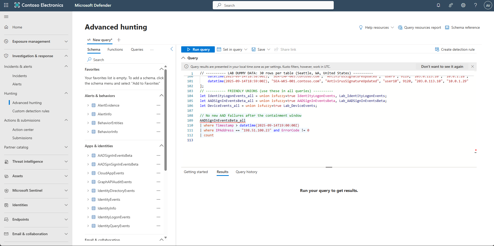
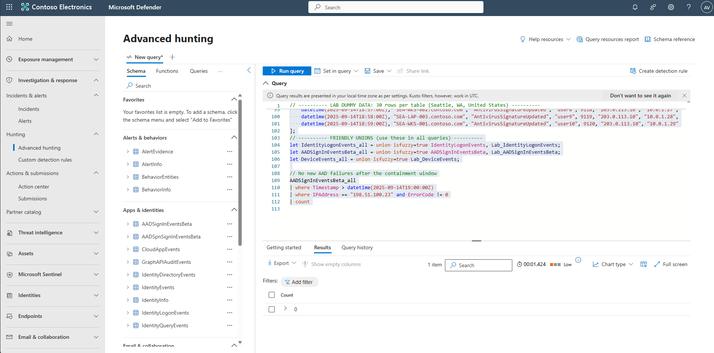
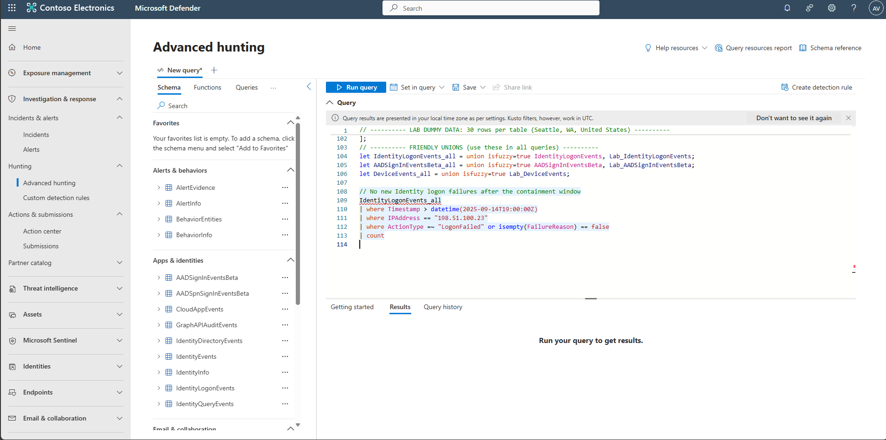
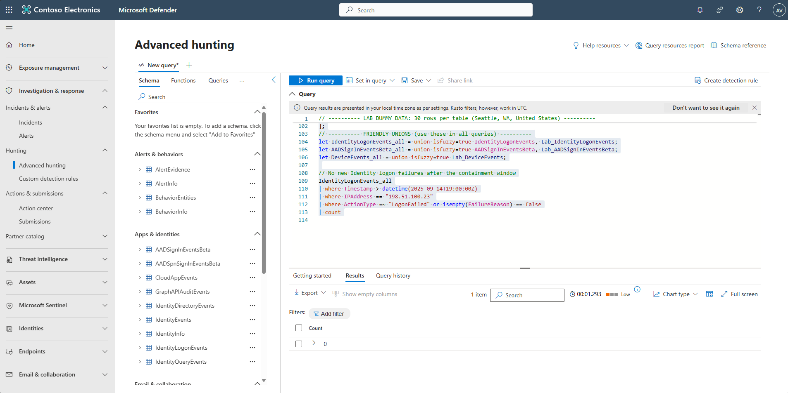

## Task 08: Verify containment and close incident

1. In the leftmost pane, select **Investigation & response** > **Hunting** > **Advanced hunting**.  

1. Copy the following KQL into the query window, select the entire query, then select **Run query**. 

    
    <details markdown='block'>
    <summary>
    Expand here to copy the KQLQuery-8
    </summary>

    {: .warning }
    > KSQL errored

    {: .note }
    > Selecting the **Copy** option in the upper-right corner of the code block  and pasting with **Ctrl+V** will be significantly faster than selecting **Type**!
    
    ```KQLQuery-8.txt-wrap
    // ---------- DYNAMIC TIME WINDOW ----------
    let Window = 30m;                 // length of the "containment window"
    let Start  = now(-1h);            // starts 60 minutes ago
    let End    = Start + Window;      // ends 30 minutes ago

    // ---------- LAB DUMMY DATA: 30 rows per table (Seattle, WA, US) ----------

    // Identity logons: 20 failures from 198.51.100.23 (inside window) + 10 successes from 203.0.113.10 (still inside window)
    let Lab_IdentityLogonEvents =
    range i from 0 to 29 step 1
    | extend Timestamp = Start + i*1m
    , AccountUpn = tostring(dynamic([
        "AlexW@LODSM200522.OnMicrosoft.com","bailey.smith@contoso.com","chris.lee@contoso.com",
        "dana.kim@contoso.com","elena.garcia@contoso.com","frank.wong@contoso.com",
        "gina.martin@contoso.com","hank.wilson@contoso.com","irene.patel@contoso.com","jason.ng@contoso.com"
    ])[i % 10])
    | extend AccountObjectId = strcat("id-", tostring(split(AccountUpn, "@")[0]))
    , ActionType    = iff(i < 20, "LogonFailed", "LogonSuccess")
    , FailureReason = iff(i < 20, "Wrong password", "")
    , LogonType     = "Interactive Logon"
    , Protocol      = "Kerberos"
    , Application   = iff(i < 20, "Microsoft Teams", "SharePoint Online")
    , DeviceName    = tostring(dynamic(["SEA-WKS-001.contoso.com","SEA-WKS-002.contoso.com","SEA-LAP-003.contoso.com"])[i % 3])
    , IPAddress     = iff(i < 20, "198.51.100.23", "203.0.113.10")
    , Location      = "Seattle, US"
    , ReportId      = tostring(9001 + i)
    | project Timestamp, AccountUpn, AccountObjectId, ActionType, FailureReason, LogonType, Protocol, Application, DeviceName, IPAddress, Location, ReportId;

    // AAD sign-ins: 20 failures from 198.51.100.23 occur BEFORE End; 10 successes from 203.0.113.10 occur AFTER End
    let Lab_AADSignInEventsBeta =
    range i from 0 to 29 step 1
    | extend Timestamp = iff(i < 20, Start + i*1m, End + (i-19)*1m)  // failures before End, successes after End
    , Application         = iff(i < 20, "Office 365 Exchange Online", "Microsoft Teams")
    , ApplicationId       = iff(i < 20, "00000002-0000-0ff1-ce00-000000000000", "1fec8e78-bce4-4aaf-ab1b-5451cc387264")
    , LogonType           = "interactive"
    , ErrorCode           = iff(i < 20, 50126, 0)
    , AccountUpn          = tostring(dynamic([
        "AlexW@LODSM200522.OnMicrosoft.com","bailey.smith@contoso.com","chris.lee@contoso.com","dana.kim@contoso.com",
        "elena.garcia@contoso.com","frank.wong@contoso.com","gina.martin@contoso.com","hank.wilson@contoso.com",
        "irene.patel@contoso.com","jason.ng@contoso.com","user1@contoso.com","user2@contoso.com","user3@contoso.com",
        "user4@contoso.com","user5@contoso.com","user6@contoso.com","user7@contoso.com","user8@contoso.com",
        "user9@contoso.com","user10@contoso.com"
    ])[i % 20])
    | extend AccountObjectId    = strcat("id-", tostring(split(AccountUpn, "@")[0]))
    , DeviceName                = tostring(dynamic(["SEA-WKS-001.contoso.com","SEA-WKS-002.contoso.com","SEA-LAP-003.contoso.com"])[i % 3])
    , OSPlatform                = "Windows 11"
    , AuthenticationRequirement = iff(i < 20, "singleFactorAuthentication", "multiFactorAuthentication")
    , RiskLevelAggregated       = iff(i < 20, 50, 1)
    , UserAgent                 = "Mozilla/5.0 (Windows NT 10.0; Win64; x64) AppleWebKit/537.36 Edge/120.0"
    , ClientAppUsed             = "Browser"
    , Browser                   = "Edge"
    , IPAddress                 = iff(i < 20, "198.51.100.23", "203.0.113.10")
    , Country                   = "US"
    , State                     = "WA"
    , City                      = "Seattle"
    , ReportId                  = tostring(9101 + i)
    | project Timestamp, Application, ApplicationId, LogonType, ErrorCode, AccountUpn, AccountObjectId, DeviceName, OSPlatform, AuthenticationRequirement, RiskLevelAggregated, UserAgent, ClientAppUsed, Browser, IPAddress, Country, State, City, ReportId;

    // Device events: 10 detections tied to 198.51.100.23 inside window, 20 benign updates after End
    let Lab_DeviceEvents =
    range i from 0 to 29 step 1
    | extend Timestamp   = iff(i < 10, Start + (5 + i)*1m, End + (10 + (i-10))*1m)
    , DeviceName         = tostring(dynamic(["SEA-WKS-001.contoso.com","SEA-WKS-002.contoso.com","SEA-LAP-003.contoso.com"])[i % 3])
    , ActionType         = iff(i < 10, "AntivirusDetection", "AntivirusSignatureUpdated")
    , AccountName        = tostring(dynamic([
        "alex.johnson","bailey.smith","chris.lee","dana.kim","elena.garcia","frank.wong","gina.martin","hank.wilson","irene.patel","jason.ng",
        "user1","user2","user3","user4","user5","user6","user7","user8","user9","user10"
    ])[i % 20])
    , ReportId           = tolong(9001 + i)
    , RemoteIP           = iff(i < 10, "198.51.100.23", "203.0.113.10")
    | extend Subnet = 1 + toint(i/10)
    | extend LocalIP = strcat("10.0.", tostring(Subnet), ".", tostring(10 + (i % 10)))
    | project Timestamp, DeviceName, ActionType, AccountName, ReportId, RemoteIP, LocalIP;

    // ---------- FRIENDLY UNIONS (lab-only here; swap to real tables if you have them) ----------
    let IdentityLogonEvents_all = Lab_IdentityLogonEvents;
    let AADSignInEventsBeta_all = Lab_AADSignInEventsBeta;
    let DeviceEvents_all        = Lab_DeviceEvents;

    // ---------- CHECK: No new AAD failures from the bad IP after the containment window ----------
    AADSignInEventsBeta_all
    | where Timestamp > End
    | where IPAddress == "198.51.100.23" and ErrorCode != 0
    | count
    ```

    </details>

    {: .note }
    > The KQL uses demo **Lab_tables** to simulate telemetry, not your production logs. We populate the Lab_IdentityLogonEvents, Lab_AADSignInEventsBeta, and Lab_DeviceEvents with realistic fields and timestamps generated relative to now() so the scenarios always produce results. To run against real data, replace the Lab_* references (currently pointing at the lab tables) with your actual tables.

      

    {: .note }
    > Result will show 0 indicating no new AAD failures after the containment window.
    >
    > 

1. To confirm no new Identity logon failures, copy the following KQL into the query window, select the entire query, then select **Run query**. 

    <details markdown='block'>
    <summary>
    Expand here to copy the KQLQuery-9
    </summary>

    {: .note }
    > Selecting the **Copy** option in the upper-right corner of the code block  and pasting with **Ctrl+V** will be significantly faster than selecting **Type**!

    ```KQLQuery-9.txt-wrap
    // ---------- DYNAMIC TIME WINDOW ----------
    let Window = 30m;                 // length of the "containment window"
    let Start  = now(-1h);            // starts 60 minutes ago
    let End    = Start + Window;      // ends 30 minutes ago

    // ---------- LAB DUMMY DATA: 30 rows per table (Seattle, WA, US) ----------

    // Identity logons: 20 failures from 198.51.100.23 (inside window) + 10 successes from 203.0.113.10 (still inside window)
    let Lab_IdentityLogonEvents =
    range i from 0 to 29 step 1
    | extend Timestamp = Start + i*1m
    , AccountUpn = tostring(dynamic([
        "AlexW@LODSM200522.OnMicrosoft.com","bailey.smith@contoso.com","chris.lee@contoso.com",
        "dana.kim@contoso.com","elena.garcia@contoso.com","frank.wong@contoso.com",
        "gina.martin@contoso.com","hank.wilson@contoso.com","irene.patel@contoso.com","jason.ng@contoso.com"
    ])[i % 10])
    | extend AccountObjectId = strcat("id-", tostring(split(AccountUpn, "@")[0]))
    , ActionType    = iff(i < 20, "LogonFailed", "LogonSuccess")
    , FailureReason = iff(i < 20, "Wrong password", "")
    , LogonType     = "Interactive Logon"
    , Protocol      = "Kerberos"
    , Application   = iff(i < 20, "Microsoft Teams", "SharePoint Online")
    , DeviceName    = tostring(dynamic(["SEA-WKS-001.contoso.com","SEA-WKS-002.contoso.com","SEA-LAP-003.contoso.com"])[i % 3])
    , IPAddress     = iff(i < 20, "198.51.100.23", "203.0.113.10")
    , Location      = "Seattle, US"
    , ReportId      = tostring(9001 + i)
    | project Timestamp, AccountUpn, AccountObjectId, ActionType, FailureReason, LogonType, Protocol, Application, DeviceName, IPAddress, Location, ReportId;

    // AAD sign-ins: 20 failures from 198.51.100.23 occur BEFORE End; 10 successes from 203.0.113.10 occur AFTER End
    let Lab_AADSignInEventsBeta =
    range i from 0 to 29 step 1
    | extend Timestamp = iff(i < 20, Start + i*1m, End + (i-19)*1m)  // failures before End, successes after End
    , Application         = iff(i < 20, "Office 365 Exchange Online", "Microsoft Teams")
    , ApplicationId       = iff(i < 20, "00000002-0000-0ff1-ce00-000000000000", "1fec8e78-bce4-4aaf-ab1b-5451cc387264")
    , LogonType           = "interactive"
    , ErrorCode           = iff(i < 20, 50126, 0)
    , AccountUpn          = tostring(dynamic([
        "AlexW@LODSM200522.OnMicrosoft.com","bailey.smith@contoso.com","chris.lee@contoso.com","dana.kim@contoso.com",
        "elena.garcia@contoso.com","frank.wong@contoso.com","gina.martin@contoso.com","hank.wilson@contoso.com",
        "irene.patel@contoso.com","jason.ng@contoso.com","user1@contoso.com","user2@contoso.com","user3@contoso.com",
        "user4@contoso.com","user5@contoso.com","user6@contoso.com","user7@contoso.com","user8@contoso.com",
        "user9@contoso.com","user10@contoso.com"
    ])[i % 20])
    | extend AccountObjectId    = strcat("id-", tostring(split(AccountUpn, "@")[0]))
    , DeviceName                = tostring(dynamic(["SEA-WKS-001.contoso.com","SEA-WKS-002.contoso.com","SEA-LAP-003.contoso.com"])[i % 3])
    , OSPlatform                = "Windows 11"
    , AuthenticationRequirement = iff(i < 20, "singleFactorAuthentication", "multiFactorAuthentication")
    , RiskLevelAggregated       = iff(i < 20, 50, 1)
    , UserAgent                 = "Mozilla/5.0 (Windows NT 10.0; Win64; x64) AppleWebKit/537.36 Edge/120.0"
    , ClientAppUsed             = "Browser"
    , Browser                   = "Edge"
    , IPAddress                 = iff(i < 20, "198.51.100.23", "203.0.113.10")
    , Country                   = "US"
    , State                     = "WA"
    , City                      = "Seattle"
    , ReportId                  = tostring(9101 + i)
    | project Timestamp, Application, ApplicationId, LogonType, ErrorCode, AccountUpn, AccountObjectId, DeviceName, OSPlatform, AuthenticationRequirement, RiskLevelAggregated, UserAgent, ClientAppUsed, Browser, IPAddress, Country, State, City, ReportId;

    // Device events: 10 detections tied to 198.51.100.23 inside window, 20 benign updates after End
    let Lab_DeviceEvents =
    range i from 0 to 29 step 1
    | extend Timestamp   = iff(i < 10, Start + (5 + i)*1m, End + (10 + (i-10))*1m)
    , DeviceName         = tostring(dynamic(["SEA-WKS-001.contoso.com","SEA-WKS-002.contoso.com","SEA-LAP-003.contoso.com"])[i % 3])
    , ActionType         = iff(i < 10, "AntivirusDetection", "AntivirusSignatureUpdated")
    , AccountName        = tostring(dynamic([
        "alex.johnson","bailey.smith","chris.lee","dana.kim","elena.garcia","frank.wong","gina.martin","hank.wilson","irene.patel","jason.ng",
        "user1","user2","user3","user4","user5","user6","user7","user8","user9","user10"
    ])[i % 20])
    , ReportId           = tolong(9001 + i)
    , RemoteIP           = iff(i < 10, "198.51.100.23", "203.0.113.10")
    | extend Subnet = 1 + toint(i/10)
    | extend LocalIP = strcat("10.0.", tostring(Subnet), ".", tostring(10 + (i % 10)))
    | project Timestamp, DeviceName, ActionType, AccountName, ReportId, RemoteIP, LocalIP;

    // ---------- FRIENDLY UNIONS (lab-only here; swap to real tables if you have them) ----------
    let IdentityLogonEvents_all = Lab_IdentityLogonEvents;
    let AADSignInEventsBeta_all = Lab_AADSignInEventsBeta;
    let DeviceEvents_all        = Lab_DeviceEvents;

    // No new Identity logon failures after the containment window
    IdentityLogonEvents_all
    | where Timestamp > datetime(2025-09-14T19:00:00Z)
    | where IPAddress == "198.51.100.23"
    | where ActionType =~ "LogonFailed" or isempty(FailureReason) == false
    | count
    ```
    </details>

    {: .note }
    > The KQL uses demo **Lab_tables** to simulate telemetry, not your production logs. We populate the Lab_IdentityLogonEvents, Lab_AADSignInEventsBeta, and Lab_DeviceEvents with realistic fields and timestamps generated relative to now() so the scenarios always produce results. To run against real data, replace the Lab_* references (currently pointing at the lab tables) with your actual tables.

      
   
    {: .note }
    > Result will show 0 indicating no new Identity Logon failures after the containment window.
    >
    > 