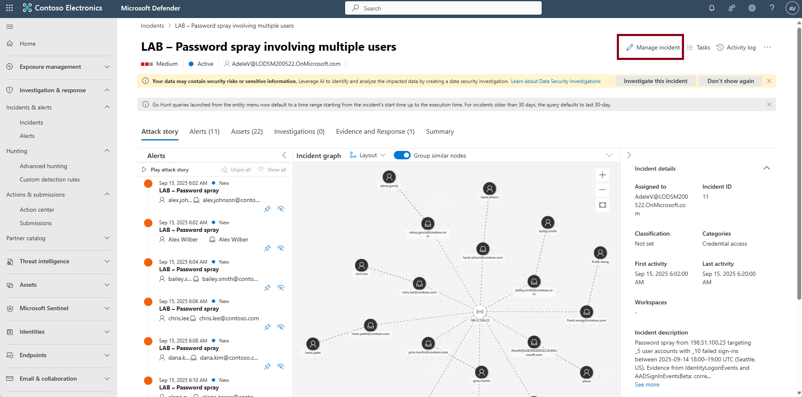
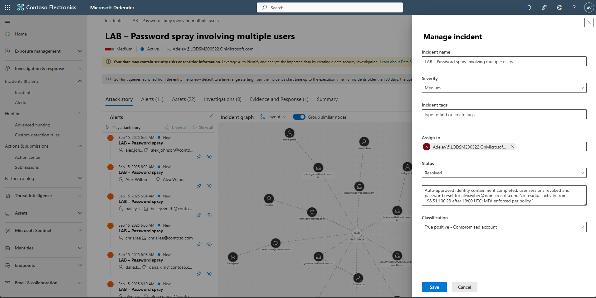

### Task 09: Close the incident

1. In the leftmost pane, select **Investigation & response** > **Incidents & alerts** > **Incidents**.  

1. Select the incident **LAB - Password spray involving multiple users**.  

1. Near the upper-right corner of the page, select **Manage incident**.  

    

1. In the **Manage incident** flyout, enter the following details to update it:

    | Item | Value |
    |:---------|:---------|
    | Status  | **Resolved**  | 
    | Description   | `Auto-approved identity containment completed. Sessions revoked and password reset for alex.wilber@onmicrosoft.com. No residual activity from 198.51.100.23 after 19:00 UTC; MFA enforced.`  |
    | Classification | **True positive - Compromised account**  |

    
