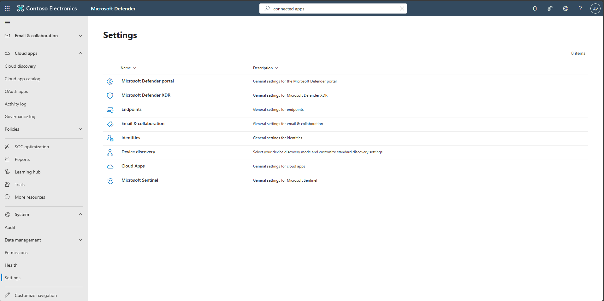
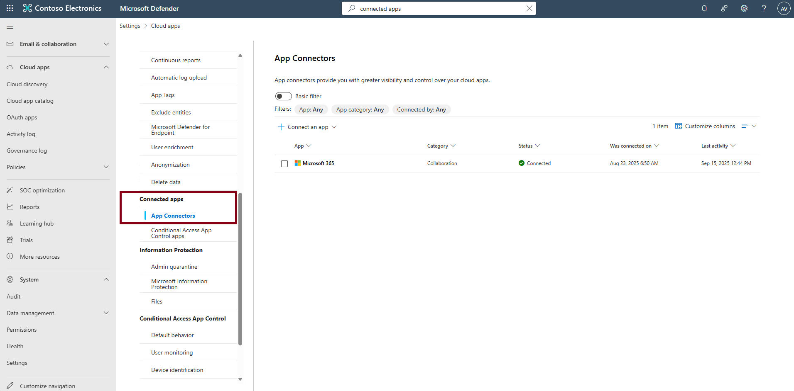
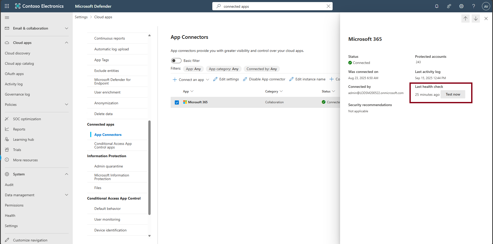
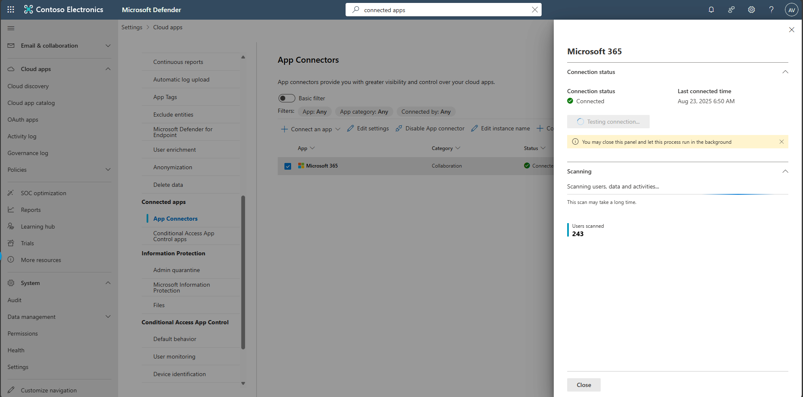

## Task 01: Detect ingestion gaps across connectors

1. In the Defender portal's leftmost pane, go to **System** > **Settings**.

1. Select **Cloud Apps**.  

   

1. In the **Cloud apps** navigation menu, under **Connected apps**, select **App connectors**.  

   

1. Review connector **Status**, **Last seen** timestamps, and any health/permission banners.  

1. Select any empty space on the row for **Microsoft 365** to open the flyout pane.

1. Select **Test now**.  

   

   
