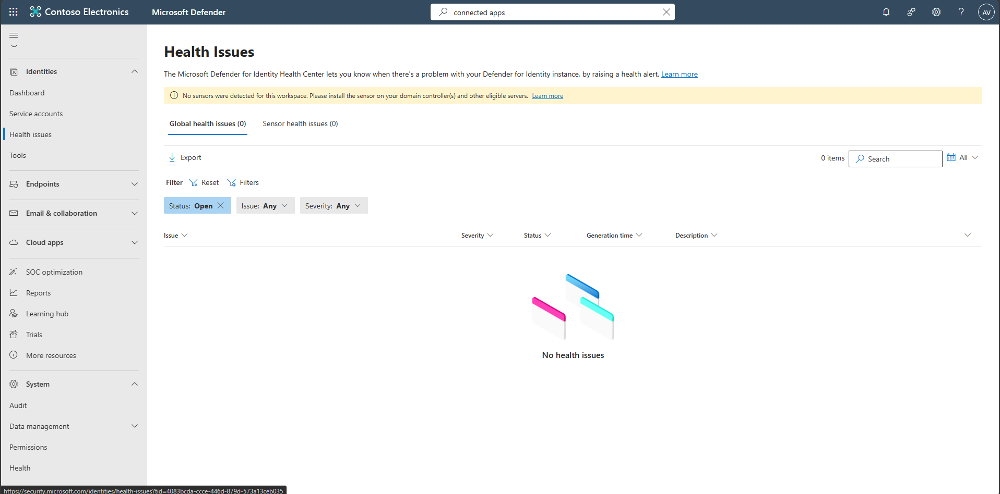
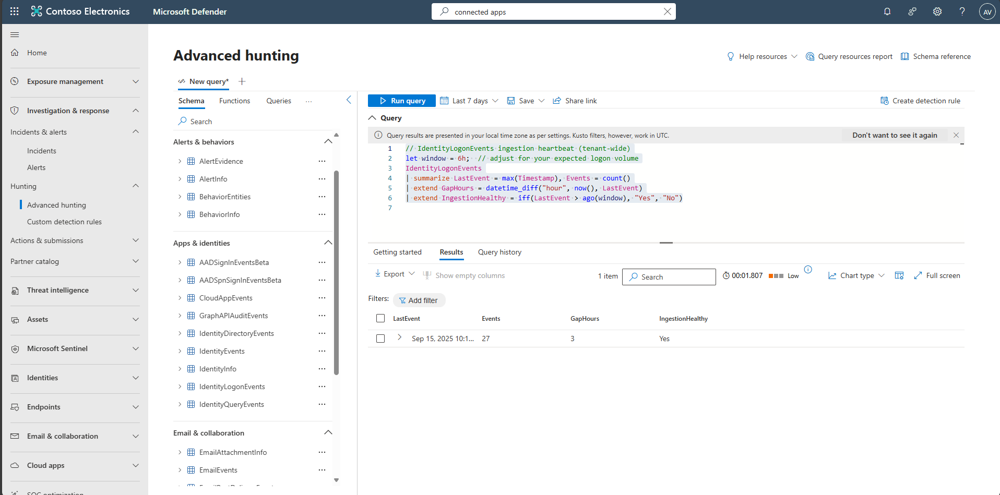

## Task 02: Validate Defender for Identity health

1. In the leftmost pane, select **Identities** > **Health issues**.  

    

    {: .note }
    > Review tenant and sensor health issues (misconfigurations, stopped services, outdated sensors).  

1. In the leftmost pane, select **Investigation & response** > **Hunting** > **Advanced hunting**.  

1. Copy the following KQL into the query window, select the entire query, then select **Run query**. 

    <details markdown='block'>
    <summary>
    Expand here to copy the Ingestion-KQL-1.txt
    </summary>

    {: .note }
    > Selecting the **Copy** option in the upper-right corner of the code block, and pasting with **Ctrl+V**, will be significantly faster than selecting **Type**!

    ```Ingestion-KQL-1.txt-wrap
    // IdentityLogonEvents ingestion heartbeat (tenant-wide)
    let window = 6h;  // adjust for your expected logon volume
    IdentityLogonEvents
    | summarize LastEvent = max(Timestamp), Events = count()
    | extend GapHours = datetime_diff("hour", now(), LastEvent)
    | extend IngestionHealthy = iff(LastEvent > ago(window), "Yes", "No")    
    ```
    </details>

    

    {: .note }
    > The results will show whether Ingestion is happening and how long the gaps are. 
