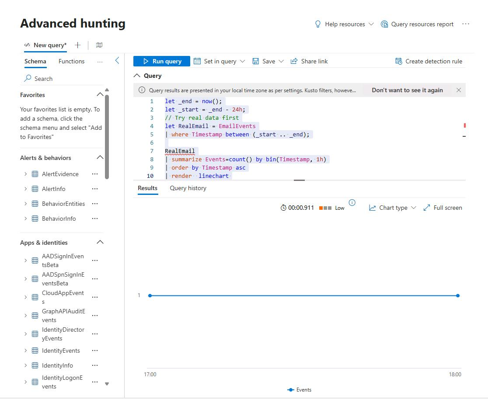
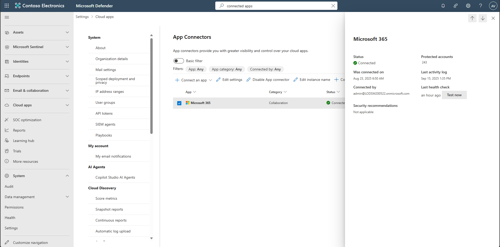

## Task 03: Validate Defender for Office 365 health

1. Copy the following KQL into the query window, select the entire query, then select **Run query**. 

    <details markdown='block'>
    <summary>
    Expand here to copy the Ingestion-KQL-2.txt
    </summary>

    {: .note }
    > Selecting the **Copy** option in the upper-right corner of the code block  and pasting with **Ctrl+V** will be significantly faster than selecting **Type**!

    ```Ingestion-KQL-2.txt-wrap
    let _end = now();
    let _start = _end - 24h;
    // Try real data first
    let RealEmail = EmailEvents
    | where Timestamp between (_start .. _end);

    RealEmail
    | summarize Events=count() by bin(Timestamp, 1h)
    | order by Timestamp asc
    | render  linechart 
    ```
    </details>

    

    {: .note }
    > Results will show emails in the last 24 hours. A flat line, or log gap between bins, may indicate a potential ingestion gap.

1. In the leftmost pane, go to **System**, then **Settings**.

1. Select **Cloud Apps**.

1. In the **Cloud apps** navigation menu, under **Connected apps**, select **App connectors**.  

1. Select any empty space on the row for **Microsoft 365** to open the flyout pane.

1. Review **Status** and any **Error** details.  

    

    {: .important }
    > Common errors:  
    > - **401/InvalidOAuthToken**: Re-authorize with a privileged app admin; verify scopes; rotate secret if expired.  
    > - **429/TooManyRequests**: Reduce polling frequency or stagger schedules.
    > - for more help, [use Microsoft’s error guide for resolution tips.](https://learn.microsoft.com/en-us/defender-cloud-apps/troubleshooting-api-connectors-errors)
