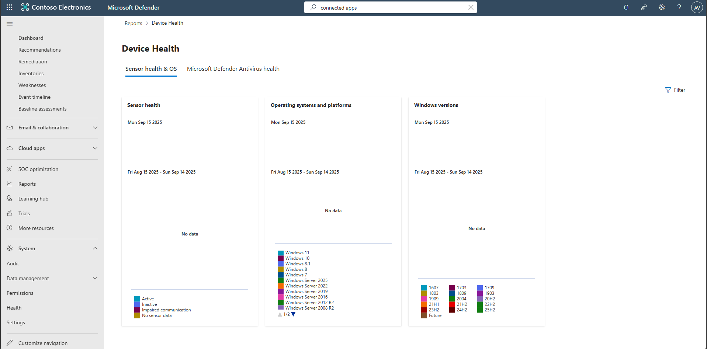

## Task 04: Validate Defender for Endpoints health

1. In the leftmost pane, select **Reports**.  

1. Under **Endpoints**, select **Device health**.  

    

    {: .note }
    > Review the **Device health** tile to confirm sensor communication.
