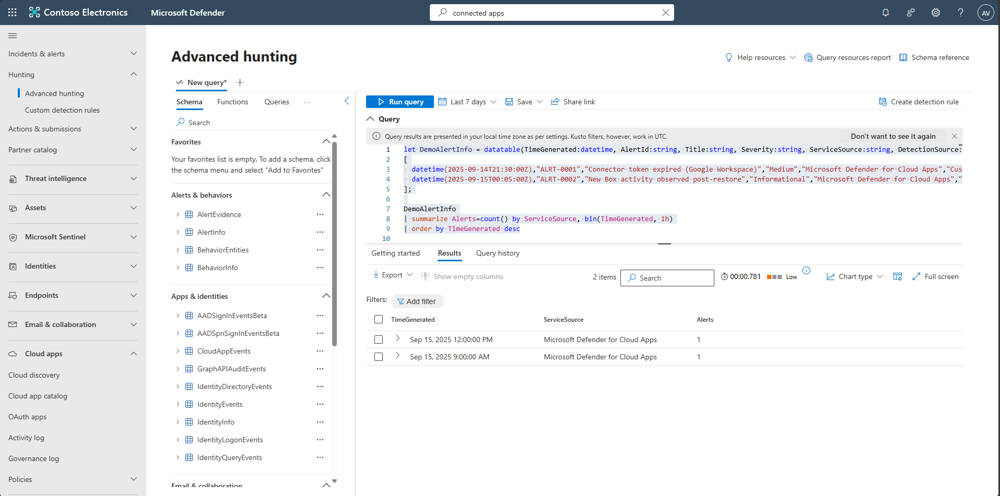

## Task 05: Prioritize connectors and define success criteria

1. Identify which connectors feed the ongoing incidents you must resolve first (e.g. CloudAppEvents for Apps, IdentityLogonEvents for MDI).

1. In the leftmost pane, select **Investigation & response** > **Hunting** > **Advanced hunting**.  

1. Map the incidents to apps.

1. Define success criteria (for example, "new events visible within 15 minutes").  

1. Copy the following KQL into the query window, select the entire query, then select **Run query**. 

    <details markdown='block'>
    <summary>
    Expand here to copy the Ingestion-KQL-3.txt
    </summary>
    
    {: .note } Selecting the **Copy** option in the upper-right corner of the code block  and pasting with **Ctrl+V** will be significantly faster than selecting **Type**!

    ```Ingestion-KQL-3.txt-wrap
    let DemoAlertInfo = datatable(TimeGenerated:datetime, AlertId:string, Title:string, Severity:string, ServiceSource:string, DetectionSource:string)
    [
      datetime(2025-09-14T21:30:00Z),"ALRT-0001","Connector token expired (Google Workspace)","Medium","Microsoft Defender for Cloud Apps","CustomDetection",
      datetime(2025-09-15T00:05:00Z),"ALRT-0002","New Box activity observed post-restore","Informational","Microsoft Defender for Cloud Apps","AnomalousActivityPolicy"
    ];

    DemoAlertInfo
    | summarize Alerts=count() by ServiceSource, bin(TimeGenerated, 1h)
    | order by TimeGenerated desc
    ```
    </details>

    {: .note }
    > The KQL uses demo **Demotables** to simulate telemetry, not your production logs. We populate the DemoAlertInfo with realistic fields and timestamps generated relative to now() so the scenarios always produce results. To run against real data, replace the Demo* references (currently pointing at the lab tables) with your actual tables.

   

1. Validate the output based on your success criteria. 