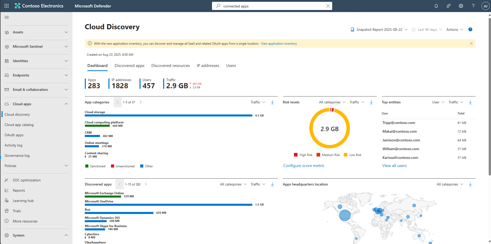
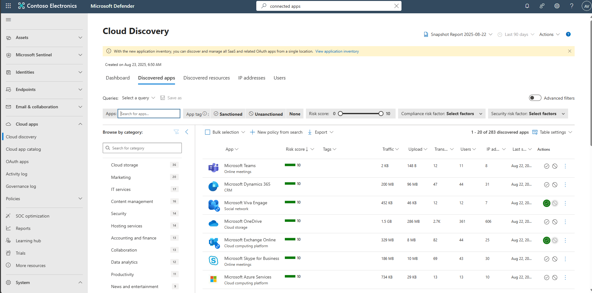

## Task 06: Cloud Discovery Data flow Validation

1. In the leftmost pane, select **Cloud apps**, then **Cloud discovery**.

     

1. Near the top, select the **Discovered apps** tab – validate risk scores, traffic and uploads are populated. 
    
{: .note }
> This shows that Cloud Discovery is successfully identifying applications and is not blocked by permissions, API health or log issues.  

