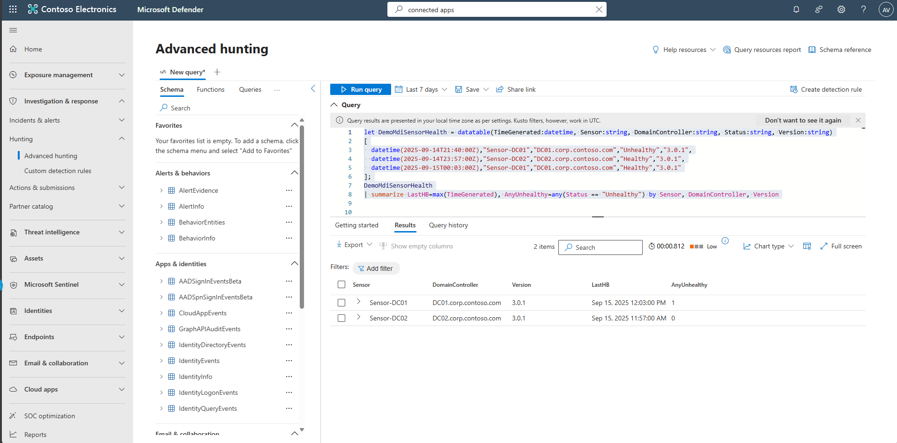

## Task 07: Validate Defender for Identity agent health

1. In the leftmost pane, select **Identities** > **Health issues** to resolve any alerts.  

    

1. In the leftmost pane, go to **System** > **Settings**.

1. Select **Identities** > **Sensors** to confirm status, version, and network adapters.  

    

    {: .note }
    > If a sensor is outdated/not starting, update or reinstall the package.

1. In the leftmost pane, select **Investigation & response** > **Hunting** > **Advanced hunting**.  

1. Copy the following KQL into the query window, select the entire query, then select **Run query**. 

    <details markdown='block'>
    <summary>
    Expand here to copy the Ingestion-KQL-4.txt
    </summary>

    {: .note }
    > Selecting the **Copy** option in the upper-right corner of the code block  and pasting with **Ctrl+V** will be significantly faster than selecting **Type**!

    ```Ingestion-KQL-4.txt-wrap
    let DemoMdiSensorHealth = datatable(TimeGenerated:datetime, Sensor:string, DomainController:string, Status:string, Version:string)
    [
      datetime(2025-09-14T21:40:00Z),"Sensor-DC01","DC01.corp.contoso.com","Unhealthy","3.0.1",
      datetime(2025-09-14T23:57:00Z),"Sensor-DC02","DC02.corp.contoso.com","Healthy","3.0.1",
      datetime(2025-09-15T00:03:00Z),"Sensor-DC01","DC01.corp.contoso.com","Healthy","3.0.1"
    ];
    DemoMdiSensorHealth
    | summarize LastHB=max(TimeGenerated), AnyUnhealthy=any(Status == "Unhealthy") by Sensor, DomainController, Version
    ```
    </details>

    {: .note }
    > This KQL query uses a custom demo table to simulate sensor health data, not production logs. It includes realistic fields and timestamps relative to now() so the results are always current. To use it with real data, simply replace the demo table reference with the actual SensorHealth Custom Log Analytics table that stores real sensor heartbeat and status information. 

    

    {: .note }
    > The result will indicate sensor-DC01 showing a recent heartbeat and changes **Unhealthy** to **Healthy**. 
