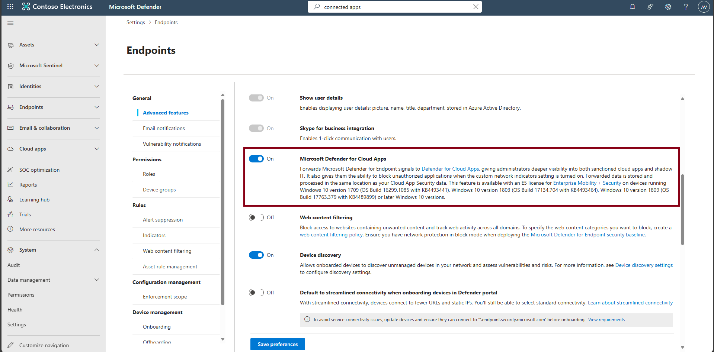
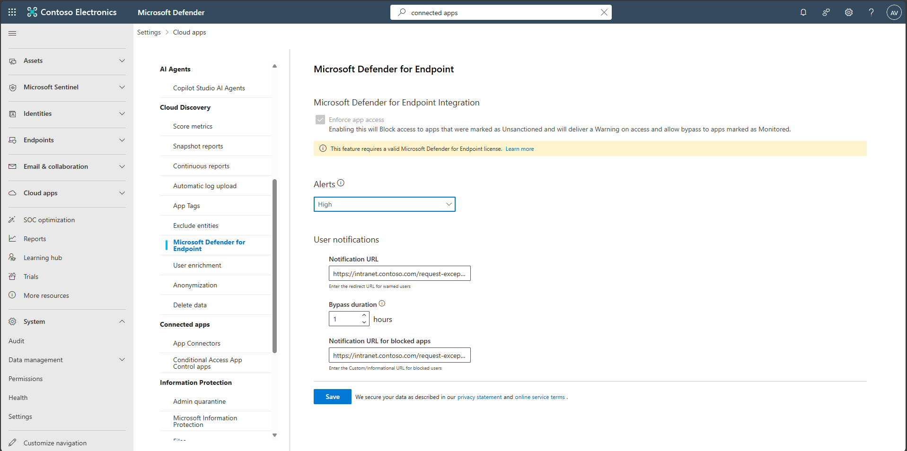
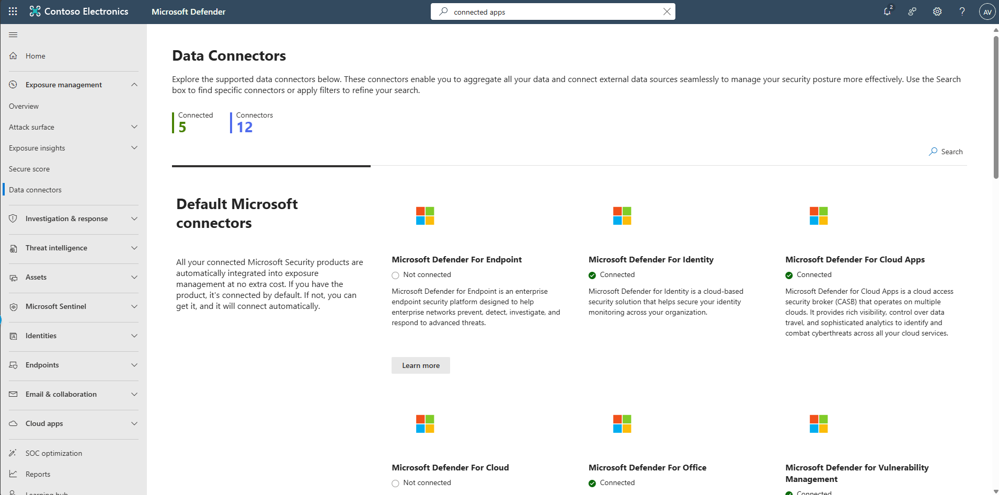
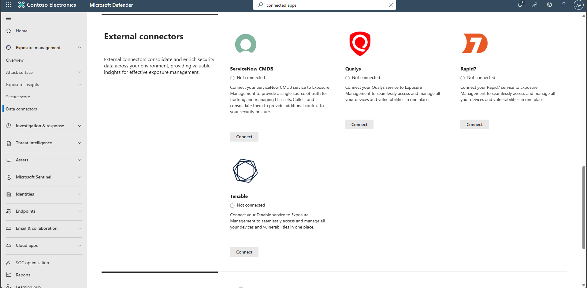

## Task 08: Enable advanced configuration for broader coverage

<!-- Redundant

1. In the leftmost pane, go to **System** > **Settings** > **Endpoints** > **Advanced features**. 

1. Turn on **Microsoft Defender for Cloud Apps** for device-based discovery. 

    -->

1. In the leftmost pane, go to **System** > **Settings**.

1. Select **Cloud Apps**.

1. In the **Cloud apps** menu, under **Cloud Discovery**, select **Microsoft Defender for Endpoint**.

1. Configure the following:  

    | Item | Value |
    |:---------|:---------|
    | Alerts   | **High**  | 
    | Notification URL | `https://intranet.contoso.com/request-exception`  |
    | Bypass duration | `1` |
    | Notification URL for blocked apps | `https://intranet.contoso.com/request-exception`    |

    

1. Select **Save**.

1. In the leftmost pane, go to **Exposure management** > **Data connectors**.

1. Connect external scanners (Qualys, Tenable, Rapid7) to enrich exposure context, if required.  

    

    