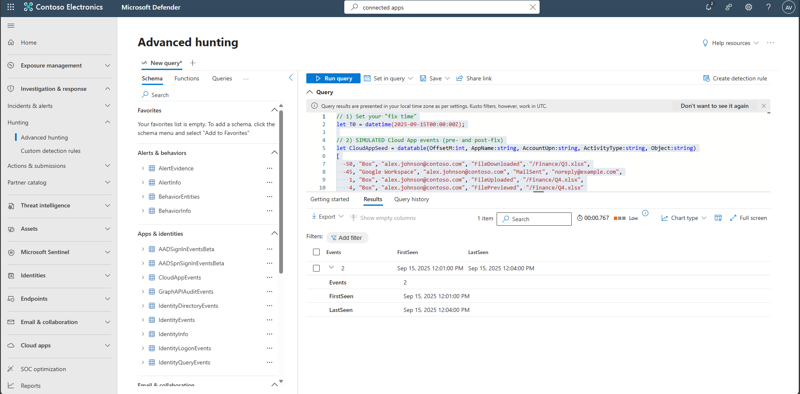

## Task 09: Reconfigure connectors and validate restoration

1. Reconfigure Cloud Apps connector, as needed.  

    - If you saw **401/Unauthorized**, select **Re-authorize**, sign in with the app admin, and confirm scopes.
    - If you saw **429/TooManyRequests**, reduce polling frequency/scope as supported by the provider.
    - Select **Save**. 

1. In the leftmost pane, select **Identities**, then **Health issues**.

1. Open each issue and follow the recommended fix.

1. In the leftmost pane, select **System**, then **Settings**.

1. Select **Identities**, then **Sensors**.

1. Confirm whether the **Sensor status** is **Healthy** and heartbeat timestamps updates. 

1. In the leftmost pane, select **Investigation & response**, then **Hunting**, and then **Advanced hunting**.  

1. Copy the following KQL into the query window, select the entire query, then select **Run query**. 

    <details markdown='block'>
    <summary>
    Expand here to copy the Ingestion-KQL-5.txt
    </summary>
    
    {: .note }
    > Selecting the **Copy** option in the upper-right corner of the code block  and pasting with **Ctrl+V** will be significantly faster than selecting **Type**!

    ```Ingestion-KQL-5.txt-wrap
    // 1) Set your "fix time"
    let T0 = datetime(2025-09-15T00:00:00Z);

    // 2) SIMULATED Cloud App events (pre- and post-fix)
    let CloudAppSeed = datatable(OffsetM:int, AppName:string, AccountUpn:string, ActivityType:string, Object:string)
    [
      -50, "Box", "alex.johnson@contoso.com", "FileDownloaded", "/Finance/Q3.xlsx",
      -45, "Google Workspace", "alex.johnson@contoso.com", "MailSent", "noreply@example.com",
        1, "Box", "alex.johnson@contoso.com", "FileUploaded", "/Finance/Q4.xlsx",
        4, "Box", "alex.johnson@contoso.com", "FilePreviewed", "/Finance/Q4.xlsx"
    ];
    let CloudAppEvents_sim =
    CloudAppSeed
    | extend TimeGenerated = T0 + totimespan(OffsetM * 1m)
    | project TimeGenerated, AppName, AccountUpn, ActivityType, Object;

    // 3) SIMULATED "post-restore" alert at T0 + 3 minutes
    let AlertSeed = datatable(OffsetM:int, AlertId:string, Title:string, Severity:string, ServiceSource:string, DetectionSource:string)
    [
      3, "ALRT-BOX-POSTFIX", "New Box activity observed post-restore", "Informational", "Microsoft Defender for Cloud Apps", "Policy"
    ];
    let AlertInfo_sim =
    AlertSeed
    | extend TimeGenerated = T0 + totimespan(OffsetM * 1m)
    | project TimeGenerated, AlertId, Title, Severity, ServiceSource, DetectionSource;

    // 4) Validations
    CloudAppEvents_sim
    | where AppName == "Box" and TimeGenerated >= T0
    | summarize Events=count(), FirstSeen=min(TimeGenerated), LastSeen=max(TimeGenerated)
    ```
    </details>

    {: .note }
    > The KQL uses demo **tables_Sim** to simulate telemetry, not your production logs. We populate the CloudAppEvents_Sim, AlertInfo_Sim with realistic fields and timestamps generated relative to now() so the scenarios always produce results. To run against real data, replace the *_Sim references (currently pointing at the lab tables) with your actual tables.

    

    {: .note }
    > Results should confirm new events were ingested after remediation, proving telemetry resumed.