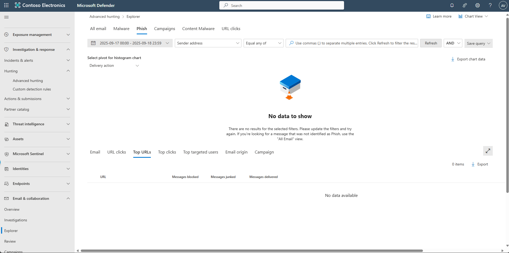
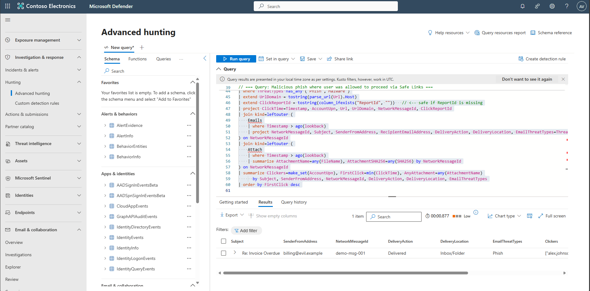

## Task 01: Identify the initial phishing email in MDO

1. In the leftmost pane of the Microsoft Defender portal, select **Email & collaboration** > **Explorer**.  

    

1. Select **Phish** from the tabs.

    {: .note }
    > This view surfaces emails that were delivered and clicked through **Safe Links**.

1. In the leftmost pane, select **Investigation & response** > **Hunting** > **Advanced hunting**.

1. Copy the following KQL into the query window, select the entire query, then select **Run query**.  

    <details markdown='block'>
    <summary> Expand here to copy KQL-1.txt  </summary>

    ```KQL-1.txt-wrap
    //  Parameters 
    let lookback = 7d;
    let _now = now();

    //  DEMO DATA (use offsets; compute timestamps after) 
    let DemoUrlClickSeed = datatable(OffsetM:int, ActionType:string, IsClickedThrough:bool, Url:string, AccountUpn:string, NetworkMessageId:string, ThreatTypes:string, ReportId:string)
    [
      -120, "ClickAllowed", true, "http://malicious.example/login",        "alex.johnson@contoso.com", "demo-msg-001", "Phish",   "demo-click-001",
       -60, "ClickAllowed", true, "http://cdn.badcdn.example/file.exe",     "alex.johnson@contoso.com", "demo-msg-001", "Malware", "demo-click-002"
    ];
    let DemoUrlClickEvents =
      DemoUrlClickSeed
      | extend Timestamp = datetime_add('minute', OffsetM, _now)
      | project Timestamp, ActionType, IsClickedThrough, Url, AccountUpn, NetworkMessageId, ThreatTypes, ReportId;

    let DemoEmailEventsSeed = datatable(OffsetM:int, NetworkMessageId:string, Subject:string, SenderFromAddress:string, RecipientEmailAddress:string, DeliveryAction:string, DeliveryLocation:string, ThreatTypes:string)
    [
      -180, "demo-msg-001", "Re: Invoice Overdue", "billing@evil.example", "alex.johnson@contoso.com", "Delivered", "Inbox/Folder", "Phish"
    ];
    let DemoEmailEvents =
      DemoEmailEventsSeed
      | extend Timestamp = datetime_add('minute', OffsetM, _now)
      | project Timestamp, NetworkMessageId, Subject, SenderFromAddress, RecipientEmailAddress, DeliveryAction, DeliveryLocation, ThreatTypes;

    let DemoEmailAttachmentInfoSeed = datatable(OffsetM:int, NetworkMessageId:string, FileName:string, SHA256:string, ThreatTypes:string)
    [
      -180, "demo-msg-001", "Invoice.zip", "DEMO_SHA256_ABC", "Malware"
    ];
    let DemoEmailAttachmentInfo =
      DemoEmailAttachmentInfoSeed
      | extend Timestamp = datetime_add('minute', OffsetM, _now)
      | project Timestamp, NetworkMessageId, FileName, SHA256, ThreatTypes;

    //  Blend demo rows with live tables 
    let Clicks  = union kind=outer UrlClickEvents,     DemoUrlClickEvents;
    let Emails  = union kind=outer EmailEvents,         DemoEmailEvents;
    let Attach  = union kind=outer EmailAttachmentInfo, DemoEmailAttachmentInfo;

    //  Query: Malicious phish where user was allowed to proceed via Safe Links 
    Clicks
    | where Timestamp > ago(lookback)
    | extend ClickedThrough = iif(tobool(column_ifexists("IsClickedThrough", false)) or ActionType == "ClickAllowed", true, false)
    | where ClickedThrough
    | where ThreatTypes has_any ("Phish","Malware")
    | extend UrlDomain = tostring(parse_url(Url).Host)
    | extend ClickReportId = tostring(column_ifexists("ReportId", ""))   // <-- safe if ReportId is missing
    | project ClickTime=Timestamp, AccountUpn, Url, UrlDomain, NetworkMessageId, ClickReportId
    | join kind=leftouter (
        Emails
        | where Timestamp > ago(lookback)
        | project NetworkMessageId, Subject, SenderFromAddress, RecipientEmailAddress, DeliveryAction, DeliveryLocation, EmailThreatTypes=ThreatTypes
    ) on NetworkMessageId
    | join kind=leftouter (
        Attach
        | where Timestamp > ago(lookback)
        | summarize AttachmentName=any(FileName), AttachmentSHA256=any(SHA256) by NetworkMessageId
    ) on NetworkMessageId
    | summarize Clickers=make_set(AccountUpn), FirstClick=min(ClickTime), AnyAttachment=any(AttachmentName)
          by Subject, SenderFromAddress, NetworkMessageId, DeliveryAction, DeliveryLocation, EmailThreatTypes
    | order by FirstClick desc
    ```
    </details>

    {: .note }
    > The KQL uses demo **Demotables** to simulate telemetry, not your production logs. We populate the DemoUrlClickEvents, DemoEmailEvents, DemoEmailAttachmentInfo with realistic fields and timestamps generated relative to now() so the scenarios always produce results. To run against real data, replace the Demo* references (currently pointing at the lab tables) with your actual tables.

    


