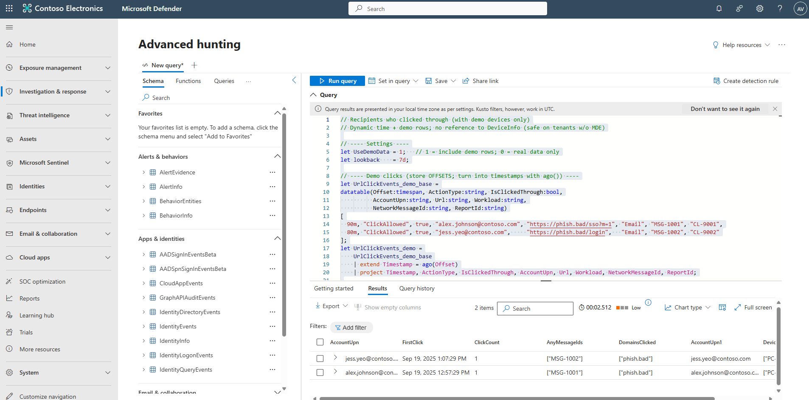

## Task 02: Correlate email click to post-phish endpoint activity

1. Copy the following KQL into the query window, then select **Run query**.

    <details markdown='block'>
    <summary>
    Expand here to copy KQL-2.txt
    </summary>

    ```KQL-2.txt-wrap
    // Recipients who clicked through (with demo devices only)
    // Dynamic time + demo rows; no reference to DeviceInfo (safe on tenants w/o MDE)

    // ---- Settings ----
    let UseDemoData = 1;   // 1 = include demo rows; 0 = real data only
    let lookback    = 7d;

    // ---- Demo clicks (store OFFSETS; turn into timestamps with ago()) ----
    let UrlClickEvents_demo_base =
    datatable(Offset:timespan, ActionType:string, IsClickedThrough:bool,
              AccountUpn:string, Url:string, Workload:string,
              NetworkMessageId:string, ReportId:string)
    [
      90m, "ClickAllowed", true, "alex.johnson@contoso.com", "https://phish.bad/sso?m=1", "Email", "MSG-1001", "CL-9001",
      80m, "ClickAllowed", true, "jess.yeo@contoso.com",     "https://phish.bad/login",   "Email", "MSG-1002", "CL-9002"
    ];
    let UrlClickEvents_demo =
        UrlClickEvents_demo_base
        | extend Timestamp = ago(Offset)
        | project Timestamp, ActionType, IsClickedThrough, AccountUpn, Url, Workload, NetworkMessageId, ReportId;

    // ---- Real clicks (MDO) ----
    let UrlClickEvents_real =
        UrlClickEvents
        | where Timestamp >= ago(lookback)
        | project Timestamp, ActionType, IsClickedThrough, AccountUpn, Url, Workload, NetworkMessageId, ReportId;

    // ---- Proper union gating (no iff around union) ----
    let UrlClickEvents_all =
        union isfuzzy=true
            (UrlClickEvents_real | extend __demo = 0),
            (UrlClickEvents_demo | extend __demo = 1)
        | where __demo == 0 or UseDemoData == 1;

    // ---- Clicks normalized ----
    let clicks =
        UrlClickEvents_all
        | extend UrlDomain = tostring(parse_url(Url).Host)
        | where ActionType == "ClickAllowed" or tobool(IsClickedThrough) == true
        | project ClickTime=Timestamp, AccountUpn=tolower(AccountUpn), Url, UrlDomain, Workload, NetworkMessageId, ReportId;

    // ---- Demo user→device map (only used when UseDemoData=1) ----
    let UserDevices_demo =
    datatable(AccountUpn:string, DeviceName:string)
    [
      "alex.johnson@contoso.com", "PC-ALPHA.contoso.com",
      "alex.johnson@contoso.com", "PC-BETA.contoso.com",
      "jess.yeo@contoso.com",     "PC-BETA.contoso.com"
    ]
    | summarize Devices = make_set(DeviceName) by AccountUpn;

    // ---- Final ----
    clicks
    | summarize FirstClick=min(ClickTime),
                ClickCount=dcount(ReportId),
                AnyMessageIds=make_set(NetworkMessageId, 3),
                DomainsClicked=make_set(UrlDomain, 5)
              by AccountUpn
    | join kind=leftouter (UserDevices_demo | project AccountUpn=tolower(AccountUpn), Devices) on AccountUpn
    | order by FirstClick desc
    ```
    </details>

    {: .note }
    > The KQL uses demo **tables_demo** to simulate telemetry, not your production logs. We populate the UrlClickEvents_demo, UserDevices_demo with realistic fields and timestamps generated relative to now() so the scenarios always produce results. To run against real data, replace the Demo* references (currently pointing at the lab tables) with your actual tables. 

    

    {: .note }
    > This KQL joins URL click, email, and device process signals to build a timeline of user activity within ±2h of the phish click.

    {: .highlight }
    > Identify:
    > - **Who** clicked (AccountUpn)  
    > - **Where** (DeviceName, IP)  
    > - **What executed** (powershell, cmd, etc.)

