## Task 01: Enable AIR and set automatic remediation levels (MDE + MDO)

1. In the leftmost pane of the Microsoft Defender portal, go to **System** > **Settings**.

1. Select **Endpoints**.

1. In the **Endpoints** menu, under **Permissions**, select **Device groups**.  

    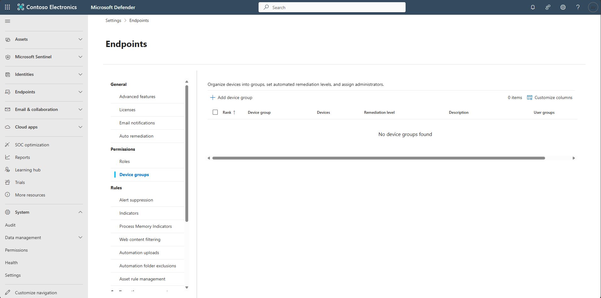

1. Select **+ Add device group**. 

1. In the flyout pane's **General** step, enter the following, then select **Next**. 

    | Item | value |
    |:---------|:---------|
    | Device group name   | `Pilot Lab`  |
    | Remediation level  | **Full remediation**  |

    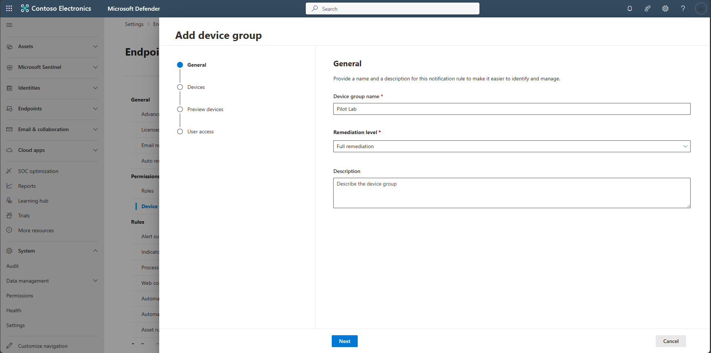

1. Under **Devices**, set the **Name** condition to **Starts with**, a value of `win`, then select **Next**.  

    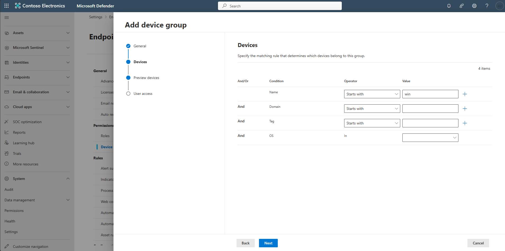

1. On **Preview devices**, select **Show preview** to confirm matching devices.  

    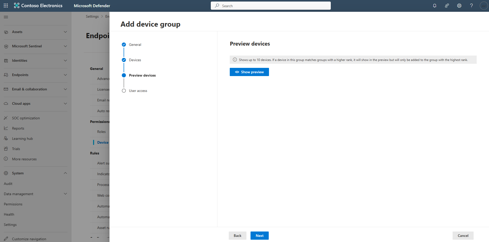

1. Verify the lab VM (for example `\winvm-mde`) appears, then select **Next**.  

    

1. Select **Submit**.  

    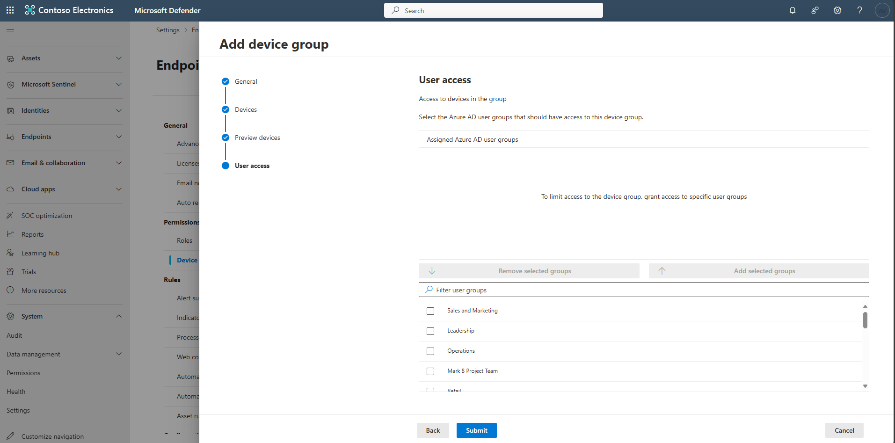

1. In the **No user groups selected** prompt, select **Continue**.  

    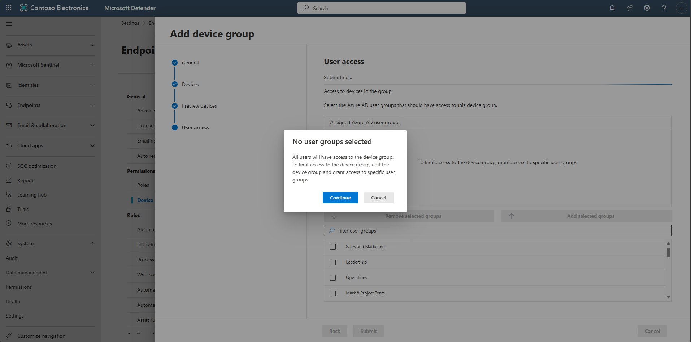

1. Select **Done**, then confirm the new device group is listed.  

    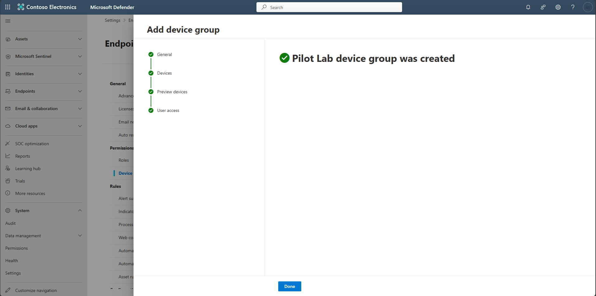  
    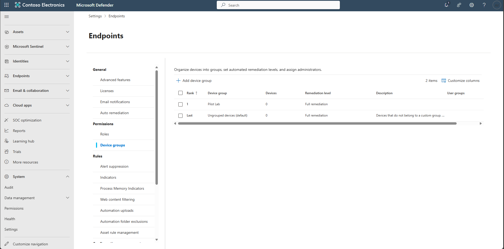

1. In the leftmost pane, go to **System** > **Settings** > **Email & collaboration**.  

    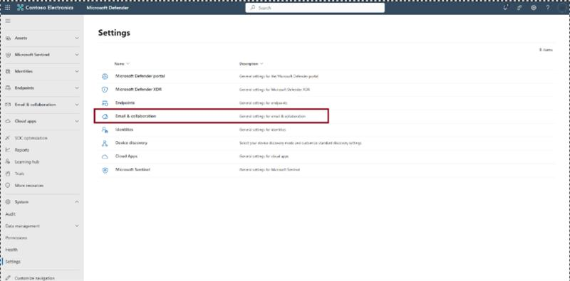

1. Select **MDO automation settings**.  

    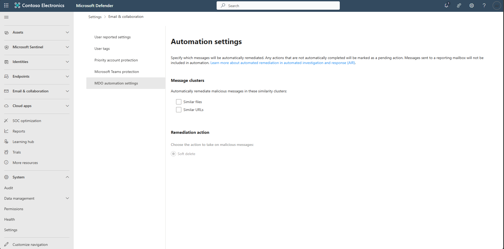

1. Under **Message clusters**, select **Similar files** and **Similar URLs**. Set **Remediation action** to **Soft delete**, then select **Save**.  

    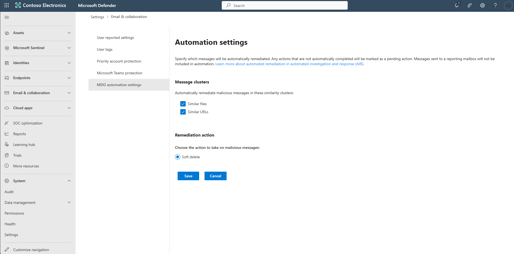

