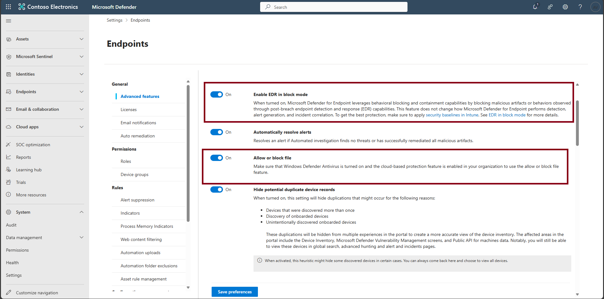
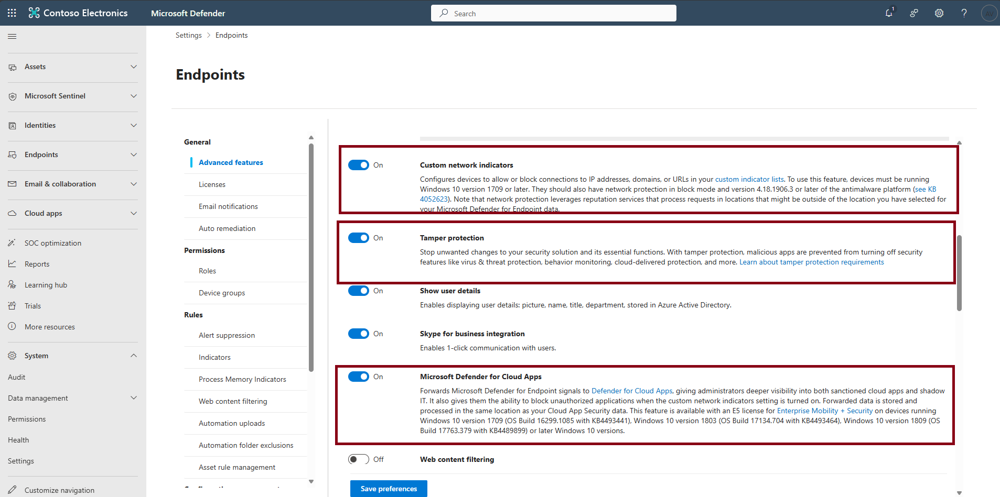

## Task 02: Configure MDE advanced features

1. In the leftmost pane, go to **System** > **Settings** > **Endpoints** > **General** > **Advanced features**.  

1. Check that the following are enabled: **EDR in block mode**, **Tamper Protection**, **Allow or block file**, **Custom network indicators**, and **Microsoft Defender for Cloud Apps**.  

     

   

