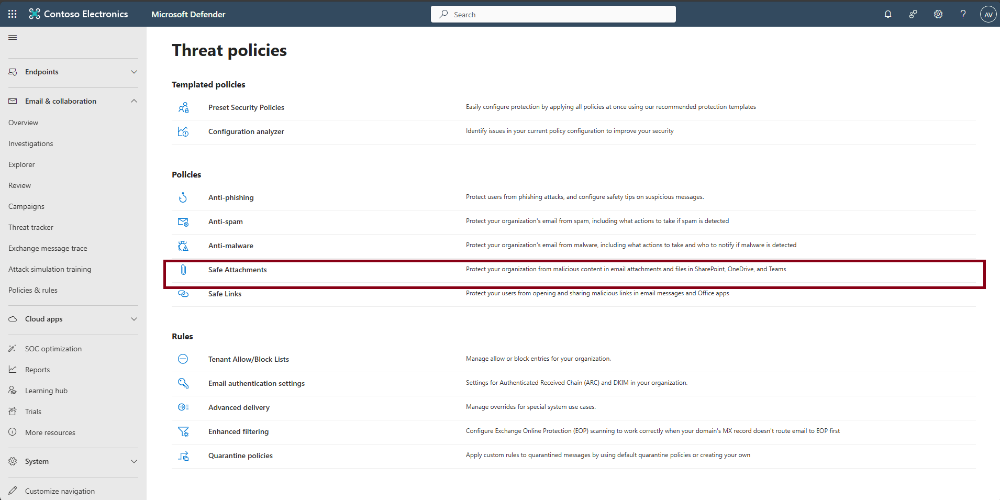

## Task 03: Configure Safe Attachments policy

1. In the leftmost pane, select **Email & collaboration** > **Policies & rules**.  

   

1. Select **Threat policies**.

1. Under the **Policies** section, select **Safe Attachments**.  

   

1. Select **+ Create**.  

   

1. Name the policy `SA-Block`, then select **Next**.  

   

1. Leave **Users**, **Groups**, and **Domains** empty so it applies to all users, then select **Next**.  

   

1. On the **Settings** step, select **Block**, then select **Next**. *(Optional: turn on **Dynamic delivery** to release body before attachment scan.)*  

    

1. Select **Submit**, then **Done**.  

      
    

1. (Optional) Adjust **priority** so this policy applies before others.  

1. On the **Safe attachments** page's top bar, select **Global settings**.

1. Confirm **Defender for Office 365 for SharePoint, OneDrive, and Microsoft Teams** is on.  

    

