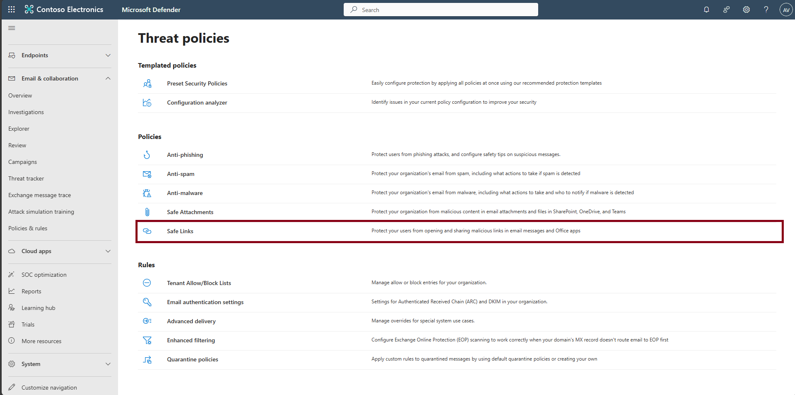
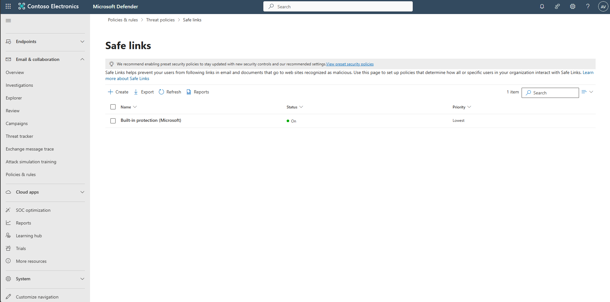
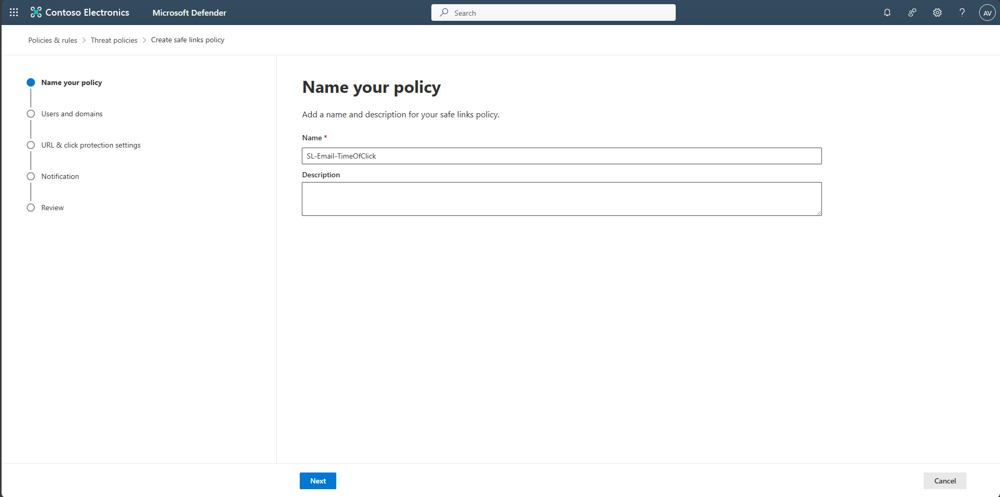
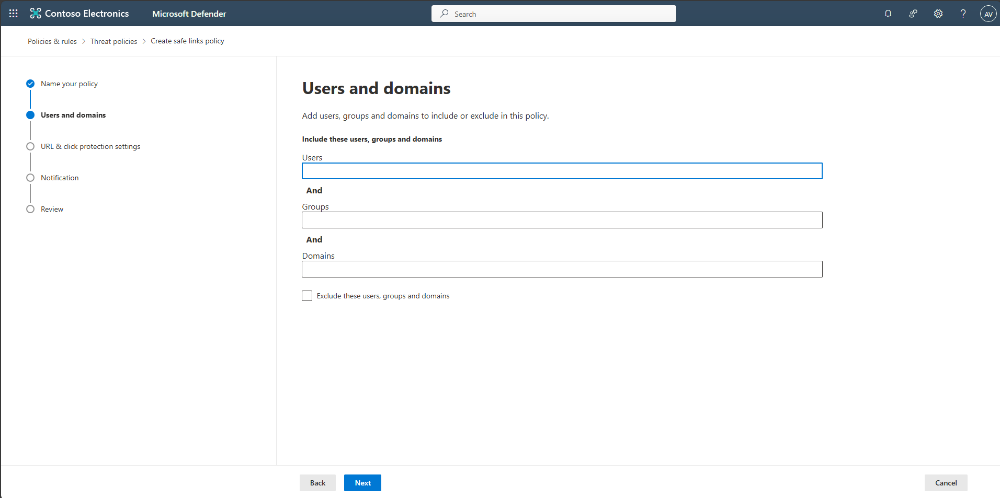
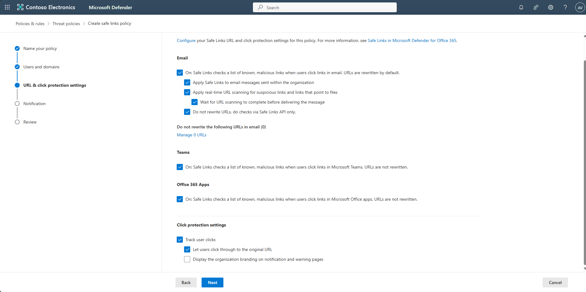
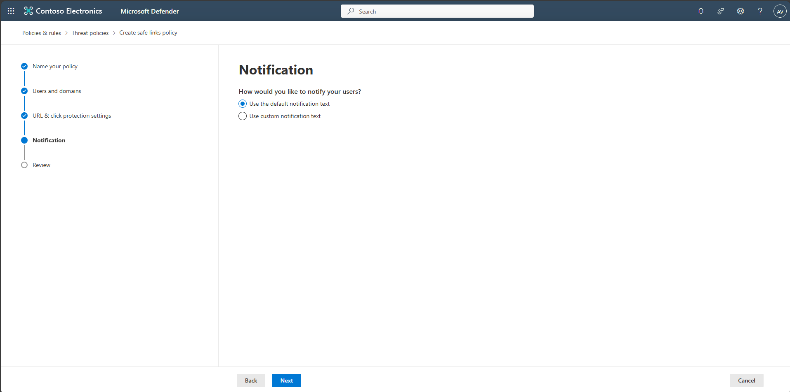
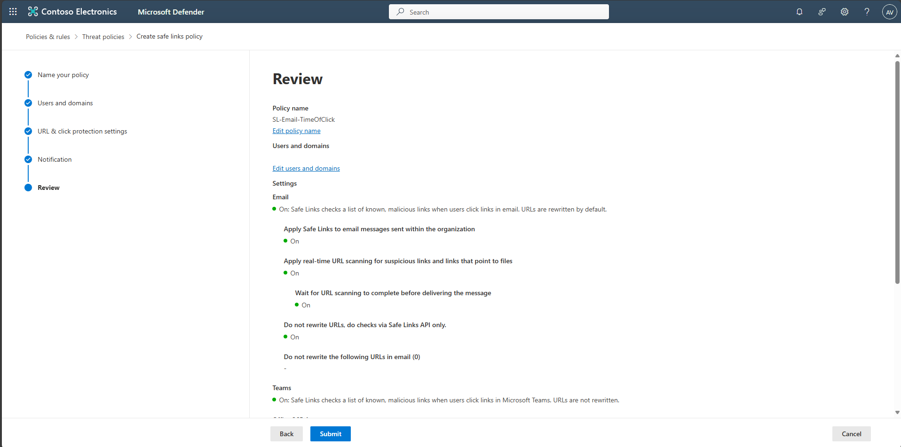
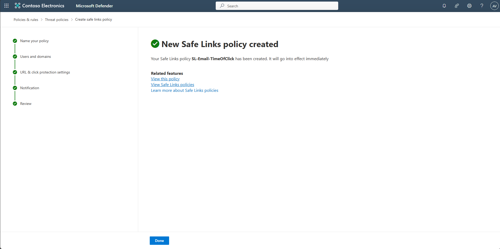
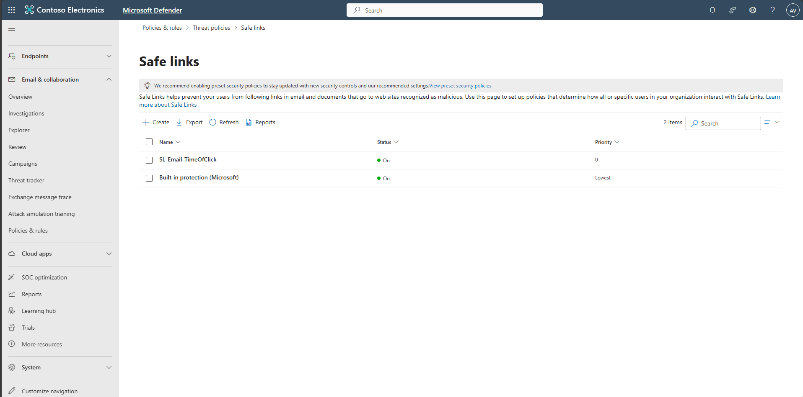

## Task 04: Configure Safe Links policy

1. In the leftmost pane, select **Email & collaboration** > **Policies & rules**.  

    

1. Select **Threat policies**.

1. Under the **Policies** section, select **Safe Links**.  

    

1. Select **+ Create**.  

    

1. Name the policy `SL-Email-TimeOfClick`, then select **Next**.  

    

1. Leave **Users**, **Groups**, and **Domains** empty so it applies to all users, then select **Next**.  

    

1. On **URL & click protection settings**, keep defaults, then select **Next**.  

    

1. On **Notification**, keep defaults, then select **Next**.  

    

1. Select **Submit**, then **Done**.  

      
    

1. (Optional) Adjust **priority** so this custom policy applies before others.  

    

