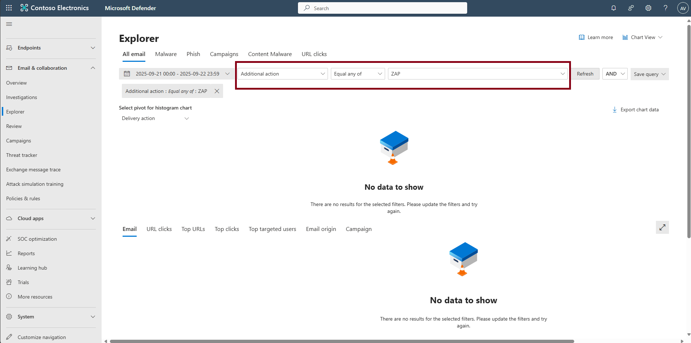

## Task 05: Observe Zero-hour Auto Purge (ZAP)

ZAP re-evaluates delivered mail and removes newly determined bad messages (within ~48 hours).  

1. In the leftmost pane, select **Email & collaboration** > **Explorer** (or **Action center**).  

1. In the filter at the top of the page, set the following, then select **Refresh** to its right.

    | Item | value |
    |:---------|:---------|
    | Date   | **Default**  |
    | Filter  | `Additional action`  |
    | Operator  | **Equal any of**  |
    | Entries  | **ZAP**  |

    

