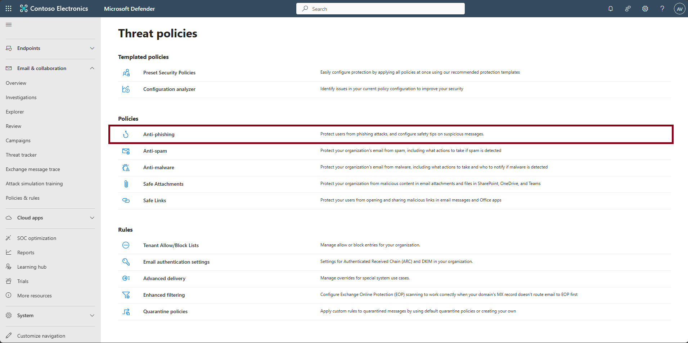
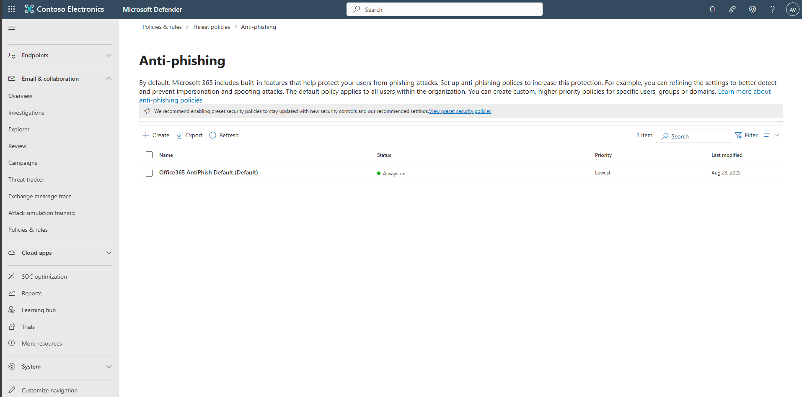
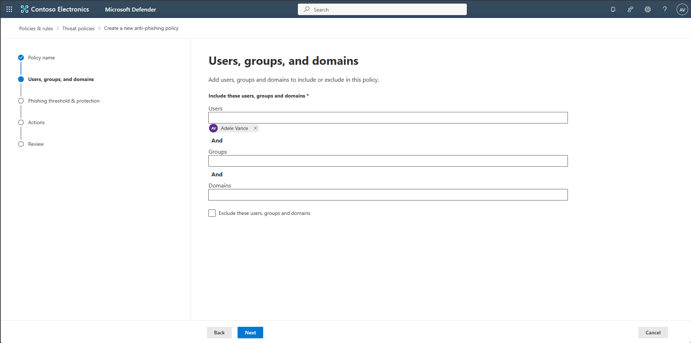
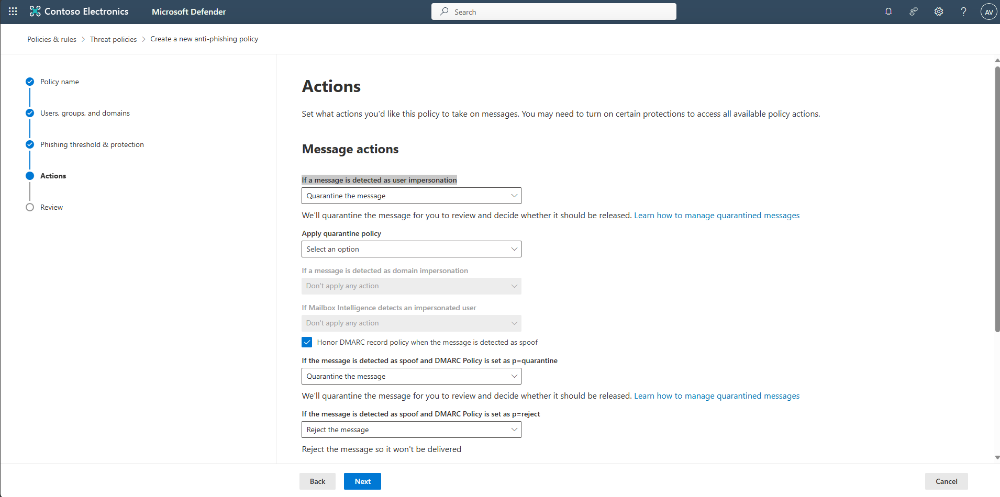
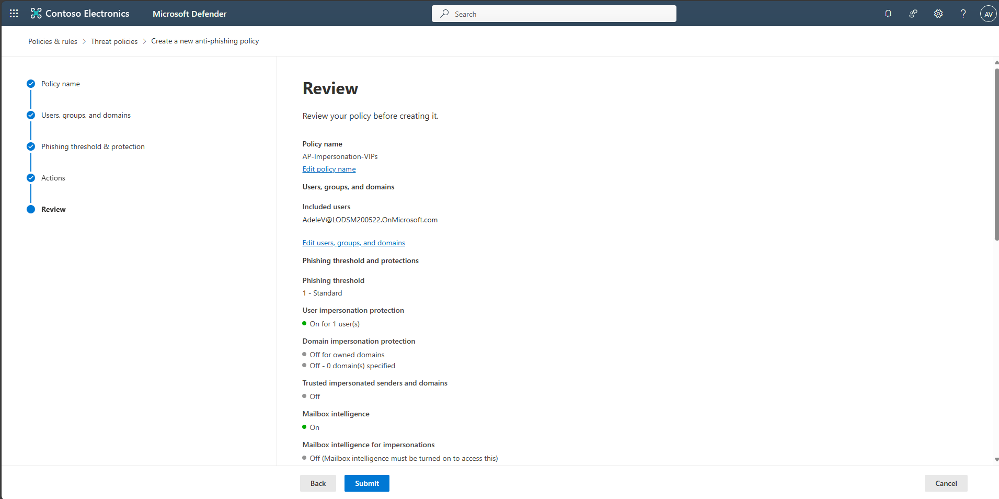
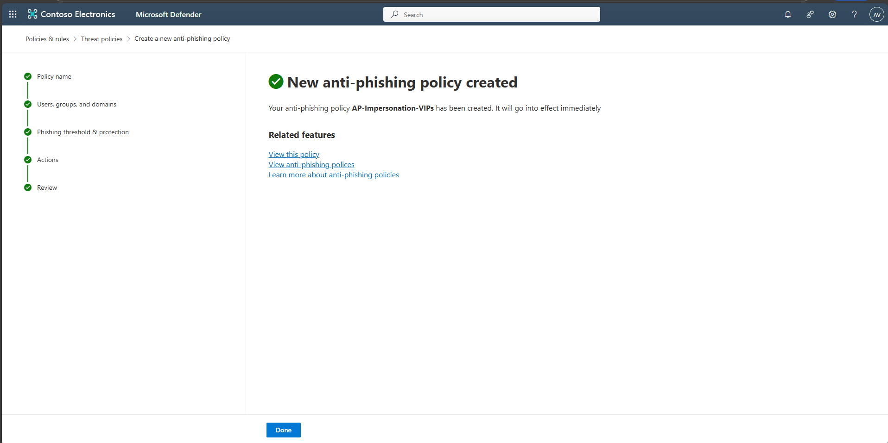
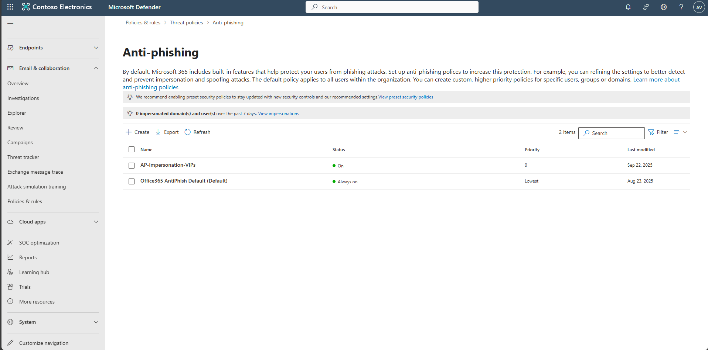

## Task 06: Configure Anti-phishing / Impersonation

1. In the leftmost pane, select **Email & collaboration** > **Policies & rules**.

1. Select **Threat policies**.

1. Under the **Policies** section, select **Anti-phishing**.  

    

1. Select **+ Create**.  

    

1. Name the policy `AP-Impersonation-VIPs`, then select **Next**.  

    

1. Under **Users**, search for and select your account (or target users) to apply protection, then select **Next**.

    

1. On **Phishing threshold & protection**, under **Impersonation**, select **Enable users to protect**, then select select **Manage 0 sender(s)**.

    

1. In the flyout pane, select **Add user**.

1. Under **Email**, search for and select your account, then select **Add**.

    

1. At the bottom of the flyout pane, select **Add**, then select **Done**.

    

1. Back on the **Phishing threshold & protection** step, select **Next**.

1. On the **Actions** step, under **If a message is detected as user impersonation**, select the dropdown menu, then select **Quarantine the message**, then select **Next**.

    

1. Select **Submit**, then **Done**. Confirm the policy is active.  

      
      
    

