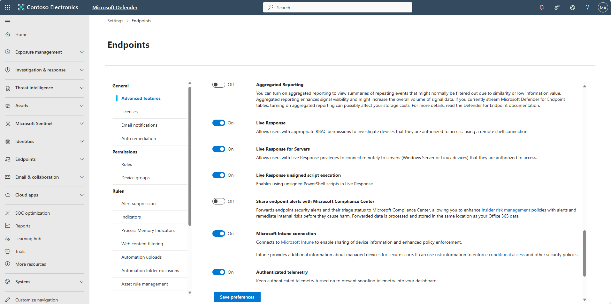
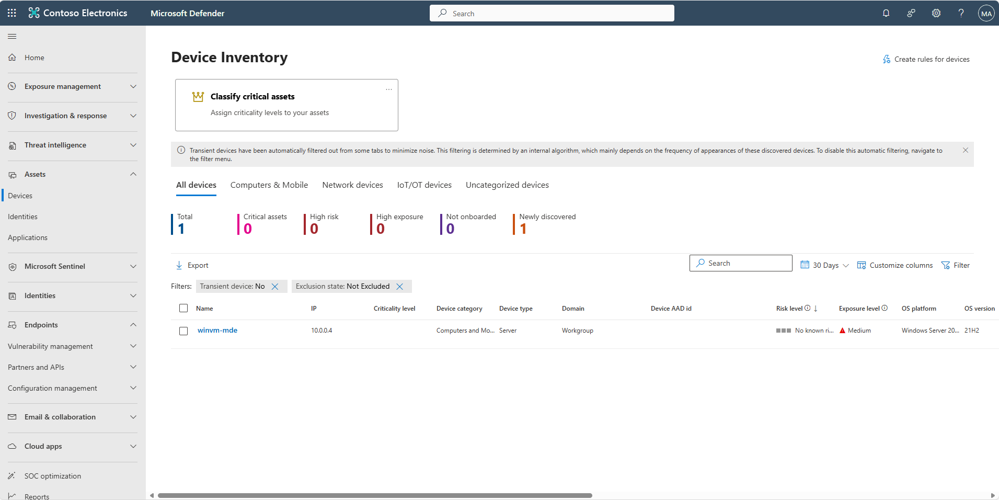
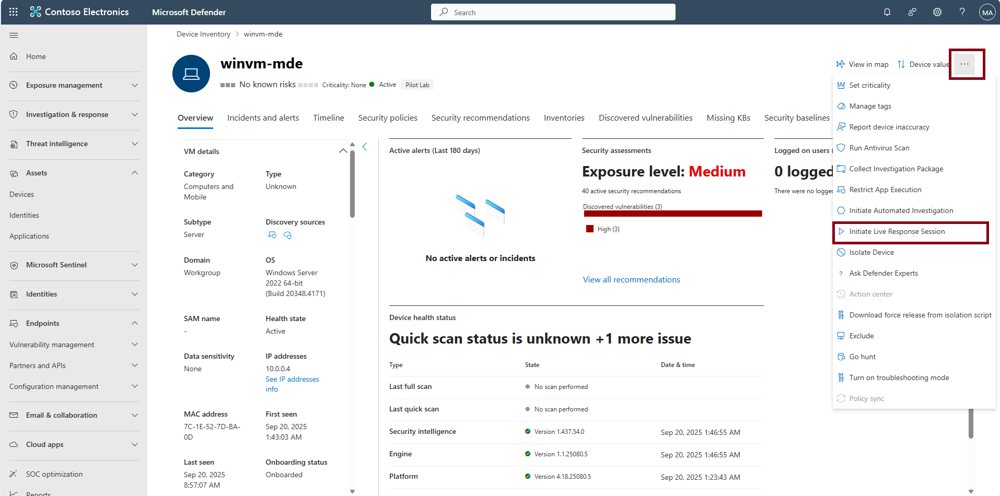
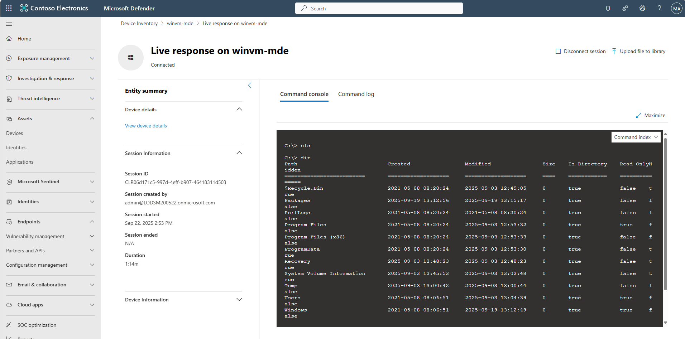
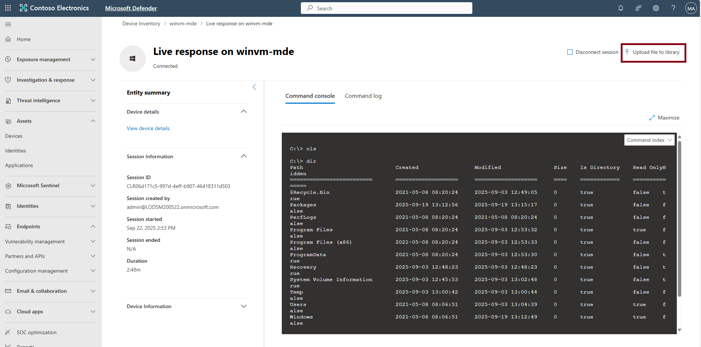

## Task 07: Enable Live Response and upload a script

1. In the leftmost pane, go to **System** > **Settings**.

1. Select **Endpoints**.

1. Stay on **General** > **Advanced features**.  

1. Verify whether **Live Response**, **Live response for servers**, and **Live response unsigned script execution** settings have been turned on. If not, turn it on and select **Save**.  

    

1. In the leftmost pane, select **Assets** > **Devices**.  

    

1. Select your onboarded Azure Windows VM, **winvm-mde**.  

    

1. In the upper-right corner of the page, select the ellipsis to open the **More actions** menu, then select **Initiate Live Response Session**.

    

1. In the console, run `dir` to confirm access.  

    

1. In the upper-right corner of the page, select **Upload file to library**.

    

    {: .warning }
    > Depending on window size, you may need to select the ellipsis in the upper-right corner of the page to open the **More actions** menu to see the option.

1. In the flyout pane, select **Upload file to library**.

1. Go to `C:\Lab Files`, select the **lr-proof** PowerShell script, then select **Open**.

    

    {: .important }
    > In production, sign your scripts.

1. At the bottom of the flyout pane, select **Submit**.

