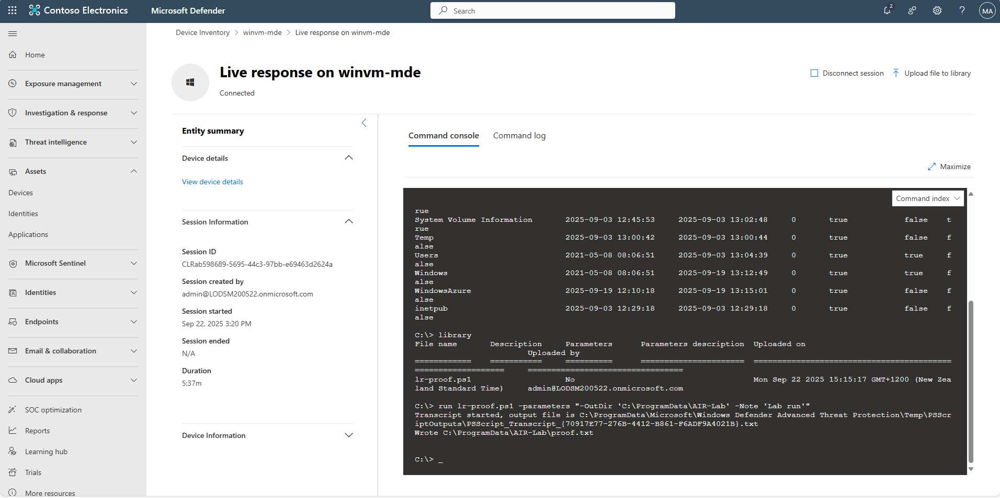
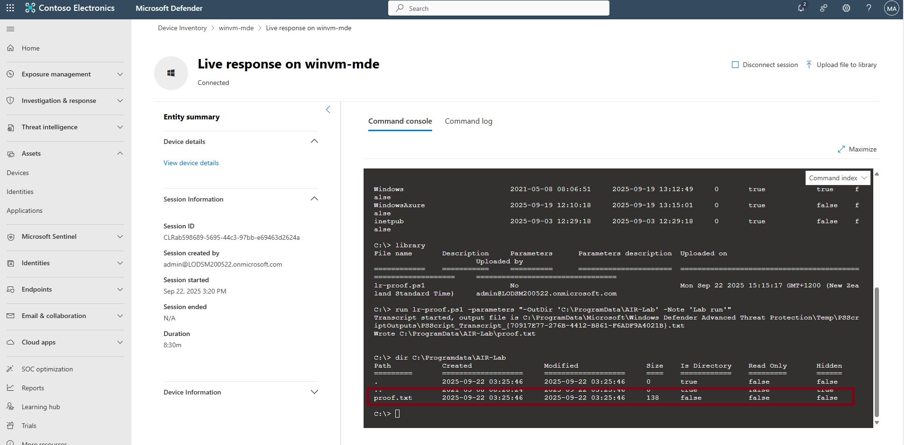
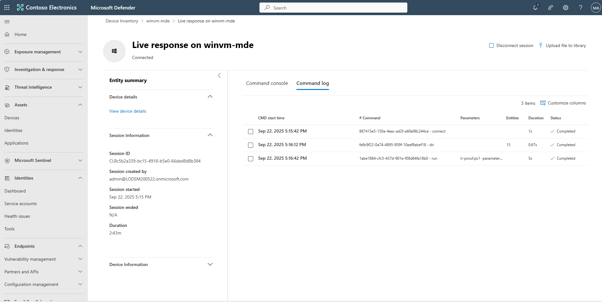
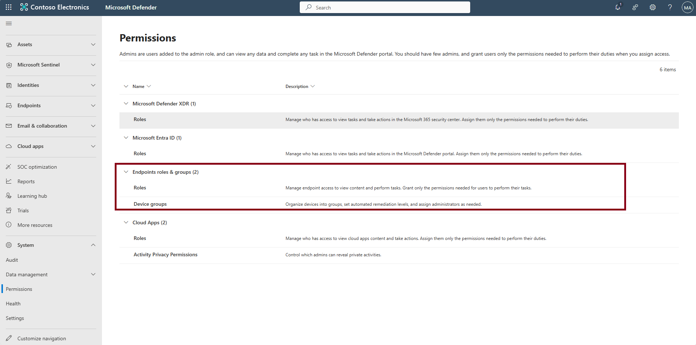
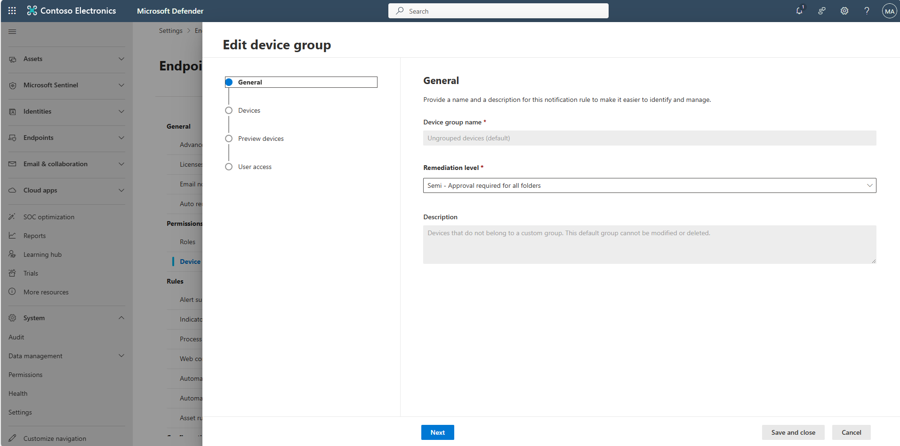
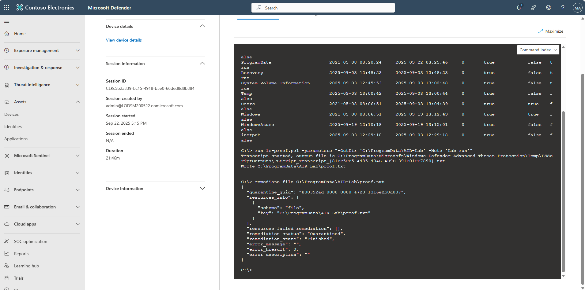
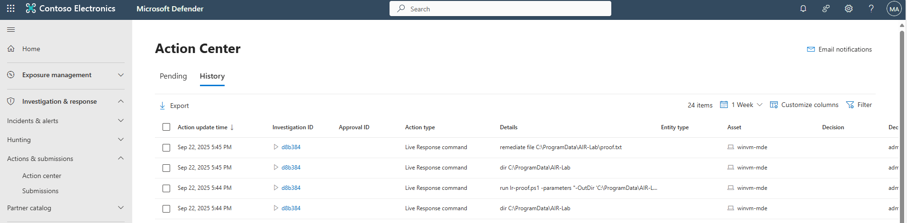

## Task 08: Execute Live Response and track actions

1. In the Live Response console, run `library` and verify **lr-proof.ps1** is listed.  

    

1. Run: 

    ```
    run lr-proof.ps1 -parameters "-OutDir 'C:\ProgramData\AIR-Lab' -Note 'Lab run'"
    ```  

    

1. Verify output by running 

    ```
    dir C:\ProgramData\AIR-Lab
    ```
    
    Then confirm **proof.txt** exists.  

   

1. Above the console, select the **Command log** tab to review actions taken.  

   

1. In the leftmost pane, go to **System** > **Permissions**.

1. Under the **Endpoints roles & groups** section, select **Device groups**.  

   

1. Select **Ungrouped devices (default)**.

1. In the flyout pane, under **Remediation level**, select the dropdown menu, then select **Semi -  Approval required for all folders**.

   

1. In the lower-right corner of pane, select **Save and close**.

1. Select the **Pilot Lab** group and repeat the same steps.

1. In the leftmost pane, go to **Assets** > **Devices**.

1. Select your pilot device, **winvm-mde**. 

1. In the upper-right corner of the page, select the ellipsis to open the **More actions** menu, then select **Initiate Live Response Session**.

1. In the console, run 

    ```
    remediate file C:\ProgramData\AIR-Lab\proof.txt
    ```  

   

1. In the leftmost pane, go to **Investigation & response** > **Actions & submissions** > **Action center**.

1. At the top of the page, select the **History** tab to confirm results.  

   

