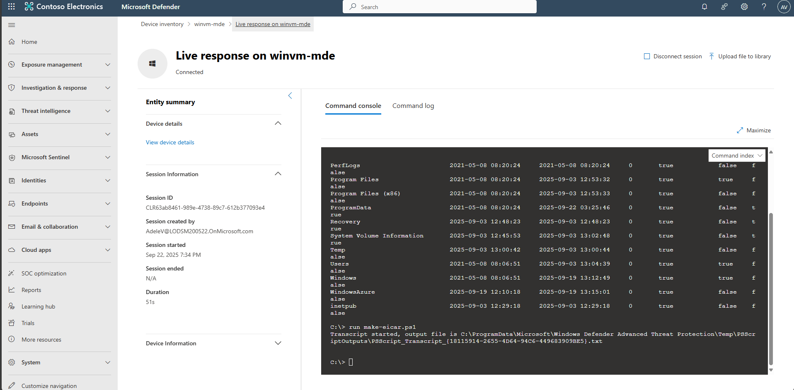

## Task 09: Validate automation with test artifacts (EICAR)

1. In the leftmost pane, go to **Assets** then **Devices**.

1. Select your pilot device, **winvm-mde**. 

1. In the upper-right corner of the page, select the ellipsis to open the **More actions** menu, then select **Initiate Live Response Session**.

1. In the upper-right corner of the page, select **Upload file to library**.

    {: .warning }
    > Depending on window size, you may need to select the ellipsis in the upper-right corner of the page to open the **More actions** menu to see the option.

1. In the flyout pane, select **Upload file to library**.

1. Go to `C:\Lab Files`, select the **make-eicar** PowerShell script, then select **Open**.

1. At the bottom of the flyout pane, select **Submit**.

1. In the console, run:

    ```
    run make-eicar.ps1
    ``` 

    

    {: .note }
    > Observe that Defender immediately quarantines the EICAR test file.  


---

# Congratulations!

### You've successfully completed the lab. Select **End** to mark the lab as **Complete**.
